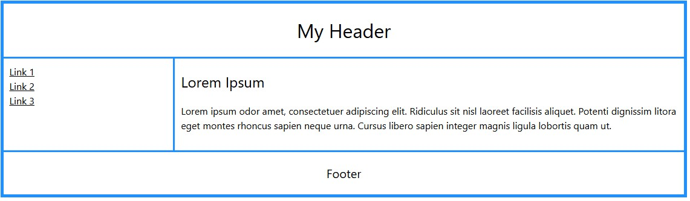

Data: 2026-01-29
[CSS](./README.md)
#Puzzle_Of_Knowledge/Computer_Science/Programming/Programming_Languages/CSS

---
# Struttura e Modello a Scatola (Box Model)

Il "Box Model" definisce come ogni elemento occupa spazio nella pagina.
- **Distanza** in base a una direzione:
	- `top:`
	- `right:`
	- `bottom:`
	- `left:`
- `width`: **Larghezza** dell'elemento (es. `20px`)
	- `min-width` / `max-width`: Impostano limiti minimi e massimi della larghezza
- `height`: **Altezza** dell'elemento (es. `20px`)
	- `min-height` / `max-height`: Impostano limiti minimi e massimi dell'altezza
- `margin`: Distanza **esterna** tra l'elemento e gli altri (es. `20px`). 
	- **auto**: Aggiusta la distanza per essere al centro (affiancato da una grandezza)
- `padding`: Distanza **interna** tra il bordo e il contenuto (es. `20px`).
- `border`: Crea un bordo con, (es.`grandezza stile colore;`), Esempi di stile:
	- **solid**: Linea continua.
	- **dashed**: linea tratteggiata.
	- **dotted**: Linea fatta di piccoli punti.
	- **double**:Doppio bordo sottile.
	- **none**: Rimuove il bordo.
- `border-radius`: Arrotonda gli angoli (es. `20px`).
- `box-shadow`: Aggiunge un'**ombra** (es. `0px 5px 10px 3px black`).

---
# Tipografia e Testo

Tutto ciò che riguarda la formattazione dei caratteri e dei paragrafi.

- `font-family`: Definisce il carattere (es. 'Montserrat'). Si possono importare con `@import`.
- `font-size`: Dimensione del testo.
- `font-weight`: Spessore.
	- **bold**: Grassetto standard.
	- **normal**:Testo normale.
	- **300**: Molto leggero/sottile, se il font lo supporta.
	- **900**: Extra black, molto spesso.
- `font-style`:
	- **italic**: Corsivo.
	- **normal**: In caso il testo ritorna normale.
- `text-align`: Gestisce la **posizione** del testo nel suo contenitore.
	- **center**: Testo centrato.
	- **right**, **left**: Testo allineato a destra o sinistra.
	- **justify**: Le righe hanno tutte la stessa lunghezza
- `text-decoration`: Decorazioni.
	- **underline**: Sottolineato.
	- **line-through**: Testo sbarrato.
	- **none**: In caso di decorazioni, il testo ritorna normale.
- `text-shadow`: Ombra applicata al testo. (`ombra-X, ombra-Y, sfocatura, colore`).
	- **none**: In caso rimuove l'ombra.
- `color`: Colore del testo.

---
# Posizionamento e Layout

Comandi che decidono dove un elemento appare nella pagina.

- `position`: Posizione dell'elemento.
    - **static**: (Default) segue il flusso normale del documento.
    - **relative**: Si sposta rispetto alla sua posizione originale.
	    - `position: relative; top: 10px; left: 20px;`
    - **absolute**: Si posiziona rispetto al primo contenitore genitore che non sia "static".
    - **fixed**: sta sempre fermo anche se si scorre la pagina.
    - **sticky**: Si comporta come "relative" finché non raggiunge un punto, poi diventa "fixed".
- `z-index`: Gestisce la profondità, (es. -1, manda l'elemento dietro agli anni)
- `float`: Fa "fluttuare" l'elemento permettendo al testo di circondarlo.
	- **top**
	- **right**
	- **bottom**
	- **left**
- `clear`: Annulla l'effetto del float che hanno gli altri elementi.
	- **both**: Evita che l'elemento salga di fianco a quelli fluttuanti.
- `display`: 
	- **none**: L'elemento sparisce e il resto della pagina si ricompatta come se non fosse mai esistito.
	- **inline**: Si affianca ad altri elementi (come le parole in una frase), non inizia una nuova riga
	- **block**: Prende tutta la larghezza disponibile (100% del contenitore), inizia sempre su una nuova riga.
	- **inline-block**: L'elemento sta sulla stessa riga degli altri (come un inline), ma si comporta come un block per quanto riguarda le dimensioni.
	- **flex**: Rende l'elemento flessibile in modo tale da gestire meglio il suo layout.
		- Da usare con: justify-content e align-items.
	- **grid**: Crea un layout come se fosse una tabella potenziata. https://www.w3schools.com/css/css_grid.asp
		- **Fondamenta**:
			1. Grid Container: L'elemento genitore su cui applichi `display: grid`.
			2. Grid Item: I figli diretti del contenitore.
			3. Grid Lines: Le linee invisibili (orizzontali e verticali) che separano le celle.
			4. Grid Cell: Il singolo "quadratino" (l'unità base).
			5. Grid Area: Un insieme di celle che formano un rettangolo (es. l'area della testata o della barra laterale).
		- **Come utilizzarlo**:
			- Grid permette di "disegnare" il layout con le parole:
```css
/*Grid Container*/
.container {
  display: grid;
  /*Parte di progettazione della griglia*/
  grid-template-areas:
    "header header"
    "menu content"
    "footer footer";
  grid-template-columns: 1fr 3fr;
  gap: 3px;
  background-color: dodgerblue;
  padding: 5px;
}
/*Grid Item*/
.container div {
  background-color: white;
  padding: 10px;
}
/*Grid Item*/
.container div.header {
  grid-area: header;
  text-align: center;
}
/*Grid Item*/
.container div.menu {
  grid-area: menu;
}
/*Grid Item*/
.container div.content {
  grid-area: content;
}
/*Grid Item*/
.container div.footer {
  grid-area: footer;
  text-align: center;  
}
```


- `justify-content`: Gestisce lo spazio tra e attorno gli elementi lungo l'asse x. (display: flex)
	- **center**: Sposta tutti gli elementi al centro del contenitore. Lo spazio vuoto viene distribuito equamente a destra e a sinistra.
	- **flex-start** (Default): Allinea gli elementi all'inizio del contenitore (solitamente a sinistra).
	- **flex-end**: Allinea gli elementi alla fine del contenitore (solitamente a destra).
	- **space-between**: Il primo elemento va all'inizio, l'ultimo alla fine, e lo spazio rimanente viene diviso equamente tra gli elementi centrali.
	- **space-around**: Distribuisce lo spazio equamente attorno a ogni elemento (quindi lo spazio tra due elementi sarà il doppio rispetto a quello tra un elemento e il bordo).
	- **space-evenly**: Lo spazio tra i bordi e tra ogni elemento è esattamente lo stesso.
- `align-items`: Gestisce lo spazio tra e attorno gli elementi lungo l'asse y. (display: flex)
	- **center**: Sposta tutti gli elementi al centro del contenitore. Lo spazio vuoto viene distribuito equamente a destra e a sinistra.
	- **flex-start** (Default): Allinea gli elementi all'inizio del contenitore (solitamente a sinistra).
	- **flex-end**: Allinea gli elementi alla fine del contenitore (solitamente a destra).
	- **space-between**: Il primo elemento va all'inizio, l'ultimo alla fine, e lo spazio rimanente viene diviso equamente tra gli elementi centrali.
	- **space-around**: Distribuisce lo spazio equamente attorno a ogni elemento (quindi lo spazio tra due elementi sarà il doppio rispetto a quello tra un elemento e il bordo).
	- **space-evenly**: Lo spazio tra i bordi e tra ogni elemento è esattamente lo stesso.
- `visibility`: 
	- **hidden**: Nasconde l'elemento ma lascia lo spazio vuoto dove si trovava.
- `overflow`: Controlla cosa succede quando il contenuto di un elemento è troppo grande per il contenitore che lo ospita.
	- **visible**: Il contenuto esce fuori dai bordi (comportamento standard).
	- **hidden**: Tutto quello che eccede i bordi viene tagliato e scompare.
	- **scroll**: Aggiunge sempre le barre di scorrimento, anche se il contenuto ci sta perfettamente.
	- **auto**: Aggiunge le barre di scorrimento solo se sono effettivamente necessarie.

---
# Sfondi e Colori

- `background-color`: Colore di sfondo solido.
- `background-image`: Immagine di sfondo
	- **url(...)**: Link alla immagine
	- **linear-gradient**: un'immagine che consiste in una transizione progressiva tra due o più colori lungo una linea retta.
	  https://www.w3schools.com/cssref/func_linear-gradient.php
- `background-size`: Grandezza dell'immagine
	- **cover**: adatta l'immagine per coprire tutto lo spazio.
- `background-position`: Allineamento dell'immagine
	- **center**: Immagine centrata
- `background-repeat`: 
	- **no-repeat**: evita che l'immagine si duplichi a mosaico.

---
# Animazioni e Responsività

- `transition`: Crea animazioni fluide quando una proprietà cambia. (da usare con :hover)
	- transition: **proprietà**, **durata**, **curva di velocità**, **ritardo**
	- **Proprietà**: Definisce quale caratteristica vuoi animare. (es. color)
	- **Durata**: Definisce il tempo di durata dell'animazione, (es. 3s oppure 3ms)
	- **Curva di velocità (Timing function)**: Definisce il "ritmo".
	    - `linear`: Velocità costante.
	    - `ease-in`: Parte lento e accelera.
	    - `ease-out`: Parte veloce e rallenta alla fine (molto naturale).
	- **Ritardo**: Definisce il tempo del ritardo
	  https://www.w3schools.com/css/css3_transitions.asp
- `@media screen and (max-width: ...)`: Permette di cambiare lo stile in base alla dimensione dello schermo (es. per cellulari).
  
---
