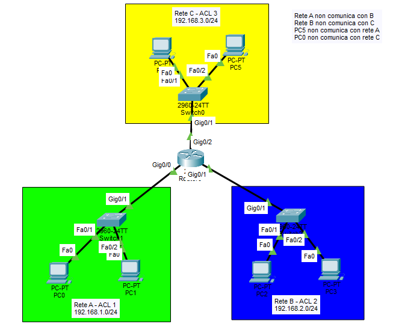

Data: 2026-05-12
[Cisco_Packet_Tracer](./README.md)
#Puzzle_Of_Knowledge/Computer_Science/System_And_Networks/Cisco_Packet_Tracer
___
# Index

# SHOW
```
Router# show access-lists
```

# ACCESS GROUP

Assegnare una ACL a una interfaccia.

``` cisco
Router(config)# interface [Interfaccia] [N]
Router(config-if)# ip address [IP] [Maschera]
Router(config-if)# ip access-group [N. ACL] ?
	out       Outbound
	in        Inbound
	
### ESEMPIO
Router(config)# interface gigabitEthernet 0/1
Router(config-if)# ip address 192.168.1.254 255.255.255.0
Router(config-if)# ip access-group 1 out
```

___
# ACL Standard

Le ACL standard vanno applicate sempre **outbound** sull'interfaccia più vicina alla destinazione.

Ci sono 2 metodi per configurare L'ACL standard:

1) Metodo esteso, prima si crea l'ACL e poi si aggiungono le righe

``` cisco
Router(config)# ip access-list standard [1-99]
Router(config-std-nacl)# [N_regola] [permit|deny] [indirizzo] [wildcard]

### ESEMPIO
Router(config)# ip access-list standard 1
Router(config-std-nacl)# 10 permit 192.168.1.0 0.0.0.255
```

2)  Metodo compatto, crea e aggiungo righe in uno:
``` cisco
Router(config)# access-list [1-99] [permit|deny] [indirizzo] [wildcard]

### Esempio
Router(config)# access-list 1 permit 192.168.1.0 0.0.0.255
```

## Esercizio



Blocca tutta la rete 192.168.1.0/24 tranne l'host .130:


```cisco
Router(config)# access-list 1 permit 192.168.1.130 0.0.0.0
Router(config)# access-list 1 deny   192.168.1.0   0.0.0.255
! (DENY ANY implicito alla fine)
```

**Applicazione sull'interfaccia:**

```cisco
Router(config)# interface fastEthernet 0/0
Router(config-if)# ip access-group 1 out
```

___
 **Sintassi**:

```cisco
Router(config)# access-list [100-199] [permit|deny] [protocollo] \
    [src] [wildcard-src] [dst] [wildcard-dst] [opzioni porta]
```

**Esempio — Blocca il traffico da rete A (192.168.1.0) verso rete B (192.168.2.0):**

```cisco
Router(config)# ip access-list extended 100
Router(config-ext-nacl)# deny ip 192.168.1.0 0.0.0.255 192.168.2.0 0.0.0.255
```

**Esempio — Permetti solo HTTP (porta 80) da rete A verso server:**

```cisco
Router(config)# access-list 100 permit tcp 192.168.1.0 0.0.0.255 any eq 80
```


## Comandi Cisco — Riferimento Rapido

### Configurare un'interfaccia del router

```cisco
Router(config)# interface fastEthernet 0/0
Router(config-if)# ip address 192.168.1.254 255.255.255.0
Router(config-if)# no shutdown
```

### ACL Standard

```cisco
! Creare l'ACL
Router(config)# access-list 1 permit 192.168.1.130 0.0.0.0
Router(config)# access-list 1 deny   192.168.1.0   0.0.0.255

! Oppure in modalità named
Router(config)# ip access-list standard 1
Router(config-std-nacl)# 10 permit 192.168.1.130 0.0.0.0
Router(config-std-nacl)# 20 deny   192.168.1.0   0.0.0.255

! Applicare all'interfaccia (OUTBOUND, vicino alla destinazione)
Router(config)# interface fastEthernet 0/0
Router(config-if)# ip access-group 1 out
```

### ACL Estese

```cisco
! Creare l'ACL
Router(config)# ip access-list extended 100
Router(config-ext-nacl)# deny ip 192.168.1.0 0.0.0.255 192.168.2.0 0.0.0.255
Router(config-ext-nacl)# permit ip any any

! Applicare all'interfaccia (INBOUND, vicino alla sorgente)
Router(config)# interface fastEthernet 0/1
Router(config-if)# ip access-group 100 in
```

### Verifica

```cisco
! Mostra tutte le ACL configurate
Router# show ip access-lists

! Mostra le ACL su un'interfaccia specifica
Router# show ip interface fastEthernet 0/0

! Mostra la running config
Router# show running-config
```

---

## Workflow — Come Configurare le ACL

```
1. Progetta la topologia
   └─ Identifica sorgenti, destinazioni e i vincoli di comunicazione

2. Decidi il tipo di ACL
   ├─ Standard (1-99)  → filtra solo sorgente → vicino alla destinazione (OUTBOUND)
   └─ Estesa (100-199) → filtra src + dst + protocollo → vicino alla sorgente (INBOUND)

3. Configura le interfacce del router
   └─ ip address + no shutdown su ogni interfaccia

4. Crea le ACL
   └─ Scrivi prima i PERMIT specifici, poi i DENY generali
      (il DENY ANY finale è implicito)

5. Applica le ACL alle interfacce
   └─ ip access-group [N] [in|out]

6. Gestisci il traffico di risposta (se necessario)
   └─ Aggiungi regole con "established" (TCP) o "echo-reply" (ICMP)

7. Verifica
   └─ show ip access-lists
```

---


