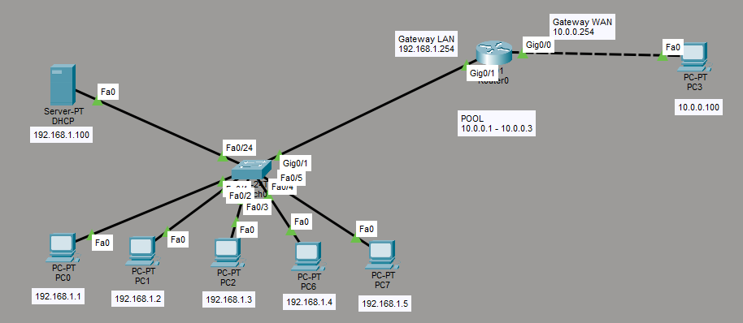

Data: 2026-05-16
[Cisco_Packet_Tracer](./README.md)
#Puzzle_Of_Knowledge/Computer_Science/System_And_Networks/Cisco_Packet_Tracer
___
# Index
- [[#Comandi]]
- [[#Verifica]]
- [[#Configurazione intefacce]]
- [[#NAT STATICO (1:1)]]
	- [[#Regola NAT statico su IP]]
		- [[#Regola NAT statico con porta (TCP/UDP)]]
	- [[#Esercizio Statico]]
- [[#NAT DINAMICO (n:n)]]
	- [[#ACL standard]]
	- [[#Pool di indirizzi pubblici]]
	- [[#Regola NAT dinamico]]
		- [[#Tabella NAT risultante]]
	- [[#Esercizio Dinamico]]
- [[#PAT (n:1)]]
	- [[#ACL standard]]
	- [[#Regola PAT]]
		- [[#Tabella NAT risultante]]
	- [[#Esercizio PAT]]
___
# Comandi
``` cisco
# Verifica
Router#show ip nat translations

# Configurazione interfacce
Router(config)#interface fastEthernet 0/0
Router#(config-if)ip address [gateway lan] [mask]
Router#(config-if)ip nat inside
Router#(config-if)exit

Router(config)#interface fastEthernet 0/1
Router#(config-if)ip address [indirizzo pubblico] [mask]
Router#(config-if)ip nat outside
Router#(config-if)exit

# NAT Statico
Router(config)#ip nat inside source static [ip-privato] [ip-pubblico]
Router(config)#ip nat inside source static tcp [ip-privato] [porta] [ip-pubblico] [porta]

# NAT Dinamico
Router(config)#access-list [N] permit [rete] [wildcard]
Router(config)#ip nat pool [NOME] [ip-inizio] [ip-fine] netmask [mask]
Router(config)#ip nat inside source list [N] pool [NOME]

# PAT
Router(config)#access-list [N] permit [rete] [wildcard]
Router(config)#ip nat inside source list [N] interface fastEthernet 0/1 overload
```
___
# Verifica
``` cisco
show ip nat translations
```
___
# Configurazione intefacce

Passaggio che si fa sempre in ogni caso

``` cisco
Router(config)# interface fastEthernet 0/0 
Router#(config-if)# ip address [gateway lan] [mask]     
Router(config-if)# ip nat inside               
Router(config-if)# exit

Router(config)# interface fastEthernet 0/1 
Router#(config-if)# ip address [indirizzo pubblico] [mask]  
Router(config-if)# ip nat outside        
Router(config-if)# exit  
```

- `fastEthernet 0/0` → LAN (inside) 
- `fastEthernet 0/1` → WAN/Internet (outside)
___
# NAT STATICO (1:1)

Il NAT statico crea una **mappatura fissa e permanente** tra un IP privato e un IP pubblico. Ogni volta che un pacchetto parte da quell'IP interno, viene sempre tradotto nello stesso IP pubblico.
## Regola NAT statico su IP

``` cisco
Router(config)# ip nat inside source static 192.168.1.2 10.0.0.100
```

|Parte del comando|Significato|
|---|---|
|`ip nat inside source`|Traduco l'IP sorgente del traffico proveniente dall'inside|
|`static`|La mappatura è fissa (non cambia mai)|
|`192.168.1.2`|IP privato dell'host interno (Inside Local)|
|`10.0.0.100`|IP pubblico a cui viene tradotto (Inside Global)|

Ogni pacchetto che parte da `192.168.1.2` viene visto da internet come `10.0.0.100`.
### Regola NAT statico con porta (TCP/UDP)
Usato per esporre un **servizio specifico** (es. un server web) all'esterno.

``` cisco
Router(config)# ip nat inside source static tcp 192.168.1.100 80 10.0.0.10 80
```

|Parte del comando|Significato|
|---|---|
|`static tcp`|Mappatura fissa sul protocollo TCP|
|`192.168.1.100 80`|IP e porta del server interno (HTTP sulla porta 80)|
|`10.0.0.10 80`|IP pubblico e porta su cui viene esposto all'esterno|
Chi da internet contatta `10.0.0.10:80` viene instradato al server interno `192.168.1.100:80`.
## Esercizio Statico


``` cisco
# Interfaccia verso la WAN
Router(config)#interface GigabitEthernet0/0
Router(config-if)#ip address 10.0.0.254 255.0.0.0
Router(config-if)#ip nat outside
Router(config-if)#no shutdown
Router(config-if)#exit

# Interfaccia versola LAN
Router(config)#interface GigabitEthernet0/1
Router(config-if)#ip address 192.168.1.254 255.255.255.0
Router(config-if)#ip nat inside
Router(config-if)#no shutdown
Router(config-if)#exit

# Regole NAT
Router(config)#ip nat inside source static 192.168.1.1 10.0.0.1
Router(config)#ip nat inside source static 192.168.1.2 10.0.0.2
Router(config)#ip nat inside source static 192.168.1.3 10.0.0.3

# Per accedere al server HTTP dalla wan
Router(config)#ip nat inside source static tcp 192.168.1.200 80 10.0.0.200 80
```
___
# NAT DINAMICO (n:n)

Il NAT dinamico assegna automaticamente un IP pubblico dal **pool** ogni volta che un host interno vuole comunicare con l'esterno. La mappatura **non è fissa**: finita la sessione, l'IP pubblico torna disponibile.
## ACL standard
L'ACL definisce **quali host interni** possono essere tradotti dal NAT. È anche la principale misura di sicurezza: solo gli IP che matchano l'ACL vengono fatti uscire.

``` cisco
Router(config)# access-list 1 permit 192.168.1.0 0.0.0.255
```

|Parte del comando|Significato|
|---|---|
|`access-list 1`|Creo l'ACL numero 1 (standard)|
|`permit`|Permetto il traffico|
|`192.168.1.0`|Rete da permettere|
|`0.0.0.255`|Wildcard mask (equivale a /24, cioè tutti gli host da .1 a .254)|
## Pool di indirizzi pubblici
Definisco il range di IP pubblici che il router può usare per le traduzioni.

``` cisco
Router(config)# ip nat pool IP_PUBBLICI 10.0.0.10 10.0.0.12 netmask 255.0.0.0
```

|Parte del comando|Significato|
|---|---|
|`ip nat pool IP_PUBBLICI`|Creo un pool chiamato `IP_PUBBLICI`|
|`10.0.0.10 10.0.0.12`|Range di IP pubblici disponibili (da .10 a .12 = 3 indirizzi)|
|`netmask 255.0.0.0`|Subnet mask del range pubblico|
In questo esempio ci sono solo 3 IP pubblici: al massimo 3 host interni possono comunicare contemporaneamente con l'esterno.

## Regola NAT dinamico

Collego l'ACL al pool: "traduci tutti gli IP che matchano l'ACL 1 usando gli indirizzi del pool".

``` cisco
Router(config)# ip nat inside source list 1 pool IP_PUBBLICI
```

|Parte del comando|Significato|
|---|---|
|`ip nat inside source`|Traduco gli IP sorgente del traffico inside|
|`list 1`|Usa l'ACL numero 1 per scegliere chi tradurre|
|`pool IP_PUBBLICI`|Usa gli IP del pool come indirizzi pubblici|
### Tabella NAT risultante

```
Router# show ip nat translations

Pro  Inside global    Inside local     Outside local    Outside global
icmp 10.0.0.10:3      192.168.1.3:3    10.0.0.100:3     10.0.0.100:3
icmp 10.0.0.11:5      192.168.1.1:5    10.0.0.100:5     10.0.0.100:5
icmp 10.0.0.12:3      192.168.1.2:3    10.0.0.100:3     10.0.0.100:3
```

Ogni host ha ricevuto un IP pubblico **diverso** dal pool (`10.0.0.10`, `.11`, `.12`).

## Esercizio Dinamico



``` cisco
Router(config)#interface GigabitEthernet0/0
Router(config-if)#ip address 10.0.0.254 255.0.0.0
Router(config-if)#ip nat outside
Router(config-if)#no shutdown
Router(config-if)#exit

Router(config)#interface GigabitEthernet0/1
Router(config-if)#ip address 192.168.1.254 255.255.255.0
Router(config-if)#ip nat inside
Router(config-if)#no shutdown
Router(config-if)#exit

Router(config)#ip nat pool IP_PUBBLICI 10.0.0.1 10.0.0.3 netmask 255.0.0.0
Router(config)#access-list 1 permit 192.168.1.0 0.0.0.255
Router(config)#ip nat inside source list 1 pool IP_PUBBLICI
```
___
# PAT (n:1)

Il PAT funziona come il NAT dinamico ma usa un **unico IP pubblico** per tutti gli host interni. Il router distingue le sessioni tramite le **porte**: ogni connessione riceve una porta diversa.
## ACL standard
L'ACL definisce **quali host interni** possono essere tradotti dal NAT. È anche la principale misura di sicurezza: solo gli IP che matchano l'ACL vengono fatti uscire.

``` cisco
Router(config)# access-list 1 permit 192.168.1.0 0.0.0.255
```
## Regola PAT

``` cisco
Router(config)# ip nat inside source list 1 interface fastEthernet 0/1 overload
```


> [!NOTE] Nota
> L'indirizzo pubblico è quello del gateway del router

|Parte del comando|Significato|
|---|---|
|`list 1`|Usa l'ACL 1 per scegliere chi tradurre|
|`interface fastEthernet 0/1`|Usa l'IP dell'interfaccia outside come IP pubblico (non serve un pool)|
|`overload`|Abilita il PAT: più host condividono lo stesso IP usando porte diverse|

Con `overload` non serve definire un pool: il router usa direttamente l'IP della sua interfaccia WAN.
### Tabella NAT risultante

``` cisco
Router# show ip nat translations

Pro  Inside global        Inside local     Outside local    Outside global
icmp 10.0.0.100:1024      192.168.1.3:5    10.0.0.100:5     10.0.0.100:1024
icmp 10.0.0.100:1025      192.168.1.4:5    10.0.0.100:5     10.0.0.100:1025
icmp 10.0.0.100:1026      192.168.1.5:5    10.0.0.100:5     10.0.0.100:1026
icmp 10.0.0.100:5         192.168.1.2:5    10.0.0.100:5     10.0.0.100:5
```

Tutti gli host usano lo stesso IP pubblico `10.0.0.100`, ma con **porte diverse** (1024, 1025, 1026…). Il router sa a chi girare la risposta grazie alla porta.
## Esercizio PAT


``` cisco
Router(config)#interface GigabitEthernet0/0
Router(config-if)#ip address 10.0.0.254 255.0.0.0
Router(config-if)#ip nat outside
Router(config-if)#no shutdown
Router(config-if)#exit

Router(config)#interface GigabitEthernet0/1
Router(config-if)#ip address 192.168.1.254 255.255.255.0
Router(config-if)#ip nat inside
Router(config-if)#no shutdown
Router(config-if)#exit

Router(config)#access-list 1 permit 192.168.1.0 0.0.0.255
Router(config)# ip nat inside source list 1 interface fastEthernet 0/1 overload
```
___