# Parte VTP e DHCP Svolta

# Impostazione Pre Configurazione 
1) i collegamenti che devono essere in trunk: 
	1) Switch e switch
	2) Switch e router 
	3) Switch e WLC
	4) Switch e AP
```
SW(config)# interface fastEthernet [N porta]
SW(config)# switchport mode trunk

//su collegamente WLC e Switch | AP e Switch
SW(config-if)# switchport trunk native vlan [numero_vlan_WIFI]
```
   
3) Tutto il resto come:
	1) Switch e PC-ADMIN
	2) Switch e Server DHCP
	3) Switch e Server Radius
``` CLI
SW(config)# interface fastEthernet 0/1
SW(config-if)# switchport mode access
SW(config-if)# switchport access vlan [numero_vlan]
```
"C:\Users\user\Desktop\Repo\BlazeZone\Blaze_Experience\Setup_Archive\Viewable\Image\Computer_Science\System_And_Networks\WLC_Admin_Set_Up_Your_Controller.jpg"
# WLC
1) Creo il profilo admin
	1) Creazione Admin:
	   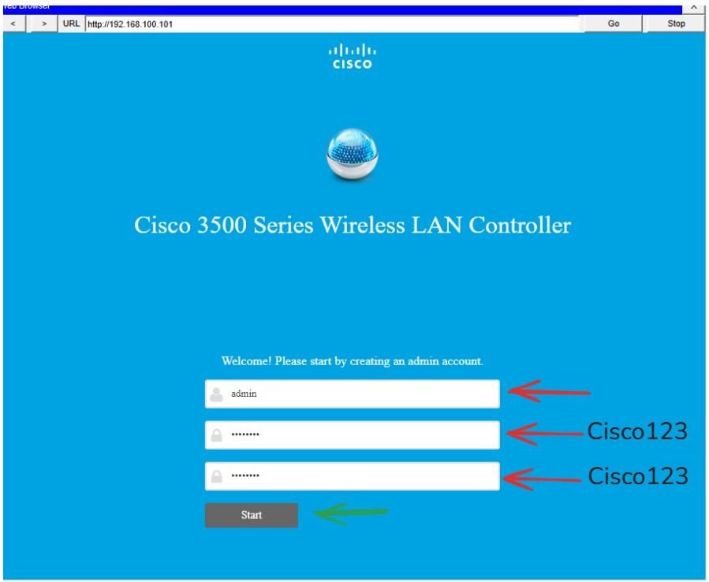
	2) Set Up Your Controller:
	   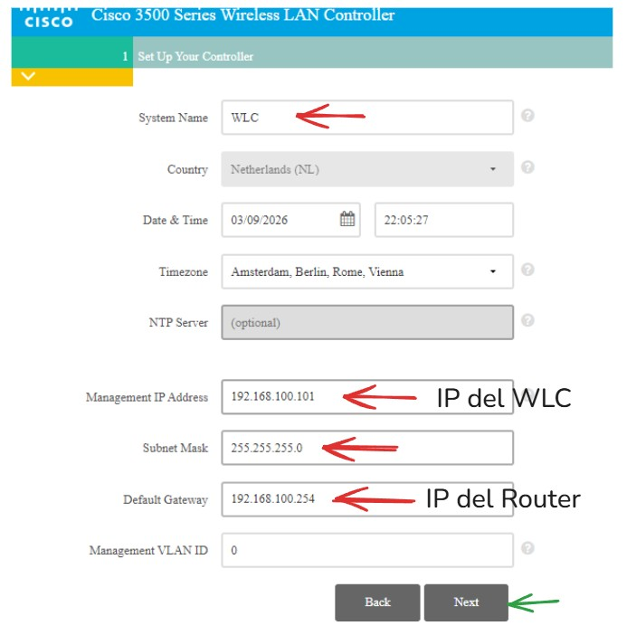
	3) Create Your Wireless Networks:
	   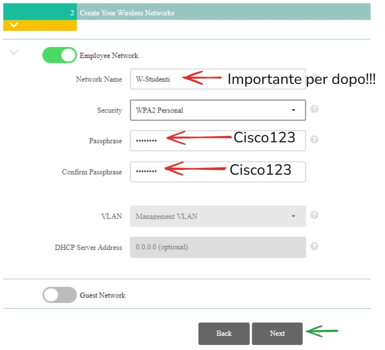
	4) Advanced Setting
	   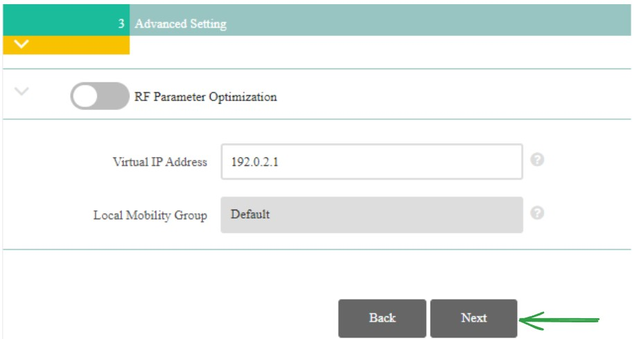
	5) Mettere https
2) DHCP
	1) Tolgo il DCHP Scope:
		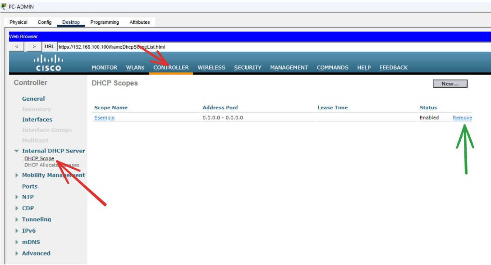
	2) Salva:
	   
3) verificare che ci siano gli AP:
	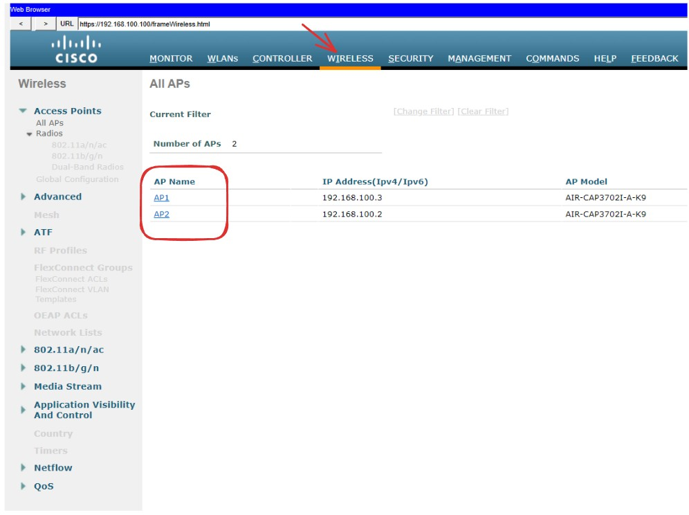
4) Interfacce
	1) Creare le interfacce:
		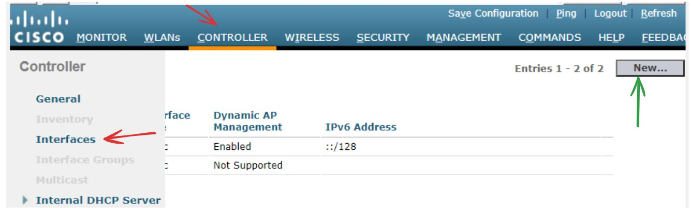
	2) Imposto:
	   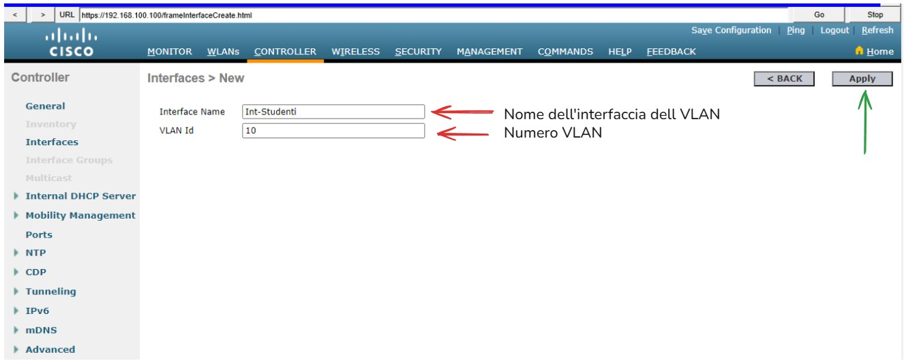
	3) Configuro le varie impostazioni dell'interfaccia:
	   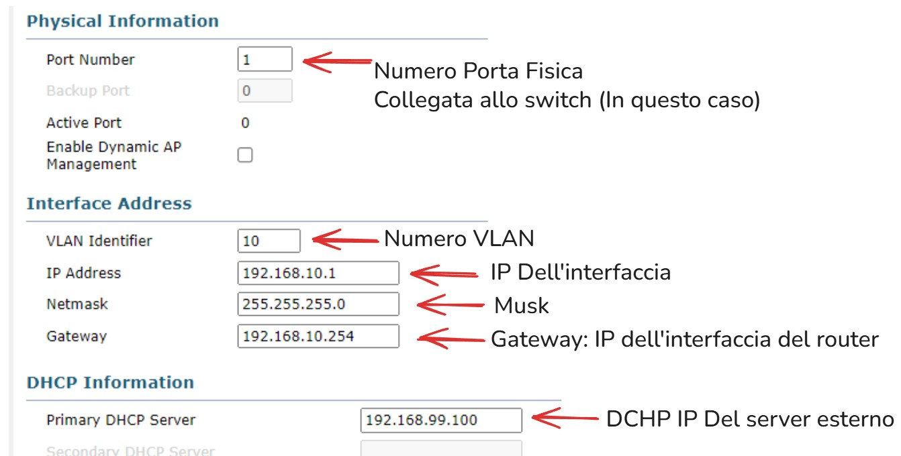
	4) Apply:
	   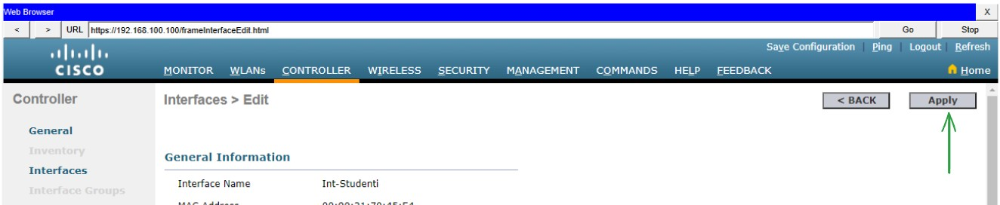
	5) Ripeto i passaggi dal **4** al **7** per ogni VLAN, in questo esempio aggiungo Int-Docenti
5) Server Radius:
	1) Aggiungo il WLC:
	   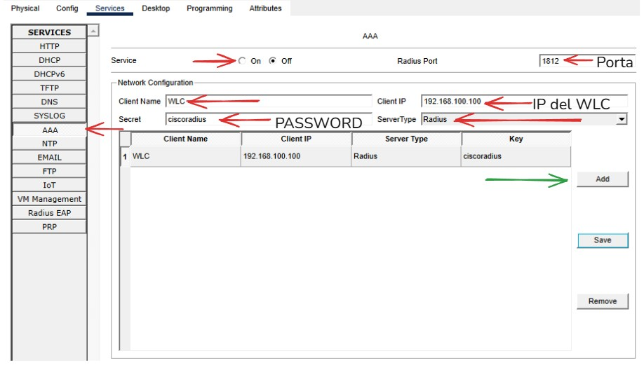
	2) Imposto gli user e password:
	   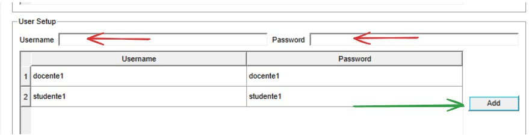
6) Radius nel WLC
	1) Imposto il radius nel WLC:
	   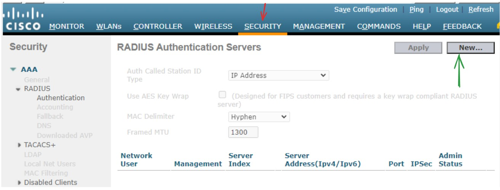
	2) Aggiungo il server radius:
	   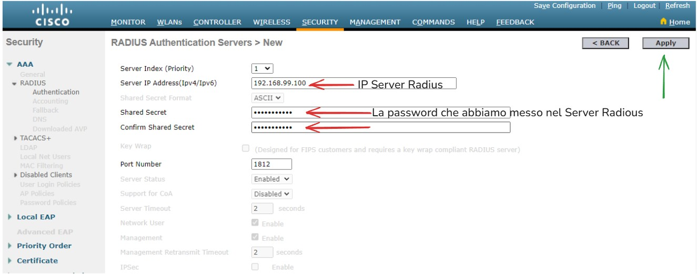
7) Configurazione delle WLAN
	1) Configuro le VLAN:
	   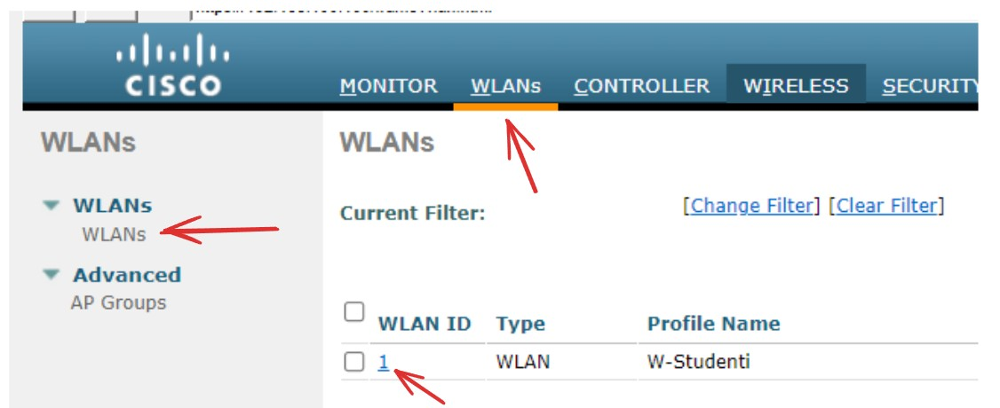
	2) All' inizio quando abbiamo creato una wlan (Durante l'accesso al WLC), c'è la ritroviamo qua, rinomino in **"WLAN Studenti"**, dopodichè la configurazione sarà ugaule alle configurazioni nuove che faremo (WLAN Docenti) correttamente le WLAN:
	   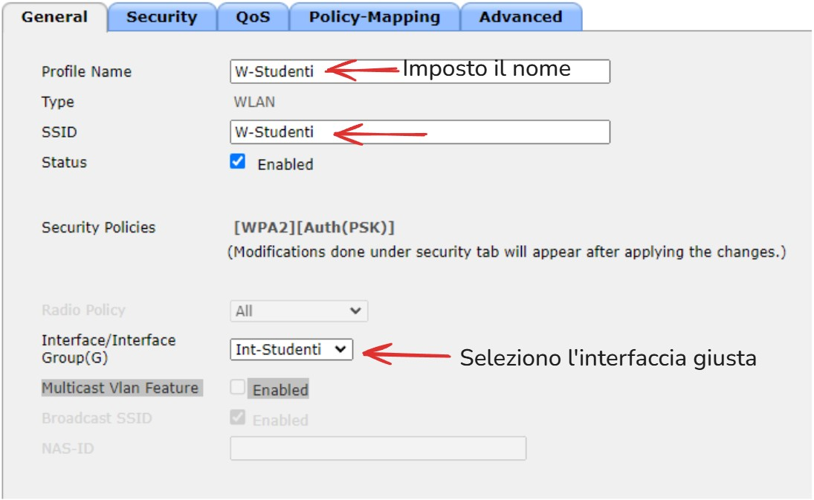
	3) Security:
		- Layer 2:
		  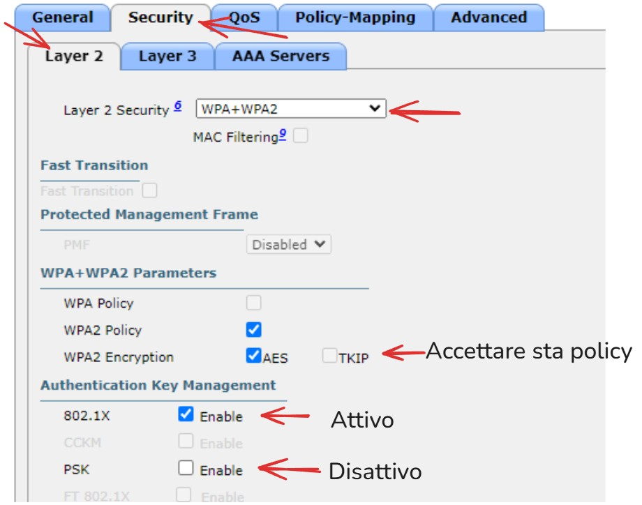
		- AAA Servers:
		  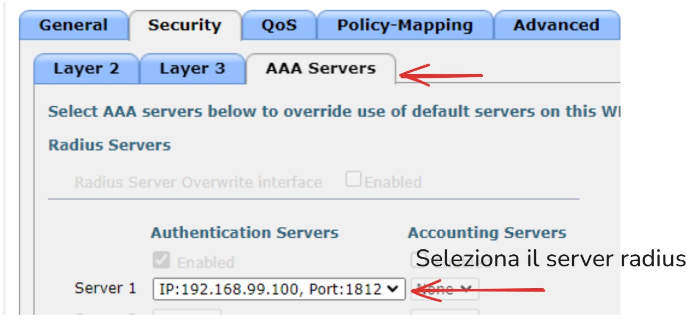
	4) Advanced:
	   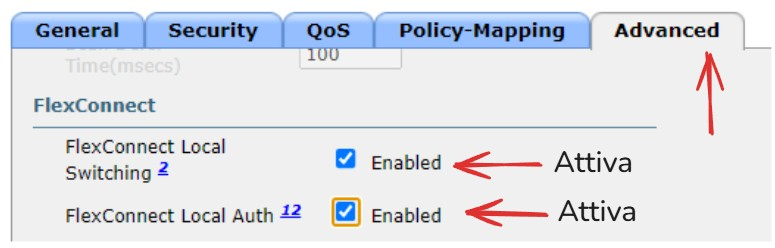
	5) apply e salva:
	   
       
8) Gruppi AP:
	1) Creo i Gruppi Degli AP:
	   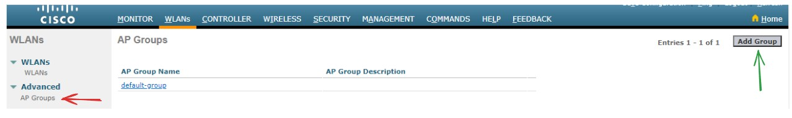
	2) Nome gruppo:
	   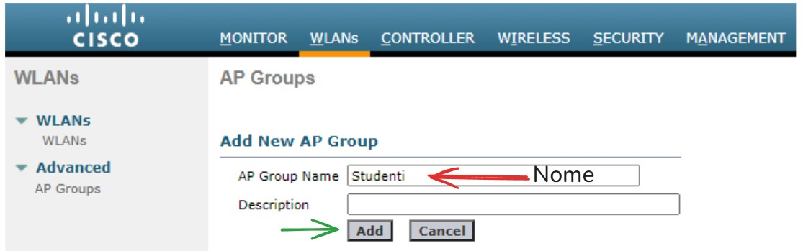
	3) WLANs:
	   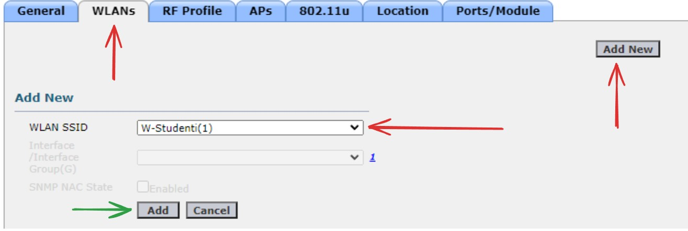
	4) APs:
	   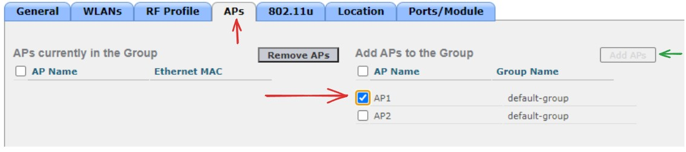
9) Laptop cambio scheda