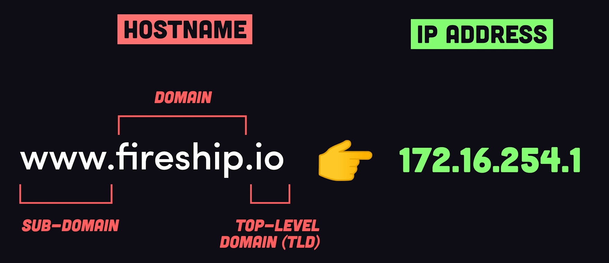
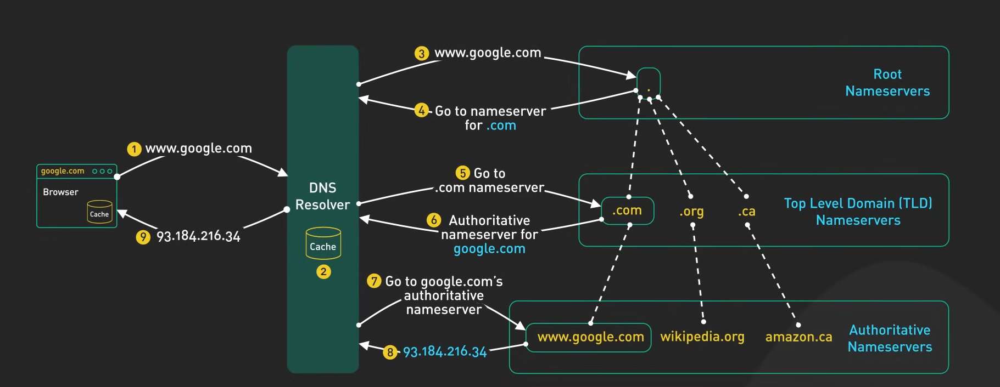

Data: 2026-05-10
[Infrastructure_Services](./README.md)
#Puzzle_Of_Knowledge/Computer_Science/System_And_Networks/IP_Services/Infrastructure_Services
___
# Index
___
# _Domain Name System_

## Panoramica

| Caratteristica              |                                                         Dettaglio                                                          |
| --------------------------- | :------------------------------------------------------------------------------------------------------------------------: |
| **Livello OSI**             |                                                      7 — Applicazione                                                      |
| **Porta**                   |                                                     **53** (UDP e TCP)                                                     |
| **Scopo**                   |                     Tradurre nomi di dominio leggibili (es. `google.com`) in indirizzi IP e viceversa                      |
| **RFC / Standard**          |                               RFC 1034 (1987) — Concetti; RFC 1035 (1987) — Implementazione                                |
| **Tipo Connessione**        | **Connectionless** (UDP) per query standard; **Connection-oriented** (TCP) per trasferimenti di zona e risposte > 512 byte |
| **Affidabilità**            |                            **Non affidabile su UDP** (nessuna conferma); **Affidabile su TCP**                             |
| **PDU (Unità Dati)**        |                                                     **Messaggio DNS**                                                      |
| **Meccanismo di Controllo** |                       Gerarchia distribuita di Name Server con caching basato su TTL (Time To Live)                        |
___
# Versioni & Evoluzione

|Versione / RFC|Anno|Novità principali|
|---|---|---|
|RFC 882/883|1983|Prima specifica del DNS (sostituisce il file HOSTS.TXT centralizzato)|
|RFC 1034/1035|1987|Specifica definitiva — concetti, struttura gerarchica, formato messaggi|
|RFC 1996|1996|DNS NOTIFY — il primario avvisa i secondari di modifiche alla zona|
|RFC 2136|1997|Dynamic DNS (DDNS) — aggiornamento dinamico dei record DNS|
|RFC 2181|1997|Chiarimenti sulla specifica DNS (TTL, CNAME, priorità record)|
|RFC 4033-4035|2005|DNSSEC — estensioni di sicurezza con firma crittografica dei record|
|RFC 7858|2016|DNS over TLS (DoT) — cifratura del traffico DNS su porta 853|
|RFC 8484|2018|DNS over HTTPS (DoH) — DNS incapsulato in HTTPS su porta 443|
|RFC 9250|2022|DNS over QUIC (DoQ) — DNS su protocollo QUIC per bassa latenza e cifratura|
___
# Come Funziona

Il DNS è un **sistema distribuito e gerarchico** che mappa i dominii leggibili (google.com) in indirizzi IP (e viceversa).
Non esiste un unico database centrale: l'informazione è distribuita tra migliaia di server autoritativi nel mondo, coordinati da una gerarchia ad albero.



Il principio fondamentale è la **delega**: ogni livello della gerarchia conosce solo i server del livello successivo, non l'intera struttura.
Questo permette una scalabilità globale e una gestione decentralizzata.

- **Il caching è il meccanismo che rende il DNS efficiente**: la risposta a ogni query viene memorizzata per un tempo definito dal TTL del record, evitando di ripetere l'intera catena di risoluzione ad ogni richiesta, e prendere la risposta direttamente nella cache locale.
## Le 3 Macro Componenti del DNS

1. **Domain Name Space**: La struttura gerarchica logica che organizza tutti i nomi di dominio.
2. **Name Server**: I server che contengono il database distribuito e rispondono alle query.
3. **Resolver**: Il software client che interroga i Name Server per conto delle applicazioni.
### Domain Name Space

Il **Domain Name Space** è una **struttura logica gerarchica ad albero** che organizza i nomi dei domini su Internet.
#### FQDN - Fully Qualified Domain Name
È il **nome di dominio completo** che identifica univocamente un host nella rete.  
- Include **tutti i livelli** del dominio, fino alla radice.  
  Esempio: `www.google.com.`  
  (il punto finale rappresenta il **dominio radice** `.`)
#### Gerarchia dei Domini
1. **Dominio Radice (Root)**:
	- Rappresentato da un punto `.` alla fine di un FQDN 
		- Esempio: `google.com.`
2. ***Top-Level Domain* (TLD)**:
	- **Generici (gTLD)**: `.com`, `.org`, `.net`
	- **Nazionali (ccTLD)**: `.it`, `.fr`, `.de`
	- **Nuovi gTLD**: `.blog`, `.shop`, `.cloud`
3. **Dominio di Secondo Livello**:
	- Nome scelto dall’organizzazione  
		- Esempio: `google` in `google.com`
4. **Sottodominio / Host (Dominio Foglia)**:
	- Specifica il nome del dispositivo o servizio  
		- Esempio: `www` in `www.google.com`
#### Regole di Naming

|Regola|Descrizione|
|:--|:--|
|**Lunghezza etichetta**|≤ **63 caratteri** per singola etichetta|
|**Lunghezza totale (FQDN)**|≤ **255 caratteri** totali|
|**Caratteri ammessi**|Lettere (a-z), cifre (0-9), trattino (`-`); no underscore nel DNS tradizionale|
|**Maiuscole/minuscole**|**Non sensibile** (`Google.com` = `google.com`)|
### *Name Server* (NS)

I **Name Server** conservano i Resource Record DNS e rispondono alle query. 

#### *Resource Record* (RR)
 Le singole "righe" che compongono il database del DNS, l'associazione del dominio e l'indirizzo IP

| Campo           | Significato                                           |
| --------------- | ----------------------------------------------------- |
| **Domain Name** | Nome del dominio a cui si riferisce il record         |
| **Type**        | Tipo di record (A, AAAA, CNAME, MX, NS, PTR, TXT…)    |
| **Class**       | Classe di rete (quasi sempre `IN` = Internet)         |
| **TTL**         | Time To Live — durata in secondi della cache          |
| **RDLength**    | Lunghezza in byte del campo RData                     |
| **RData**       | Valore del record (es. indirizzo IP, nome di dominio) |
Tipi di record più comuni:

| Tipo      | Descrizione                                                                                            |
| --------- | ------------------------------------------------------------------------------------------------------ |
| **A**     | Associa un dominio a un indirizzo **IPv4**                                                             |
| **AAAA**  | Associa un dominio a un indirizzo **IPv6**                                                             |
| **CNAME** | Alias: fa puntare un nome a un altro nome (no loop, no CNAME su MX/NS)                                 |
| **MX**    | Specifica i mail server per un dominio (con priorità numerica)                                         |
| **NS**    | Indica i Name Server autoritativi per la zona                                                          |
| **PTR**   | Risoluzione inversa (IP → nome), usato con `in-addr.arpa`                                              |
| **TXT**   | Testo libero (usato per SPF, DKIM, DMARC, verifica dominio)                                            |
| **SOA**   | Start of Authority — parametri autoritativi della zona (primario, refresh, retry, expire, minimum TTL) |
| **SRV**   | Indica host e porta per un servizio specifico (es. SIP, XMPP)                                          |
| **CAA**   | Certification Authority Authorization — specifica quali CA possono emettere certificati per il dominio |
#### Zone & Deleghe Dei Server
- **Zona**: È il "territorio" (l'insieme di nomi) di cui un server è l'unico responsabile e di cui conosce ogni dettaglio.
- **Delega**: Il server dice alla query DNS a che server deve andare, per avere la risoluzione.
#### Tipi di Server

##### Root Name Server
- Non conosce direttamente gli IP dei domini
- Sa dove si trovano i server TLD (es. `.com`)
##### Name Server TLD:
- Gestisce la zona per un TLD (es. `.com`, `.it`).
- Risponde indicando i Name Server autoritativi per il dominio di secondo livello richiesto.
##### Name Server Autoritativo:
- Contiene i record **ufficiali** di una zona (es. `google.com`).
- Fornisce risposte definitive (flag AA = Authoritative Answer impostato nella risposta).
###### Primario & Secondario

| Tipo Server    | Funzione                                                        |
| -------------- | --------------------------------------------------------------- |
| **Primario**   | Contiene i record originali, modificabili; fonte autoritativa   |
| **Secondario** | Copia di sola lettura per ridondanza e bilanciamento del carico |
- **Trasferimento di zona (AXFR/IXFR)**: i server secondari sincronizzano i record dal primario via TCP porta 53.
### Resolver (Client DNS)
Il **Resolver** è il componente sul dispositivo dell’utente che invia query DNS ai Name Server.
- Integrato nel sistema operativo
- Attiva la risoluzione quando un’app (es. browser) richiede un dominio

## Caching DNS
- Ogni risposta DNS include un **TTL** (Time To Live) che indica per quanti secondi la risposta può essere tenuta in cache.
- I **Recursive Resolver** memorizzano le risposte per evitare query ripetute verso i server autoritativi.
- **TTL basso** (es. 60s): utile per cambi frequenti o failover rapido, ma genera più traffico DNS.
- **TTL alto** (es. 86400s = 1 giorno): riduce il traffico ma rallenta la propagazione di modifiche ai record.
## DNS Inverso (Reverse DNS)
Consente di ottenere il **nome** associato a un **indirizzo IP**, invertendo la direzione della risoluzione.

**Esempio IPv4**:

```
IP: 93.184.216.34
Query DNS: 34.216.184.93.in-addr.arpa.
Risposta PTR: example.com.
```
___
# Flusso Operativo

## Risoluzione Ricorsiva Con Cache Vuota
In questo scenario, il **client** (il tuo computer o smartphone) richiede a un server DNS (solitamente quello del tuo provider internet o un resolver pubblico come 8.8.8.8) di **risolvere** il nome.

```
[ UTENTE ]
          |
    (1)   v 
   +--------------+         (2)          +--------------------+
   |   BROWSER    | -------------------> | RECURSIVE RESOLVER | <---+ (7) Mette la 
   |    (Stub)    | <------------------- |   (es. 8.8.8.8)    |     |    risposta
   +--------------+         (8)          +---------+----------+     |    in cache
                                                   |                |
        -------------------------------------------+                |
        |                  (Passaggi Iterativi)                     |
        |                                                           |
        |      (4) Query                                            |
        +----------------------------> [ ROOT SERVER ]              |
        | <--------------------------- (Risposta: vai al TLD .com)  |
        |      (4) Refer/Hint                                       |
        |                                                           |
        |      (5) Query                                            |
        +----------------------------> [ TLD SERVER (.com) ]        |
        | <--------------------------- (Risposta: vai all'Auth)     |
        |      (5) Refer/Hint                                       |
        |                                                           |
        |      (6) Query                                            |
        +----------------------------> [ SERVER AUTORITATIVO ]      |
                                        (Risposta: IP Finale) ----->|              
```

| Fase                   | #   | Azione                                                          | Generato  | Ricevuto  | Note                                           |
| ---------------------- | --- | --------------------------------------------------------------- | --------- | --------- | ---------------------------------------------- |
| **Query Client**       | 1   | Il browser chiede la risoluzione di `google.com`                | Browser   | Stub      | Il SO usa la libreria resolver integrata       |
| **Query Ricorsiva**    | 2   | Lo Stub invia query ricorsiva al Recursive Resolver             | Stub      | Recursive | UDP porta 53, flag RD=1                        |
| **Cache Check**        | 3   | Il Recursive controlla la cache — miss                          | Recursive |           | Cache vuota: avvia risoluzione iterativa       |
| **Root Query**         | 4   | Il Recursive chiede ai Root Server chi gestisce `.com`          | Recursive | Root      | Risposta: NS dei TLD `.com`                    |
| **TLD Query**          | 5   | Il Recursive chiede al TLD `.com` chi gestisce `google.com`     | Recursive | TLD       | Risposta: NS autoritativi di `google.com`      |
| **Autoritativo Query** | 6   | Il Recursive chiede l'IP di `google.com` al server autoritativo | Recursive | Auth      | Risposta con flag AA=1 (Authoritative Answer)  |
| **Cache + Risposta**   | 7   | Il Recursive mette in cache e risponde allo Stub                | Recursive | Stub      | Cache valida per il valore TTL del record A    |
| **Risposta Client**    | 8   | Lo Stub passa l'IP al browser                                   | Stub      | Browser   | Flag RA=1 nella risposta (Recursion Available) |



## Risoluzione Iterativa Con Cache Vuota
____
___
___
# Casi d'Uso Reali

- **Navigazione Web**: Quando un utente digita `www.example.com` nel browser, lo Stub Resolver interroga il Recursive Resolver che risolve il nome in un indirizzo IP. Il browser si connette all'IP ottenuto — senza DNS, ogni sito richiederebbe la memorizzazione dell'IP numerico.
- **Mail Server Routing (record MX)**: Quando un mail server deve consegnare un'email a `user@example.com`, esegue una query DNS per i record **MX** di `example.com`. I record MX includono una priorità numerica: il server prova prima quello con valore più basso (alta priorità), poi i successivi come fallback.
- **Load Balancing DNS (Round Robin)**: Un servizio con alta disponibilità può avere più record A per lo stesso nome (es. `www.example.com → 1.1.1.1` e `www.example.com → 2.2.2.2`). Il Recursive Resolver restituisce gli IP in ordine variabile, distribuendo il traffico tra i server.
- **CDN e Geo-DNS**: I Content Delivery Network usano DNS per restituire indirizzi IP diversi a seconda della posizione geografica del Recursive Resolver, indirizzando l'utente al nodo CDN più vicino (es. Cloudflare, Akamai).
- **Verifica Anti-Spam con SPF/DKIM (record TXT)**: Quando un mail server riceve un'email da `example.com`, esegue una query DNS per il record **TXT SPF** di `example.com` per verificare se l'IP mittente è autorizzato a inviare mail per quel dominio.

___
# Limitazioni Tecniche

- **Propagazione lenta dei cambi**: Le modifiche ai record DNS non sono istantanee — dipendono dal TTL dei record già in cache nei Recursive Resolver. Con TTL di 24h, un cambio di IP potrebbe richiedere fino a 24 ore per propagarsi globalmente.
- **Single Point of Failure senza ridondanza**: Un dominio con un solo Name Server autoritativo diventa irraggiungibile se quel server cade. La best practice richiede almeno due NS autoritativi geograficamente separati.
- **Overhead su UDP con risposte grandi**: Le risposte DNS tradizionali erano limitate a **512 byte** su UDP. Risposte più grandi (es. con DNSSEC) richiedono il meccanismo **EDNS0** (RFC 2671) o il fallback su TCP, aggiungendo latenza.
- **Assenza di cifratura nativa**: Il DNS tradizionale trasmette query e risposte in chiaro su UDP/TCP. Qualsiasi osservatore sulla rete può vedere quali domini vengono risolti. DNS over TLS (DoT) e DNS over HTTPS (DoH) mitigano questo ma non sono universalmente adottati.
- **Nessuna autenticazione nativa**: Le risposte DNS classiche non sono firmate. Un resolver non può verificare che la risposta provenga dal server autoritativo legittimo. DNSSEC risolve il problema ma ha diffusione limitata.
- **Dipendenza dalla correttezza del TTL**: TTL troppo alti rendono il DNS lento a propagare cambi. TTL troppo bassi aumentano il carico sui Name Server e la latenza media (più cache miss).

___
# PDU & Incapsulamento

- **Nome PDU**: Messaggio DNS (DNS Message)
- **Incapsulato in**: Datagramma UDP (porta 53) per query standard; Segmento TCP (porta 53) per trasferimenti di zona e risposte > 512 byte
- **Incapsula**: Nessun payload sottostante — il messaggio DNS è il payload applicativo

```
L1 [ Header Cavo/Wi-Fi ] PDU: Bit
	L2 [ Header Ethernet ] PDU: Frame
	    L3 [ Header IP ] PDU: Pacchetto
	        L4 [ Header UDP/TCP ] PDU: Datagramma/Segmento
	             L7 [ Header DNS + Question + Answer + Authority + Additional ] PDU: Messaggio DNS
```

> [!Note] Nota 
> DNS usa **UDP porta 53** per le query standard (bassa latenza, nessun handshake). Usa **TCP porta 53** per: risposte troncate (flag TC=1), trasferimenti di zona (AXFR/IXFR), risposte DNSSEC con payload > 512 byte.

___
# Struttura Del Pacchetto

## Header

L'header DNS è **fisso a 12 byte**, presente sia nelle query che nelle risposte.

|Campo|Dimensione|Descrizione|
|---|---|---|
|**ID (Identifier)**|16 bit|Numero casuale che identifica la transazione; la risposta deve avere lo stesso ID della query|
|**Flags**|16 bit|Campo di controllo: QR, Opcode, AA, TC, RD, RA, Z, RCODE (vedi sezione Flags)|
|**QDCOUNT**|16 bit|Numero di voci nella sezione Question (di solito 1)|
|**ANCOUNT**|16 bit|Numero di Resource Record nella sezione Answer|
|**NSCOUNT**|16 bit|Numero di Resource Record nella sezione Authority|
|**ARCOUNT**|16 bit|Numero di Resource Record nella sezione Additional|

```
 0                   1                   2                   3
 0 1 2 3 4 5 6 7 8 9 0 1 2 3 4 5 6 7 8 9 0 1 2 3 4 5 6 7 8 9 0 1
+-+-+-+-+-+-+-+-+-+-+-+-+-+-+-+-+-+-+-+-+-+-+-+-+-+-+-+-+-+-+-+-+
|                    ID (Identifier)          16 bit             |
+-+-+-+-+-+-+-+-+-+-+-+-+-+-+-+-+-+-+-+-+-+-+-+-+-+-+-+-+-+-+-+-+
|QR| Opcode  |AA|TC|RD|RA|  Z  |           RCODE               |
|1b|  4 bit  |1b|1b|1b|1b| 3bit|           4 bit               |
+-+-+-+-+-+-+-+-+-+-+-+-+-+-+-+-+-+-+-+-+-+-+-+-+-+-+-+-+-+-+-+-+
|           QDCOUNT             |  n° entry in Question         |
+-+-+-+-+-+-+-+-+-+-+-+-+-+-+-+-+-+-+-+-+-+-+-+-+-+-+-+-+-+-+-+-+
|           ANCOUNT             |  n° RR in Answer              |
+-+-+-+-+-+-+-+-+-+-+-+-+-+-+-+-+-+-+-+-+-+-+-+-+-+-+-+-+-+-+-+-+
|           NSCOUNT             |  n° RR in Authority           |
+-+-+-+-+-+-+-+-+-+-+-+-+-+-+-+-+-+-+-+-+-+-+-+-+-+-+-+-+-+-+-+-+
|           ARCOUNT             |  n° RR in Additional          |
+-+-+-+-+-+-+-+-+-+-+-+-+-+-+-+-+-+-+-+-+-+-+-+-+-+-+-+-+-+-+-+-+
```

## Body

Il corpo del messaggio DNS è diviso in **quattro sezioni** variabili:

- **Question**: presente sia nella query che nella risposta. Contiene il nome richiesto (**QNAME**), il tipo di record (**QTYPE**, es. A=1, MX=15, AAAA=28) e la classe (**QCLASS**, quasi sempre IN=1 per Internet).
- **Answer**: presente solo nelle risposte. Contiene i Resource Record che rispondono direttamente alla query (es. il record A con l'IP).
- **Authority**: contiene i record NS dei server autoritativi per la zona, usati nelle risposte iterative per indicare dove continuare la ricerca.
- **Additional**: contiene record supplementari utili (es. i record A degli NS listati in Authority — "glue records" — per evitare query aggiuntive).

**Formato di un Resource Record nel Body:**

|Campo|Dimensione|Descrizione|
|---|---|---|
|**NAME**|Variabile|Nome del dominio (compresso con puntatori per ridurre la dimensione)|
|**TYPE**|16 bit|Tipo di record (A=1, NS=2, CNAME=5, PTR=12, MX=15, AAAA=28…)|
|**CLASS**|16 bit|Classe (IN=1 per Internet)|
|**TTL**|32 bit|Time To Live in secondi|
|**RDLENGTH**|16 bit|Lunghezza in byte del campo RDATA|
|**RDATA**|Variabile|Dati del record (es. 4 byte per IPv4, 16 byte per IPv6, nome per CNAME)|

## Flags

Il campo Flags è di **16 bit**, suddiviso nei seguenti sottocampi:

|Flag|Bit|Significato|
|---|---|---|
|**QR**|1|`0` = Query (domanda); `1` = Response (risposta)|
|**Opcode**|4|`0` = Query standard; `1` = Inverse Query (deprecata); `2` = Server Status Request|
|**AA**|1|Authoritative Answer: `1` = la risposta proviene dal server autoritativo per la zona|
|**TC**|1|TrunCated: `1` = il messaggio è stato troncato (> 512 byte su UDP → riprovare su TCP)|
|**RD**|1|Recursion Desired: `1` = il client chiede risoluzione ricorsiva al server|
|**RA**|1|Recursion Available: `1` = il server supporta la risoluzione ricorsiva|
|**Z**|3|Riservato (deve essere 0; in DNSSEC usato per i bit AD e CD)|
|**RCODE**|4|Response Code: `0`=No Error, `1`=Format Error, `2`=Server Failure, `3`=NXDOMAIN, `5`=Refused|

___
# Porte e Protocolli Correlati

|Porta|Livello OSI|Protocollo|Uso|
|---|---|---|---|
|**53/UDP**|7|DNS|Query e risposte standard (< 512 byte o con EDNS0)|
|**53/TCP**|7|DNS|Risposte troncate, trasferimenti di zona (AXFR/IXFR), DNSSEC|
|**853/TCP**|7|DNS over TLS|Query DNS cifrate con TLS (DoT) — RFC 7858|
|**443/TCP**|7|DNS over HTTPS|Query DNS incapsulate in HTTPS (DoH) — RFC 8484|
|**5353/UDP**|7|mDNS|Multicast DNS — risoluzione locale senza server (es. `.local`, Bonjour)|

___
# Confronto

**DNS Ricorsivo vs DNS Iterativo**

|Caratteristica|Query Ricorsiva|Query Iterativa|
|---|---|---|
|**Chi esegue il lavoro**|Il Recursive Resolver fa tutta la catena|Il richiedente interroga ogni server passo per passo|
|**Risposta al richiedente**|Risposta finale (IP o errore NXDOMAIN)|Referral al prossimo server da interrogare|
|**Carico server**|Alto per il Recursive Resolver|Distribuito su ogni server della gerarchia|
|**Usato tra**|Stub Resolver ↔ Recursive Resolver|Recursive Resolver ↔ Root/TLD/Autoritativi|
|**Flag RD**|Impostato a `1` dal client|Non richiesto|

**DNS Classico vs DNSSEC**

|Caratteristica|DNS Classico|DNSSEC|
|---|---|---|
|**Autenticazione**|Nessuna|Firme crittografiche (RRSIG) su ogni Resource Record|
|**Integrità**|Non garantita|Garantita dalla catena di fiducia fino alla root|
|**Overhead**|Minimo|Significativo (risposte molto più grandi)|
|**Diffusione**|Universale|Parziale — non tutti i domini e resolver supportano DNSSEC|
|**Record extra**|A, AAAA, MX, NS, TXT…|+ DNSKEY, RRSIG, NSEC/NSEC3, DS|
|**Cifratura**|No|No (firma ≠ cifratura — le risposte rimangono leggibili)|
___

# Aspetti di Sicurezza

## Vulnerabilità Note

- **Assenza di autenticazione**: Le risposte DNS classiche non sono firmate. Un resolver non può verificare che la risposta provenga dal server autoritativo legittimo — base degli attacchi di avvelenamento della cache.
- **Traffico in chiaro**: Query e risposte viaggiano non cifrate su UDP/TCP porta 53. Qualsiasi osservatore (ISP, attaccante MITM) può rilevare quali domini vengono risolti, violando la privacy.
- **Cache Poisoning vulnerability**: I Recursive Resolver accettano risposte anche non esplicitamente richieste. L'attacco Kaminsky (2008) ha dimostrato come sfruttare la prevedibilità dell'ID di transazione e della porta sorgente per avvelenare la cache.
- **Zone Transfer non protetto**: AXFR senza controllo d'accesso espone l'intera lista di record di un dominio a chiunque, rivelando la topologia interna.
- **Subdomain Takeover**: Se un record CNAME punta a un servizio cloud non più registrato, un attaccante può registrarlo e prendere il controllo del sottodominio.

## Attacchi Comuni

- **DNS Cache Poisoning**: L'attaccante invia risposte false al Recursive Resolver prima della risposta legittima, inserendo record corrotti nella cache. Gli utenti vengono reindirizzati verso IP malevoli per l'intera durata del TTL. Mitigato da DNSSEC e randomizzazione della porta sorgente.
- **DNS Spoofing / MITM**: Intercettazione e modifica di query/risposte DNS in transito (possibile in assenza di cifratura). Un attaccante sulla rete locale può rispondere con dati falsi prima del server legittimo.
- **DNS Amplification (DDoS)**: L'attaccante invia query DNS con IP sorgente falsificato (IP della vittima) a Recursive Resolver aperti. I resolver rispondono con risposte amplificate (fattore 50–100x) all'IP della vittima, causando un attacco DDoS per amplificazione.
- **NXDOMAIN Attack**: Flood di query per nomi di dominio inesistenti verso i Name Server autoritativi, saturandone le risorse (CPU e connessioni). I server devono rispondere con NXDOMAIN ad ogni query.
- **DNS Tunneling**: Dati arbitrari vengono codificati nei nomi di dominio delle query (es. `base64data.evil.com`) e nelle risposte TXT. Permette esfiltrazione dati o canale C2 attraverso firewall che consentono il traffico DNS. Tool come `iodine` o `dnscat2` automatizzano questo attacco.
- **Fast Flux DNS**: I botnet cambiano continuamente i record A di un dominio (TTL molto bassi, centinaia di IP diversi) per nascondere l'infrastruttura C2 e rendere difficile il blocco per IP.

## Contromisure

- **DNSSEC**: Firma crittografica dei record DNS. Il resolver verifica l'autenticità della risposta attraverso una catena di fiducia fino ai Root Server. Non cifra il traffico ma garantisce integrità e autenticità.
- **DNS over TLS (DoT) / DNS over HTTPS (DoH)**: Cifratura del traffico DNS per proteggere la privacy. DoT usa la porta 853, DoH la porta 443 (più difficile da bloccare). Mitigano sniffing e MITM.
- **Randomizzazione porta sorgente e Transaction ID**: Rendono molto più difficile il cache poisoning (Kaminsky patch) — il resolver usa porte sorgente UDP casuali per ogni query.
- **Blocco Zone Transfer non autorizzato**: Limitare AXFR solo agli IP dei server secondari legittimi (direttiva `allow-transfer` in BIND/named).
- **Response Rate Limiting (RRL)**: I Name Server limitano il numero di risposte identiche per IP sorgente in un intervallo di tempo, mitigando il DNS Amplification.
- **DNS Sinkhole**: Reindirizzare i domini malevoli noti verso un IP controllato (es. `0.0.0.0`) a livello di Recursive Resolver, bloccando l'accesso a C2 e siti di phishing.
- **BCP38 + uRPF**: Prevenire lo spoofing dell'IP sorgente sui router di bordo, rendendo inefficace il DNS Amplification (l'attaccante non può falsificare l'IP della vittima).
- **Monitoraggio query DNS anomale**: Rilevare pattern di DNS tunneling (query molto lunghe, alta entropia nei nomi, alto volume di query TXT verso lo stesso dominio).

___

# Comandi Cisco IOS

``` Shell
# Configurare il router come DNS Server per i client della LAN
ip dns server

# Specificare i forwarder DNS per le query non risolte localmente
ip name-server 8.8.8.8 8.8.4.4

# Abilitare la risoluzione DNS sul router (abilitata di default)
ip domain-lookup

# Disabilitare la risoluzione DNS (evita hang su comandi digitati erroneamente in lab)
no ip domain-lookup

# Configurare il dominio locale del router
ip domain-name example.com

# Aggiungere un record statico di host (DNS statico locale)
ip host server1.example.com 192.168.1.10

# Verificare la risoluzione DNS (ping con nome — il router esegue la query DNS)
ping www.google.com

# Mostrare la cache DNS e gli host statici configurati
show hosts

# Mostrare la configurazione DNS corrente
show running-config | include ip name-server
show running-config | include ip domain

# Debug DNS (solo in lab — molto verbose)
debug ip domain
```

___
# Troubleshooting

**Sintomi comuni**:

|Sintomo / Errore|Possibili Cause Tecniche|Descrizione del Fenomeno|
|---|---|---|
|**Nomi non risolti, IP funzionanti**|DNS Server irraggiungibile, firewall blocca porta 53|`ping 8.8.8.8` funziona, `ping google.com` fallisce — il problema è esclusivamente la risoluzione DNS|
|**Risoluzione lenta**|DNS Server lontano o sovraccarico, cache miss frequenti|Latenza elevata sulle prime connessioni, migliora sui successivi accessi grazie alla cache locale|
|**NXDOMAIN su dominio esistente**|Cache avvelenata, propagazione incompleta dopo cambio NS|Il resolver ha in cache una risposta NXDOMAIN precedente — attendere scadenza TTL o flushare la cache|
|**Risposta con IP errato**|Cache poisoning, DNS Spoofing|Il dominio risolve verso un IP non corretto — verificare con query diretta verso il server autoritativo|
|**Timeout intermittenti**|Rate limiting del resolver, UDP perso, firewall asimmetrico|Alcune query riescono, altre vanno in timeout — testare forzando TCP (`dig +tcp`)|
|**Zone Transfer fallisce**|`allow-transfer` non configurato, firewall blocca TCP 53|Il server secondario non riesce a sincronizzare i record dal primario|
|**Cambio IP non propagato**|TTL alto sul vecchio record, cache non scaduta nei resolver|Dopo cambio del record A, alcuni utenti continuano a vedere il vecchio IP per la durata del TTL|

**Comandi di verifica**:

```bash
# Query DNS base
nslookup google.com
nslookup google.com 8.8.8.8          # Usa server DNS specifico

# Query avanzata con dig (Linux/Mac)
dig google.com                        # Record A
dig google.com MX                     # Record MX
dig @8.8.8.8 google.com              # Query verso server specifico
dig +trace google.com                 # Traccia completa (root → autoritativo)
dig +short google.com                 # Solo l'IP
dig +tcp google.com                   # Forza TCP invece di UDP
dig -x 8.8.8.8                       # Reverse DNS (PTR lookup)

# Flush cache DNS
sudo systemd-resolve --flush-caches   # Linux (systemd)
sudo dscacheutil -flushcache          # macOS
ipconfig /flushdns                    # Windows

# Verifica porta 53 raggiungibile
nc -zvu 8.8.8.8 53                   # UDP
nc -zv 8.8.8.8 53                    # TCP

# Cattura traffico DNS
tcpdump -i eth0 port 53
tcpdump -i eth0 'udp port 53'        # Solo UDP DNS
```

**Cause frequenti**:

|Problema|Causa Tecnica|Sintomo e Comportamento|
|---|---|---|
|**DNS Server non risponde**|Firewall blocca UDP/TCP 53, server down|Tutti i nomi falliscono, gli IP diretti funzionano — controllare connettività verso il DNS server configurato|
|**Cache stale dopo cambio record**|TTL alto sul record precedente ancora in cache nei resolver|Alcuni client vedono il vecchio IP — il cambio si propaga man mano che i TTL scadono|
|**Risposta troncata su UDP**|Risposta > 512 byte, flag TC=1 impostato dal server|Il resolver deve ripetere la query su TCP — se TCP 53 è bloccato dal firewall, la risoluzione fallisce|
|**MTU Mismatch**|Differenza MTU tra link, pacchetti con DF impostato, risposte DNSSEC grandi|I pacchetti DNS piccoli (query) passano, le risposte grandi (DNSSEC) vengono scartate silenziosamente (Black Hole)|

___
# Note Esame

## Da sapere a memoria

| Argomento             | Dettagli Tecnici                                                                                      |
| --------------------- | ----------------------------------------------------------------------------------------------------- |
| **Definizione**       | Layer 7, sistema distribuito e gerarchico, converte nomi → IP e IP → nomi                             |
| **RFC**               | Concetti: **RFC 1034** (1987); Implementazione: **RFC 1035** (1987)                                   |
| **Porta**             | **53/UDP** (query standard) e **53/TCP** (zone transfer, risposte troncate, DNSSEC)                   |
| **Dimensione Header** | Fisso **12 byte** (ID 2B + Flags 2B + QDCOUNT 2B + ANCOUNT 2B + NSCOUNT 2B + ARCOUNT 2B)              |
| **Flag QR**           | `0` = Query; `1` = Response                                                                           |
| **Flag AA**           | Authoritative Answer — risposta diretta dal server autoritativo della zona                            |
| **Flag TC**           | TrunCated — risposta troncata, riprovare su TCP                                                       |
| **Flag RD**           | Recursion Desired — il client chiede risoluzione ricorsiva                                            |
| **Flag RA**           | Recursion Available — il server supporta la ricorsione                                                |
| **RCODE 0**           | No Error                                                                                              |
| **RCODE 3**           | NXDOMAIN — il nome di dominio non esiste                                                              |
| **Record A**          | Dominio → IPv4                                                                                        |
| **Record AAAA**       | Dominio → IPv6                                                                                        |
| **Record CNAME**      | Alias → altro nome (non può essere target di MX/NS)                                                   |
| **Record MX**         | Mail server per il dominio — valore numerico più basso = priorità più alta                            |
| **Record NS**         | Name Server autoritativi per la zona                                                                  |
| **Record PTR**        | IP → nome (reverse DNS, usa `in-addr.arpa.` per IPv4)                                                 |
| **Record SOA**        | Start of Authority — parametri della zona (primario, serial, refresh, retry, expire, minimum TTL)     |
| **TTL**               | Tempo in secondi per cui la risposta può essere tenuta in cache                                       |
| **Query ricorsiva**   | Stub → Recursive Resolver (RD=1, il server risolve tutto e restituisce risposta finale)               |
| **Query iterativa**   | Recursive Resolver → Root/TLD/Autoritativo (ogni server risponde con referral al prossimo)            |
| **Reverse DNS**       | Query PTR su `x.x.x.x.in-addr.arpa.` (IP scritto al contrario)                                        |
| **Root Server**       | 13 indirizzi logici (A–M), replicati con anycast globalmente                                          |
| **DNS Amplification** | Spoofing IP sorgente + query verso open resolver → risposta amplificata (50–100x) alla vittima (DDoS) |
| **Cache Poisoning**   | Inserimento di record falsi nella cache del resolver (Kaminsky 2008)                                  |
| **DNSSEC**            | Firma crittografica dei record — garantisce autenticità/integrità, **NON** cifratura                  |

## Trabocchetti frequenti

|Concetto Errato|Realtà Tecnica|
|---|---|
|**DNS usa solo UDP**|**FALSO**. DNS usa **UDP 53** per query standard, ma **TCP 53** per zone transfer e risposte troncate (TC=1)|
|**DNS è a Layer 4**|**FALSO**. DNS è un protocollo applicativo di **Layer 7** — usa UDP/TCP come trasporto|
|**CNAME può essere target di MX/NS**|**FALSO**. Un record MX o NS non può avere come target un CNAME — deve puntare direttamente a un A/AAAA|
|**TTL basso garantisce aggiornamenti rapidi**|**PARZIALMENTE VERO**. Il TTL basso aiuta solo se impostato PRIMA del cambio. Il vecchio TTL deve prima scadere in tutti i resolver|
|**DNSSEC cifra il traffico DNS**|**FALSO**. DNSSEC **firma** i record per autenticità/integrità, ma le risposte rimangono leggibili. Per cifrare: DoT/DoH|
|**Il Root Server conosce tutti gli IP**|**FALSO**. I Root Server conoscono solo i server TLD (`.com`, `.org`…) — non risolvono i nomi direttamente|
|**MX con valore più alto = priorità più alta**|**FALSO**. In un record MX il valore numerico più **basso** = priorità più **alta** (viene preferito)|
|**Reverse DNS usa record A**|**FALSO**. Il reverse DNS usa record **PTR** nel dominio `in-addr.arpa.` (IPv4) o `ip6.arpa.` (IPv6)|
|**Dopo cambio record DNS si propaga subito**|**FALSO**. La propagazione dipende dal TTL dei vecchi record in cache nei Recursive Resolver|
|**Il server autoritativo esegue ricorsione**|**FALSO**. I server autoritativi rispondono solo per le zone di loro competenza — non eseguono ricorsione|

___
# Quick Reference Card

```
PORTE:
  53/UDP   → Query standard (< 512 byte o con EDNS0)
  53/TCP   → Zone transfer (AXFR/IXFR), risposte troncate (TC=1), DNSSEC
  853/TCP  → DNS over TLS (DoT) — RFC 7858
  443/TCP  → DNS over HTTPS (DoH) — RFC 8484

RECORD PRINCIPALI:
  A     → dominio → IPv4
  AAAA  → dominio → IPv6
  CNAME → alias → altro nome (NON può essere target di MX/NS)
  MX    → mail server (priorità: valore più BASSO = più ALTA priorità)
  NS    → name server autoritativi della zona
  PTR   → IP → nome (reverse DNS, usa in-addr.arpa.)
  TXT   → testo libero (SPF, DKIM, DMARC, verifica dominio)
  SOA   → parametri autoritativi della zona
  SRV   → host + porta per un servizio specifico

FLAGS (16 bit nell'header):
  QR     → 0=Query, 1=Response
  Opcode → 0=Standard query
  AA     → Authoritative Answer (risposta dal server autoritativo)
  TC     → TrunCated (risposta troncata → riprovare su TCP)
  RD     → Recursion Desired (client chiede ricorsione)
  RA     → Recursion Available (server supporta ricorsione)
  RCODE  → 0=No Error, 1=Format Error, 2=Server Failure, 3=NXDOMAIN, 5=Refused

HEADER: 12 byte fissi
  ID(16) | Flags(16) | QDCOUNT(16) | ANCOUNT(16) | NSCOUNT(16) | ARCOUNT(16)

GERARCHIA:
  . (root) → TLD (.com, .it…) → SLD (google, wikipedia…) → host (www, mail…)
  Root Server: 13 indirizzi logici (A–M), replicati con anycast globale

RISOLUZIONE:
  Stub Resolver --[ricorsiva]--> Recursive Resolver --[iterativa]--> Root → TLD → Autoritativo

REVERSE DNS:
  IPv4: IP al contrario + .in-addr.arpa.  (es. 34.216.184.93.in-addr.arpa.)
  IPv6: espanso al contrario + .ip6.arpa.

SICUREZZA:
  Cache Poisoning  → DNSSEC + randomizzazione porta sorgente
  DNS in chiaro    → DoT (853) / DoH (443)
  DNS Amplification → RRL + BCP38 (anti-spoofing sorgente)
  Zone Transfer    → allow-transfer solo su IP autorizzati

REGOLE CHIAVE:
  - CNAME NON può essere target di MX/NS
  - MX priority: numero più basso = priorità più alta
  - TTL basso va impostato PRIMA del cambio per propagazione rapida
  - DNSSEC firma ma NON cifra
  - TC=1 → ripetere la query su TCP
  - I Root Server conoscono i TLD, non risolvono i nomi direttamente
```

___