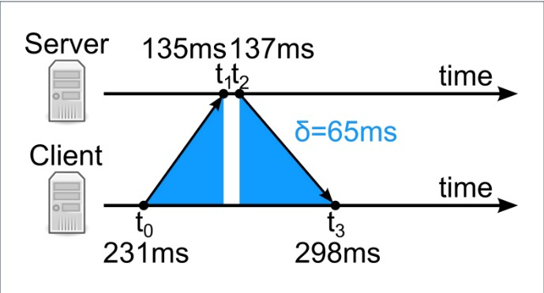

Data: 2026-05-26
[Infrastructure_Services](./README.md)
#Puzzle_Of_Knowledge/Computer_Science/System_And_Networks/IP_Services/Infrastructure_Services
___
# Index
- [[#Network Time Protocol (NTP)]]
    - [[#Panoramica]]
- [[#Versioni & Evoluzione]]
- [[#Come Funziona]]
    - [[#Algoritmo di Sincronizzazione]]
    - [[#Gerarchia Stratum]]
    - [[#Reference Identifiers (REFID)]]
- [[#Flusso Operativo]]
- [[#Casi d'Uso Reali]]
- [[#Limitazioni Tecniche]]
- [[#PDU & Incapsulamento]]
- [[#Struttura Del Pacchetto]]
    - [[#Header]]
    - [[#Body]]
    - [[#Flags]]
- [[#Porte e Protocolli Correlati]]
- [[#Confronto]]
- [[#Aspetti di Sicurezza]]
    - [[#Vulnerabilità Note]]
    - [[#Attacchi Comuni]]
    - [[#Contromisure]]
- [[#Comandi Cisco IOS]]
- [[#Troubleshooting]]
- [[#Note Esame]]
    - [[#Da sapere a memoria]]
    - [[#Trabocchetti frequenti]]
- [[#Quick Reference Card]]

___
# _Network Time Protocol (NTP)_

## Panoramica

|Caratteristica|Dettaglio|
|---|:-:|
|**Livello OSI**|7 — Applicazione|
|**Porta**|**123/UDP**|
|**Scopo**|Sincronizzare gli orologi dei computer all'interno di una rete a commutazione di pacchetto|
|**RFC / Standard**|RFC 958 (originale), RFC 5905 (NTPv4 — corrente)|
|**Tipo Connessione**|**Connectionless** (UDP) — può operare anche in broadcast/multicast|
|**Affidabilità**|**Non affidabile** — i tempi di latenza risultano spesso variabili|
|**PDU (Unità Dati)**|**Pacchetto NTP**|
|**Meccanismo di Controllo**|Correzione graduale dell'orologio tramite calcolo di **Round Trip Delay** e **Time Offset**|
___
# Versioni & Evoluzione

|Versione|Anno|Novità principali|
|---|---|---|
|NTPv1 (RFC 958)|1985|Prima versione — solo modalità client-server simmetrica|
|NTPv2 (RFC 1119)|1989|Aggiunta autenticazione crittografica|
|NTPv3 (RFC 1305)|1992|Miglioramento algoritmo di sincronizzazione, supporto broadcast/multicast|
|NTPv4 (RFC 5905)|2010|Versione corrente — supporto IPv6, miglioramento precisione, algoritmo Kiss-o'-Death|
|SNTP|—|Simple NTP — versione semplificata per client che non necessitano alta precisione|
___
# Come Funziona

Il client NTP interroga regolarmente uno o più server e **corregge gradualmente** il proprio orologio interno.
Poiché i tempi di latenza nelle reti a commutazione di pacchetto (Internet) sono **variabili e inaffidabili**, NTP nasce proprio per gestire tali criticità e garantire una **coerenza** temporale tra i nodi.

Il protocollo definisce:
- Un'architettura **client-server** (può essere anche **peer-to-peer**).
- Modalità di funzionamento **broadcast** e **multicast**: dopo la calibrazione iniziale, il client ascolta
  passivamente gli aggiornamenti del server.
- L'utilizzo della porta **UDP 123**.

**Timestamps**: l'implementazione si basa sull'invio e ricezione di timestamps, ovvero la rappresentazione dell'**ora del giorno** in cui è avvenuto un evento.

- 32 bit per i secondi
- 32 bit per le frazioni di secondi

**Leap Second**: il protocollo prevede la correzione del leap second (differenza tra tempo atomico e tempo terrestre) tramite un warning nel campo Leap Indicator. Lo corregge ogni volta che si verifica.

> [!NOTE] Nota
> **Nota**: NTP non fornisce informazioni su fusi orari o sul passaggio tra ora legale e ora solare.
## Algoritmo di Sincronizzazione
L'accuratezza massima si ottiene quando il ritardo dei pacchetti è **simmetrico**.
### Calcoli Principali

**Round Trip Delay** ($\delta$): misura il tempo totale dello spazio percorso dal pacchetto, escludendo il tempo di elaborazione del server.
$$\delta = (t_3 - t_0) - (t_2 - t_1)$$
**Time Offset** ($\theta$): rappresenta il tempo di ritardo medio.
$$\theta = \frac{(t_1 - t_0) + (t_3 - t_2)}{2}$$Dove:
- $t_0$ = timestamp di invio della richiesta del client
- $t_1$ = timestamp di ricezione della richiesta sul server
- $t_2$ = timestamp di invio della risposta del server
- $t_3$ = timestamp di ricezione della risposta dal client

I valori ottenuti sono sottoposti ad analisi statistiche:
- I valori anomali vengono **scartati**
- L'offset finale è calcolato sulla base degli ultimi 3 candidati validi
- Si raggiunge una **giusta sincronizzazione** quando l'offset finale è 0
## Gerarchia Stratum
NTP organizza le sorgenti di tempo in una gerarchia di livelli chiamata **stratum**, numerata per evitare cicli. I dispositivi in ogni stratum possono comunicare tra di loro per eseguire dei test.

| Stratum | Descrizione                                                                                                                                                                                                                                                                           |
| ----------- | ----------------------------------------------------------------------------------------------------------------------------------------------------------------------------------------------------------------------------------------------------------------------------------------- |
| **0**       | **Orologi atomici** nei satelliti: misurano il tempo con la frequenza di risonanza degli atomi. `GNSS` (sistema satellitare), `PTP` (Precise Time Protocol). Generano un **impulso** per secondo che attiva un **interrupt**. Nel protocollo NTP è indicato come stratum non specificato. |
| **1**       | Server primari collegati **direttamente** ai dispositivi Stratum 0. Sincronizzati con scarti di pochi microsecondi.                                                                                                                                                                       |
| **2**       | Sincronizzati con Stratum 1 attraverso la rete. Sono **client** per Stratum 1 (possono interrogare più server) e **server** per Stratum 3.                                                                                                                                                |
| **3**       | Sincronizzati con Stratum 2 attraverso la rete. Sono **client** per Stratum 2 e **server** per Stratum 4.                                                                                                                                                                                 |
| **...**     | ...                                                                                                                                                                                                                                                                                       |
| **15**      | Livello massimo consentito.                                                                                                                                                                                                                                                               |

Valori speciali:
- $0$ = Invalido / non specificato (Stratum 0 fisico)
- $1$ = Server Primario
- $2$–$15$ = Server Secondari
- $16$ = Non sincronizzato

> [!NOTE] Nota
> **Nota**: Il livello di stratum **non è** necessariamente un indicatore di qualità o affidabilità della sincronizzazione.

## Reference Identifiers (REFID)
Sono codici con cui il server identifica la propria sorgente temporale. Esempi comuni:

- `GPS`: Global Positioning System
- `PPS`: Generic Pulse-Per-Second

**Kiss-o'-Death (KoD)**: il campo REFID può contenere messaggi di stato speciali che ordinano al client di **interrompere** le interrogazioni al server.
___
# Flusso Operativo

```
Client                                                    Server
  |                                                          |
  |-------- Richiesta NTP (t0) ----------------------------->|
  |         [client registra t0]        [server registra t1] |
  |                                     [server registra t2] |
  |<-------- Risposta NTP (t3) ------------------------------|
  |         [client registra t3]                             |
  |                                                          |
  | Calcolo:                                                 |
  |   δ = (t3 - t0) - (t2 - t1)   → Round Trip Delay         |
  |   θ = [(t1-t0) + (t2-t3)] / 2 → Time Offset              |
  |                                                          |
  | [orologio corretto gradualmente di θ]                    |
```

|Fase|#|Azione|Note|
|---|---|---|---|
|**Richiesta**|1|Il client invia un pacchetto NTP al server (porta 123/UDP)|Il client registra il timestamp $t_0$|
|**Ricezione server**|2|Il server riceve la richiesta|Il server registra il timestamp $t_1$|
|**Risposta server**|3|Il server invia la risposta con $t_1$ e $t_2$ inclusi|Il server registra il timestamp $t_2$|
|**Ricezione client**|4|Il client riceve la risposta|Il client registra il timestamp $t_3$|
|**Calcolo e correzione**|5|Il client calcola $\delta$ e $\theta$, corregge l'orologio|Valori anomali scartati; media sugli ultimi 3|

___
# Casi d'Uso Reali

- **Sistemi distribuiti**: garantisce la coerenza temporale tra nodi in ambienti con più server che operano in parallelo (es. database distribuiti, cluster).
- **Settore Finanziario / Legale**: fondamentale per transazioni bancarie, firme digitali e operazioni in borsa, dove il timestamp è vincolante legalmente.
- **Protocolli di rete**: garantisce la coerenza temporale in DHCP, DNS e SNMP, evitando scadenze o rinnovi errati dei record.
- **Logging e audit**: in sistemi di sicurezza e SIEM, i log devono avere timestamp coerenti tra tutti i dispositivi per permettere la correlazione degli eventi.
___
# Limitazioni Tecniche

- **Latenza asimmetrica**: l'algoritmo assume un ritardo simmetrico nei due sensi. Se il percorso andata/ritorno è asimmetrico (frequente su Internet), l'accuratezza si riduce.
- **Nessuna gestione dei fusi orari**: NTP fornisce solo il tempo UTC; la conversione a ora locale e la gestione dell'ora legale spettano al sistema operativo.
- **Precisione limitata su Internet**: la precisione su reti WAN è nell'ordine delle **decine di millisecondi**; solo su LAN scende al di sotto del millisecondo.
- **Dipendenza dalla rete**: se il server NTP è irraggiungibile, il client non può sincronizzarsi e l'orologio locale può derivare nel tempo (clock drift).
___
# PDU & Incapsulamento

- **Nome PDU**: Pacchetto NTP
- **Incapsulato in**: Datagramma UDP (porta 123), a sua volta in pacchetto IP
- **Incapsula**: Payload applicativo (timestamps e parametri di sincronizzazione)

```
L1 [ Header Cavo/Wi-Fi ] PDU: Bit
	L2 [ Header Ethernet ] PDU: Frame
	    L3 [ Header IP ] PDU: Pacchetto
	        L4 [ Header UDP ] PDU: Datagramma
	             L7 [ Header NTP ] PDU: Pacchetto NTP
```
___
# Struttura Del Pacchetto

## Header

| Campo                    | Dimensione | Descrizione                                                                                                                                                 |
| ------------------------ | ---------- | ----------------------------------------------------------------------------------------------------------------------------------------------------------- |
| **Leap Indicator (LI)**  | 2 bit      | Avviso su secondi intercalari: `0` = no warning, `1` = ultimo minuto di 61s, `2` = ultimo minuto di 59s, `3` = non sincronizzato                            |
| **Version Number (VN)**  | 3 bit      | Indica la versione del protocollo utilizzata (attualmente 4)                                                                                                |
| **Mode**                 | 3 bit      | Specifica la modalità di associazione: `1`=attivo simmetrico, `2`=passivo simmetrico, `3`=client, `4`=server, `5`=broadcast, `6`=NTP control, `7`=riservato |
| **Stratum**              | 1 byte     | Indica il livello gerarchico del server (0–16)                                                                                                              |
| **Poll**                 | 1 byte     | Intervallo massimo tra messaggi consecutivi, in potenza di 2 (es. `6` = 64 secondi)                                                                         |
| **Precision**            | 1 byte     | Precisione dell'orologio di sistema, in potenza di 2 secondi (valore negativo)                                                                              |
| **Root Delay**           | 4 byte     | Ritardo totale accumulato fino all'orologio di riferimento primario (Stratum 1), in secondi frazionari                                                      |
| **Root Dispersion**      | 4 byte     | Dispersione massima rispetto all'orologio primario, in secondi frazionari                                                                                   |
| **Reference ID (REFID)** | 4 byte     | Identifica la sorgente temporale di riferimento (es. `GPS`, `PPS`); per Stratum ≥ 2 contiene l'IP del server upstream; può contenere messaggi KoD           |
| **Reference Timestamp**  | 8 byte     | Ora in cui l'orologio locale è stato sincronizzato l'ultima volta ($t_{ref}$)                                                                               |
| **Origin Timestamp**     | 8 byte     | Ora in cui la richiesta è partita dal client ($t_0$)                                                                                                        |
| **Receive Timestamp**    | 8 byte     | Ora in cui la richiesta è arrivata al server ($t_1$)                                                                                                        |
| **Transmit Timestamp**   | 8 byte     | Ora in cui la risposta è partita dal server ($t_2$); usato dal client come $t_3$ al momento della ricezione                                                 |

```
 0                   1                   2                   3
 0 1 2 3 4 5 6 7 8 9 0 1 2 3 4 5 6 7 8 9 0 1 2 3 4 5 6 7 8 9 0 1
+-+-+-+-+-+-+-+-+-+-+-+-+-+-+-+-+-+-+-+-+-+-+-+-+-+-+-+-+-+-+-+-+
|LI | VN  |Mode |    Stratum    |     Poll      |   Precision   |
+-+-+-+-+-+-+-+-+-+-+-+-+-+-+-+-+-+-+-+-+-+-+-+-+-+-+-+-+-+-+-+-+
|                          Root Delay (4B)                      |
+-+-+-+-+-+-+-+-+-+-+-+-+-+-+-+-+-+-+-+-+-+-+-+-+-+-+-+-+-+-+-+-+
|                       Root Dispersion (4B)                    |
+-+-+-+-+-+-+-+-+-+-+-+-+-+-+-+-+-+-+-+-+-+-+-+-+-+-+-+-+-+-+-+-+
|                     Reference ID — REFID (4B)                 |
+-+-+-+-+-+-+-+-+-+-+-+-+-+-+-+-+-+-+-+-+-+-+-+-+-+-+-+-+-+-+-+-+
|                   Reference Timestamp (8B)                    |
|                                                               |
+-+-+-+-+-+-+-+-+-+-+-+-+-+-+-+-+-+-+-+-+-+-+-+-+-+-+-+-+-+-+-+-+
|                    Origin Timestamp (8B)                      |
|                                                               |
+-+-+-+-+-+-+-+-+-+-+-+-+-+-+-+-+-+-+-+-+-+-+-+-+-+-+-+-+-+-+-+-+
|                    Receive Timestamp (8B)                     |
|                                                               |
+-+-+-+-+-+-+-+-+-+-+-+-+-+-+-+-+-+-+-+-+-+-+-+-+-+-+-+-+-+-+-+-+
|                    Transmit Timestamp (8B)                    |
|                                                               |
+-+-+-+-+-+-+-+-+-+-+-+-+-+-+-+-+-+-+-+-+-+-+-+-+-+-+-+-+-+-+-+-+
|                  Key Identifier (opzionale, 4B)               |
+-+-+-+-+-+-+-+-+-+-+-+-+-+-+-+-+-+-+-+-+-+-+-+-+-+-+-+-+-+-+-+-+
|                Message Digest (opzionale, 16B)                |
|                                                               |
|                                                               |
|                                                               |
+-+-+-+-+-+-+-+-+-+-+-+-+-+-+-+-+-+-+-+-+-+-+-+-+-+-+-+-+-+-+-+-+
```

## Body
NTP non ha un body separato dall'header: tutti i dati operativi (timestamps, REFID, delay) sono contenuti nei campi dell'header stesso. I campi opzionali **Key Identifier** e **Message Digest** sono aggiunti in coda per l'autenticazione crittografica.

## Flags
Il primo byte del pacchetto NTP combina tre campi distinti:

|Bit|Campo|Valori|
|---|---|---|
|7–6|**Leap Indicator (LI)**|`00` = no warning; `01` = ultimo minuto 61s; `10` = ultimo minuto 59s; `11` = non sincronizzato|
|5–3|**Version Number (VN)**|`100` = NTPv4 (versione corrente)|
|2–0|**Mode**|`001`=simm. attivo; `010`=simm. passivo; `011`=client; `100`=server; `101`=broadcast; `110`=NTP ctrl; `111`=riservato|
___
# Porte e Protocolli Correlati

| Porta       | Livello OSI          | Protocollo | Uso                                                  |
| ----------- | -------------------- | ---------- | ---------------------------------------------------- |
| **123/UDP** | **7** (Applicazione) | NTP        | Sia client che server utilizzano la stessa porta 123 |
___
# Confronto

**NTP vs PTP (Precision Time Protocol)**

|Caratteristica|NTP|PTP (IEEE 1588)|
|---|---|---|
|**Precisione**|Decine di ms (WAN), <1 ms (LAN)|Ordine dei nanosecondi / microsecondi|
|**Complessità**|Bassa — software-only|Alta — richiede supporto hardware|
|**Ambito**|Reti IP generiche (Internet, LAN)|Reti industriali, telecomunicazioni, finanza|
|**Porta**|123/UDP|319/320 UDP|
|**Gerarchia**|Stratum (0–16)|Master / Slave / Boundary Clock|
|**Utilizzo tipico**|Sincronizzazione generale server e PC|Sistemi che richiedono alta precisione|

**NTP vs SNTP**

|Caratteristica|NTP|SNTP|
|---|---|---|
|**Algoritmo**|Completo — filtraggio e analisi statistica|Semplificato — singola stima dell'offset|
|**Precisione**|Maggiore|Minore|
|**Complessità**|Alta|Bassa|
|**Utilizzo**|Server e dispositivi critici|Client semplici, dispositivi embedded|
___
# Aspetti di Sicurezza

## Vulnerabilità Note
- **Assenza di autenticazione nativa**: senza autenticazione crittografica, qualsiasi host può spacciarsi per un server NTP legittimo.
- **Traffico in chiaro**: i pacchetti NTP viaggiano in chiaro; un attaccante sulla rete può intercettare e analizzare le comunicazioni.
- **Amplification**: i server NTP possono essere sfruttati per attacchi DDoS di amplificazione (una piccola richiesta genera una risposta molto più grande).

## Attacchi Comuni
- **Man-in-the-Middle (MITM)**: un attaccante intercetta i pacchetti NTP e altera i timestamp, modificando l'orologio del client. Può essere usato per bypassare la scadenza delle chiavi di crittografia o invalidare certificati digitali.
- **DoS / DDoS tramite NTP Amplification**: l'attaccante invia richieste con IP sorgente falsificato (spoofing) a server NTP pubblici, i quali inviano risposte molto più grandi alla vittima (fattore di amplificazione fino a 556x con il comando `monlist`).
- **Rogue NTP Server**: un server NTP non autorizzato risponde ai client con timestamp errati, causando una desincronizzazione controllata dall'attaccante.

## Contromisure
- **Autenticazione crittografica**: NTPv3/v4 supportano autenticazione tramite MD5 o SHA. Assicura che il client riceva risposte solo da server fidati.
- **NTS (Network Time Security)**: estensione moderna di sicurezza per NTPv4 (RFC 8915) che usa TLS/AEAD per autenticazione e integrità, senza richiedere segreti condivisi pre-configurati.
- **Disabilitazione di `monlist`**: il comando `monlist` nei server NTP vecchi restituisce l'elenco dei client recenti — usato per amplificazione; va disabilitato (`noquery` nelle ACL ntpd).
- **Filtraggio UDP 123**: limitare tramite firewall le sorgenti autorizzate a interrogare i server NTP esposti.
- **Utilizzo di pool NTP interni**: usare server NTP interni (Stratum 1/2 privati) invece di server pubblici riduce la superficie d'attacco.

___
# Comandi Cisco IOS

```cisco
! Configurare il router come client NTP
ntp server 192.168.1.1

! Configurare il router come client NTP con preferenza
ntp server 192.168.1.1 prefer

! Configurare il router come server NTP master (Stratum specificato)
ntp master 3

! Configurare autenticazione NTP
ntp authenticate
ntp authentication-key 1 md5 CHIAVE_SEGRETA
ntp trusted-key 1
ntp server 192.168.1.1 key 1

! Verificare la sincronizzazione NTP
show ntp status

! Verificare le associazioni NTP (server configurati e stato)
show ntp associations

! Verificare dettagli delle associazioni
show ntp associations detail

! Debug NTP
debug ntp events
debug ntp packets
```
___
# Troubleshooting

**Sintomi comuni**:

|Sintomo / Errore|Possibili Cause Tecniche|Descrizione del Fenomeno|
|---|---|---|
|**Orologio non sincronizzato**|Server NTP non raggiungibile, firewall blocca UDP 123, Stratum 16|Il dispositivo mostra stato "unsynchronised" — verificare raggiungibilità del server e regole firewall|
|**Offset elevato (>1 secondo)**|Server NTP di scarsa qualità, latenza asimmetrica, clock drift eccessivo|La differenza di tempo tra client e server è troppo alta; NTP può rifiutarsi di correggere (step vs slew)|
|**Stratum troppo alto (es. 15)**|Catena di sincronizzazione troppo lunga, server upstream degradati|La precisione degrada man mano che ci si allontana dallo Stratum 1|
|**KoD (Kiss-o'-Death) ricevuto**|Il server ha bloccato il client per troppe richieste o policy|Il campo REFID contiene un codice KoD — il client deve interrompere le interrogazioni verso quel server|
|**Tempo scattato bruscamente (step)**|Offset > 128ms (soglia di default ntpd) — correzione immediata invece di slew|Può causare problemi ad applicazioni sensibili al tempo (Kerberos, TLS, DB)|

**Comandi di verifica**:

```bash
# Linux — verifica stato sincronizzazione NTP (systemd-timesyncd)
timedatectl status

# Linux — verifica con ntpq (se si usa ntpd)
ntpq -p

# Linux — forza risincronizzazione
sudo ntpdate -u 0.it.pool.ntp.org

# Linux — verifica con chronyc (se si usa chrony)
chronyc tracking
chronyc sources -v

# Verifica raggiungibilità server NTP (UDP 123)
nc -zuv 192.168.1.1 123

# Cattura traffico NTP (Wireshark / tcpdump)
tcpdump -i eth0 port 123
```

**Cause frequenti**:

|Problema|Causa Tecnica|Sintomo e Comportamento|
|---|---|---|
|**Dispositivo a Stratum 16**|Nessun server raggiungibile o tutti i server scartati|Il dispositivo non sincronizza — verificare connettività e lista server|
|**Correzione non applicata**|Offset troppo grande (>1000s) — ntpd si rifiuta di correggere|Necessario `ntpdate` manuale per allineare l'orologio prima di avviare ntpd|
|**Deriva eccessiva (drift)**|Hardware clock di scarsa qualità o temperatura variabile|L'orologio si allontana rapidamente dal tempo reale tra un polling e l'altro|
|**MTU Mismatch**|Differenza nella dimensione massima dei pacchetti tra due nodi|I pacchetti piccoli (ACK) passano, quelli grandi vengono scartati se hanno il flag **DF** (Don't Fragment)|
___
# Note Esame

## Da sapere a memoria

|Argomento|Dettagli Tecnici|
|---|---|
|**Definizione**|Layer 7, sincronizza gli orologi dei computer via rete a commutazione di pacchetto|
|**Porta**|**123/UDP** — usata sia da client che da server|
|**Precisione**|Decine di ms su Internet, <1 ms su LAN|
|**Timestamps**|64 bit: 32 bit secondi + 32 bit frazioni di secondo|
|**Leap Second**|Corretto tramite Leap Indicator nel pacchetto; NTP non gestisce fusi orari né ora legale|
|**Round Trip Delay (δ)**|$\delta = (t_3 - t_0) - (t_2 - t_1)$|
|**Time Offset (θ)**|$\theta = [(t_1 - t_0) + (t_2 - t_3)] / 2$|
|**Gerarchia Stratum**|0 = orologio atomico (non in rete), 1 = server primario, 2–15 = server secondari, 16 = non sincronizzato|
|**Stratum 16**|Indica che il dispositivo **non è sincronizzato**|
|**REFID**|Identifica la sorgente temporale; contiene messaggi KoD per bloccare il client|
|**KoD**|Kiss-o'-Death — il server ordina al client di interrompere le interrogazioni|
|**Leap Indicator (LI)**|`00`=ok, `01`=minuto da 61s, `10`=minuto da 59s, `11`=non sincronizzato|
|**Mode**|`3`=client, `4`=server, `5`=broadcast|
|**Sicurezza**|Vulnerabile a MITM senza autenticazione; NTS (RFC 8915) è la soluzione moderna|
|**NTP Amplification**|Attacco DDoS che sfrutta `monlist` — mitigato disabilitando il comando e filtrando UDP 123|
## Trabocchetti frequenti

|Concetto Errato|Realtà Tecnica|
|---|---|
|**NTP usa TCP**|**FALSO**. NTP usa esclusivamente **UDP** — porta 123. Non c'è handshake TCP.|
|**NTP gestisce i fusi orari**|**FALSO**. NTP fornisce solo il tempo **UTC**. La conversione locale spetta al sistema operativo.|
|**Stratum 0 è accessibile via rete**|**FALSO**. Gli orologi Stratum 0 (atomici, GPS) non sono direttamente accessibili via NTP; si collegano fisicamente ai server Stratum 1.|
|**Un Stratum basso garantisce alta qualità**|**FALSO** (o almeno non sempre). Il livello stratum non è necessariamente un indicatore di qualità o affidabilità.|
|**Client e server NTP usano porte diverse**|**FALSO**. Sia client che server usano la stessa porta **123/UDP**, a differenza di DHCP che usa 67 e 68.|
|**NTP corregge immediatamente grandi differenze**|**DIPENDE**. ntpd usa la modalità _slew_ (correzione graduale) per offset piccoli e _step_ (correzione immediata) solo se l'offset supera la soglia (default ~128ms).|
___
# Quick Reference Card

```
PORTA:
  123/UDP → sia client che server NTP (stessa porta per entrambi)

ALGORITMO DI SINCRONIZZAZIONE:
  t0 = client invia richiesta
  t1 = server riceve richiesta
  t2 = server invia risposta
  t3 = client riceve risposta

  Round Trip Delay:  δ = (t3 - t0) - (t2 - t1)
  Time Offset:       θ = [(t1 - t0) + (t2 - t3)] / 2
  Sincronizzato quando θ → 0

GERARCHIA STRATUM:
  0    → Orologi atomici/GPS (fisici, non in rete via NTP)
  1    → Server primari (connessi fisicamente a Stratum 0)
  2–15 → Server secondari (sincronizzati via rete)
  16   → Non sincronizzato

CAMPI HEADER CHIAVE:
  LI   → Leap Indicator (2 bit): 00=ok, 01=+1s, 10=-1s, 11=unsync
  VN   → Version Number (3 bit): 100 = NTPv4
  Mode → 011=client, 100=server, 101=broadcast
  REFID → Identificatore sorgente temporale (es. GPS, PPS) o KoD

TIMESTAMPS (64 bit ciascuno):
  Reference  → ultima sincronizzazione dell'orologio locale
  Origin     → t0 (invio richiesta client)
  Receive    → t1 (ricezione richiesta server)
  Transmit   → t2 (invio risposta server) / usato come t3 lato client

PRECISIONE:
  Internet (WAN) → decine di millisecondi
  LAN            → sotto il millisecondo

SICUREZZA:
  MITM             → autenticazione crittografica (MD5/SHA) o NTS (RFC 8915)
  NTP Amplification → disabilitare monlist, filtrare UDP 123
  Rogue NTP Server  → usare server interni fidati + autenticazione

CISCO IOS:
  ntp server <IP>          → configura server NTP
  ntp master <stratum>     → abilita il router come server NTP
  ntp authenticate         → abilita autenticazione NTP
  show ntp status          → stato sincronizzazione
  show ntp associations    → server configurati e stato

REGOLE CHIAVE:
  - NTP usa SOLO UDP — mai TCP
  - Stessa porta (123) per client e server — diverso da DHCP
  - NTP non gestisce fusi orari né ora legale — solo UTC
  - Stratum 0 non è raggiungibile via NTP (collegamento fisico diretto)
  - Stratum 16 = non sincronizzato
  - Il livello di stratum non indica necessariamente la qualità della sorgente
  - KoD nel REFID = il server sta chiedendo al client di smettere di interrogarlo
```
___