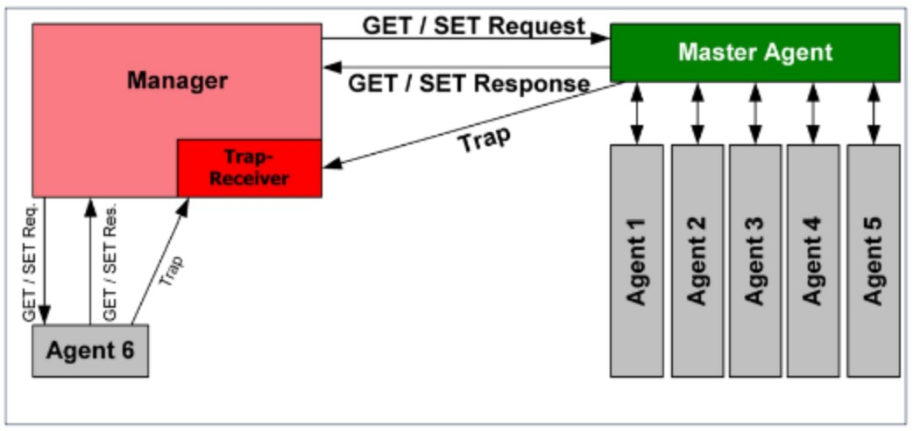

Data: 2026-05-27
[Infrastructure_Services](./README.md)
#Puzzle_Of_Knowledge/Computer_Science/System_And_Networks/IP_Services/Infrastructure_Services
___
# Index
- [[#Simple Network Management Protocol (SNMP)]]
    - [[#Panoramica]]
- [[#Versioni & Evoluzione]]
- [[#Come Funziona]]
    - [[#Le 5 Componenti dell'Architettura SNMP]]
        - [[#Managed Component]]
        - [[#Subagent]]
        - [[#Management Information Base (MIB)]]
        - [[#Master Agent]]
        - [[#SNMP Network Manager]]
    - [[#Polling e Trap]]
- [[#Flusso Operativo]]
- [[#Casi d'Uso Reali]]
- [[#Limitazioni Tecniche]]
- [[#PDU & Incapsulamento]]
- [[#Struttura Del Pacchetto]]
    - [[#Header]]
    - [[#Body]]
    - [[#Flags]]
- [[#Porte e Protocolli Correlati]]
- [[#Confronto]]
- [[#Aspetti di Sicurezza]]
    - [[#Vulnerabilità Note]]
    - [[#Attacchi Comuni]]
    - [[#Contromisure]]
- [[#Comandi Cisco IOS]]
- [[#Troubleshooting]]
- [[#Note Esame]]
    - [[#Da sapere a memoria]]
    - [[#Trabocchetti frequenti]]
- [[#Quick Reference Card]]
___
# _Simple Network Management Protocol (SNMP)_

## Panoramica

|Caratteristica|Dettaglio|
|---|:-:|
|**Livello OSI**|7 — Applicazione|
|**Porta**|**161/UDP** (richieste/risposte) · **162/UDP** (trap)|
|**Scopo**|Raccogliere informazioni dai dispositivi di rete, monitorarne lo stato e modificarne la configurazione|
|**RFC / Standard**|RFC 1157 (SNMPv1) · RFC 1901/1905/1906 (SNMPv2c) · RFC 3411-3418 (SNMPv3)|
|**Tipo Connessione**|**Connectionless** (UDP)|
|**Affidabilità**|**Non affidabile** (nessuna conferma su UDP)|
|**PDU (Unità Dati)**|**Messaggio SNMP**|
|**Meccanismo di Controllo**|Modello **manager/agent**: il manager interroga gli agent (polling) o riceve notifiche asincrone (trap)|
___
# Versioni & Evoluzione

| Versione | Anno      | Novità principali                                                                                     |
| -------- | --------- | ----------------------------------------------------------------------------------------------------- |
| SNMPv1   | 1988      | Prima versione — autenticazione tramite community string in chiaro; solo GetRequest, SetRequest, Trap |
| SNMPv2c  | 1993/1996 | Aggiunge GetBulkRequest e InformRequest; community string ancora in chiaro; PDU rinominate            |
| SNMPv2u  | —         | Tentativo fallito di aggiungere sicurezza a v2; non adottato                                          |
| SNMPv3   | 1999/2002 | Autenticazione (MD5/SHA) e cifratura (DES/AES); modello di sicurezza USM e controllo accessi VACM     |
___
# Come Funziona

L'**SNMP** è un protocollo di **Layer 7** che opera secondo un modello **manager/agent** (analogo al client/server): 
- il **Network Manager** interroga i dispositivi di rete, raccoglie dati statistici e può modificarne la configurazione; 
- gli **agent** residenti sui dispositivi rispondono alle richieste e possono inviare notifiche asincrone.

I dati scambiati sono strutturati in un database gerarchico chiamato **MIB (Management Information Base)**, dove ogni oggetto è identificato univocamente da un **OID (Object IDentifier)**.

## Le 5 Componenti dell'Architettura SNMP


1. **Managed Component**: il dispositivo fisico o virtuale da monitorare (router, switch, server, stampante…).
2. **Subagent**: il software installato sul Managed Component che raccoglie i dati tecnici specifici del dispositivo.
3. **Management Information Base (MIB)**: il database gerarchico che descrive lo stato e la configurazione del Managed Component tramite OID.
4. **Master Agent**: l'interfaccia software tra il Network Manager e i subagent locali.
5. **SNMP Network Manager**: il software che interroga i master agent per ottenere statistiche e inviare comandi di configurazione.

### Managed Component
È l'hardware o software fisico (router, switch, server, stampante) che ospita i subagent. Ogni dispositivo gestito deve avere almeno un master agent attivo per poter essere monitorato.

### Subagent
Il **subagent** è il software installato sul dispositivo di rete che fornisce le informazioni specifiche al master agent.

- **Specificità**: un singolo dispositivo può avere più subagent, ognuno dedicato a un componente (es. uno per la CPU, uno per la memoria, uno per la temperatura).
- **Feedback**: notifica il master agent in caso di richieste non disponibili o invalide.

### Management Information Base (MIB)
Il **MIB** è un database strutturato **gerarchicamente ad albero** in cui vengono archiviati gli **OID (Object IDentifier)** degli oggetti del dispositivo.

Ogni nodo dell'albero rappresenta una variabile gestita (es. numero di interfacce, byte inviati, stato della CPU).

**Tipologie di MIB:**

- **Standard di settore**: oggetti comuni a tutti i produttori (es. `SNMPv2-MIB`, `IF-MIB`).
- **Proprietari (Vendor MIB)**: oggetti specifici definiti dal produttore del dispositivo (es. `CISCO-MEMORY-POOL-MIB`).

**Esempio di OID**: `1.3.6.1.2.1.1.1.0` → `iso.org.dod.internet.mgmt.mib-2.system.sysDescr.0`

### Master Agent
Il **master agent** è il software che fornisce l'interfaccia tra il Network Manager e i vari subagent locali. È indispensabile per monitorare e gestire il componente.

**Task principali:**

1. **Inoltro richieste**: riceve le richieste dal Manager, le formatta e le invia ai subagent competenti.
2. **Inoltro risposte**: raccoglie i dati dai subagent, li formatta e li restituisce al Manager.
3. **Gestione errori**: informa il Network Manager di richieste non valide o non disponibili.

### SNMP Network Manager
Il **Network Manager** è il software utilizzato dall'amministratore per supervisionare la rete. Permette:

- **Monitoraggio**: controllo remoto e in tempo reale dei dispositivi.
- **Misurazione**: campionamento periodico dei dati per creare serie storiche.
- **Statistiche**: grafici e report sulle prestazioni di dispositivi e rete.

SNMP usa **UDP** per minimizzare l'occupazione di banda. È possibile avere più manager attivi contemporaneamente.

L'accesso al subagent può essere:

- **Unidirezionale** (read-only): solo monitoraggio, nessuna modifica.
- **Bidirezionale** (read-write): monitoraggio e configurazione remota.

## Polling e Trap
Il sistema SNMP non è solo passivo:

- **Polling**: il Network Manager interroga periodicamente i dispositivi per raccogliere dati statistici (modello pull).
- **Trap**: notifica asincrona inviata dal subagent al Network Manager al verificarsi di una condizione preconfigurata (modello push). Dopo una trap, il manager può interrogare specificamente il componente per determinare la causa del problema.
___
# Flusso Operativo

**Scenario GetRequest (polling standard)**:

```
Network Manager              Master Agent / Subagent
       |                              |
       |------- GetRequest (OID) ---->|
       |                              |  (subagent legge il valore dall'MIB)
       |<------ Response (valore) ----|
       |                              |

Network Manager              Master Agent / Subagent
       |                              |
       |<------- Trap (evento) -------|
       |                              |
       |------ GetRequest (dettagli)->|
       |<------ Response -------------|
```

|Fase|#|Azione|Generato|Ricevuto|Note|
|---|---|---|---|---|---|
|**Polling**|1|Il Manager invia GetRequest con OID desiderato|Network Manager|Master Agent|UDP porta 161; include community string|
||2|Il Master Agent invia la richiesta al Subagent|Master Agent|Subagent|Inoltro interno al componente MIB|
||3|Il Subagent legge il valore e risponde|Subagent|Master Agent|Dati letti dall'MIB locale|
||4|Il Master Agent invia la Response al Manager|Master Agent|Network Manager|UDP porta 161; contiene il valore richiesto|
|**Trap**|5|Si verifica un evento critico sul dispositivo|—|—|Es. interfaccia down, soglia CPU superata|
||6|Il Subagent invia una Trap al Network Manager|Master Agent|Network Manager|UDP porta 162; nessuna conferma in SNMPv1/v2c|
||7|(v2c/v3) Il Manager risponde con InformRequest|Network Manager|Master Agent|Solo se usato InformRequest (con ACK)|
|**Configurazione**|8|Il Manager invia SetRequest per modificare un valore|Network Manager|Master Agent|Accesso read-write richiesto|
||9|Il Master Agent applica la modifica e risponde|Master Agent|Network Manager|Response conferma il nuovo valore|
___
# Casi d'Uso Reali

- **Monitoraggio banda interfacce**: un NMS (es. Zabbix, PRTG) interroga periodicamente via SNMP i contatori `ifInOctets` / `ifOutOctets` (IF-MIB) per calcolare il traffico in ingresso/uscita su ogni interfaccia di un router.
- **Alert disponibilità dispositivo**: il subagent è configurato per inviare una Trap `linkDown` al manager quando un'interfaccia fisica va offline — il NOC riceve un allarme in tempo reale senza dover fare polling continuo.
- **Inventario automatico di rete**: il manager esegue un GetBulkRequest sull'albero MIB dei dispositivi per raccogliere automaticamente informazioni su modello, versione firmware e configurazione — utile per la gestione degli asset.
- **Configurazione remota**: tramite SetRequest (con accesso read-write) è possibile modificare parametri di un dispositivo da remoto, es. abilitare/disabilitare un'interfaccia o cambiare un valore di soglia, senza accedere via CLI.
___
# Limitazioni Tecniche

- **Nessuna affidabilità nativa su UDP**: le PDU SNMP viaggiano su UDP, quindi pacchetti persi non vengono ritrasmessi automaticamente (solo InformRequest in SNMPv2 prevede un ACK).
- **Scalabilità del polling**: in reti molto grandi, il polling sincrono di migliaia di dispositivi genera overhead di banda e latenza; il paradigma push (trap) aiuta, ma non elimina il problema.
- **Overhead GetBulkRequest limitato**: SNMPv1 usa GetNextRequest per la scansione dei MIB, molto inefficiente su alberi grandi; GetBulkRequest (v2c+) migliora ma non è equivalente a una query database.
- **Dimensione delle community string**: in SNMPv1 e v2c, la community string funge da unica credenziale — non esiste granularità utente/ruolo.
- **Visibilità limitata senza vendor MIB**: senza i MIB proprietari del produttore installati sul manager, molti OID appaiono come numeri non leggibili, rendendo il monitoraggio parziale.
___
# PDU & Incapsulamento

- **Nome PDU**: Messaggio SNMP
- **Incapsulato in**: Datagramma UDP (porta 161 per richieste/risposte, porta 162 per trap)
- **Incapsula**: Il payload applicativo (variable bindings con OID e valori)

```
L1 [ Header Cavo/Wi-Fi ] PDU: Bit
	L2 [ Header Ethernet ] PDU: Frame
	    L3 [ Header IP ] PDU: Pacchetto
	        L4 [ Header UDP ] PDU: Datagramma
	             L7 [ Header SNMP ] PDU: Messaggio SNMP
	                  [ Variable Bindings (OID + Valore) ]
```
___
# Struttura Del Pacchetto

## Header

|Campo|Dimensione|Descrizione|
|---|---|---|
|**IP Header**|20 byte|Header IP standard|
|**UDP Header**|8 byte|Porta sorgente e destinazione (161 o 162), lunghezza, checksum|
|**Version**|Variabile|Versione SNMP: `0`=v1, `1`=v2c, `3`=v3|
|**Community**|Variabile|Stringa di autenticazione (v1/v2c) — equivalente a una password in chiaro|
|**PDU-Type**|1 byte|Tipo di PDU: GetRequest, SetRequest, Response, Trap, ecc.|
|**Request-ID**|4 byte|Identificatore della transazione per abbinare richiesta e risposta|
|**Error-Status**|4 byte|Codice errore: `0`=noError, `1`=tooBig, `2`=noSuchName, `3`=badValue…|
|**Error-Index**|4 byte|Indice della variable binding che ha causato l'errore (0 se nessun errore)|

```
+------------------+------------------+
|    IP Header     |    UDP Header    |
+--------+---------+----------+-------+-------+------------+-------------+
| version| community| PDU-Type |req-id |error  | error-index| variable    |
|        |          |          |       |status |            | bindings    |
+--------+----------+----------+-------+-------+------------+-------------+
```

## Body
Il corpo del messaggio SNMP è composto dalla sezione **Variable Bindings (VarBind)**: una lista di coppie `OID → Valore` che specifica gli oggetti richiesti (nella query) o i valori restituiti/impostati (nella risposta).

|Campo|Descrizione|
|---|---|
|**OID**|Object IDentifier — percorso gerarchico che identifica univocamente l'oggetto nel MIB|
|**Value**|Valore dell'oggetto (Integer, OctetString, Counter32, Gauge32, TimeTicks, IpAddress, OID…)|

In una **GetRequest** il campo Value è vuoto (null); nella **Response** contiene il valore letto dal dispositivo. In una **SetRequest** il campo Value contiene il nuovo valore da applicare.

## Flags
SNMP non ha un campo flags dedicato come TCP/DNS. Il controllo del flusso è gestito dai campi **PDU-Type**, **Error-Status** ed **Error-Index**.

|Campo|Valore|Significato|
|---|---|---|
|**Error-Status**|`0`|noError — nessun errore|
||`1`|tooBig — la risposta è troppo grande per il buffer|
||`2`|noSuchName — l'OID richiesto non esiste (v1)|
||`3`|badValue — valore non valido in SetRequest|
||`4`|readOnly — tentativo di scrittura su OID read-only|
||`5`|genErr — errore generico|
___
# Porte e Protocolli Correlati

|Porta|Livello OSI|Protocollo|Uso|
|---|---|---|---|
|**161**|**7** (Applicazione)|SNMP - UDP|Richieste del Manager all'Agent e risposte|
|**162**|**7** (Applicazione)|SNMP - UDP|Trap e InformRequest dall'Agent al Manager|
|**10161**|**7** (Applicazione)|SNMPv3 TLS|SNMP over TLS (RFC 6353) — versione sicura con cifratura|
|**10162**|**7** (Applicazione)|SNMPv3 TLS|Trap SNMP over TLS|
___
# Confronto

**SNMPv1 vs SNMPv2c vs SNMPv3**

|Caratteristica|SNMPv1|SNMPv2c|SNMPv3|
|---|---|---|---|
|**Autenticazione**|Community string in chiaro|Community string in chiaro|USM: MD5 o SHA (hashing)|
|**Cifratura**|Nessuna|Nessuna|DES, 3DES, AES|
|**Controllo accessi**|Per community|Per community|VACM: granulare per utente/gruppo/OID|
|**PDU GetBulk**|Non supportata|Supportata|Supportata|
|**InformRequest**|Non supportata|Supportata (ACK garantito)|Supportata|
|**Gestione errori**|Limitata|Migliorata|Completa con ReportPDU|
|**Compatibilità**|Universale|Molto diffusa|Richiesta configurazione più complessa|
___
# Aspetti di Sicurezza

## Vulnerabilità Note
- **Community string in chiaro (v1/v2c)**: la stringa di autenticazione viaggia non cifrata su UDP — chiunque possa catturare il traffico di rete può leggerla e utilizzarla per interrogare o modificare i dispositivi.
- **Community string di default**: molti dispositivi escono dalla fabbrica con community string note (`public` per read-only, `private` per read-write) che spesso non vengono cambiate durante la configurazione.
- **Nessuna integrità del messaggio (v1/v2c)**: un attaccante può modificare i pacchetti SNMP in transito senza che il destinatario se ne accorga.
- **Assenza di cifratura (v1/v2c)**: tutti i dati MIB (configurazione, topologia, statistiche) vengono trasmessi in chiaro, esponendo informazioni sensibili sull'infrastruttura.
- **UDP spoofing**: l'assenza di un handshake rende relativamente semplice falsificare l'IP sorgente per inviare trap o richieste fasulle.

## Attacchi Comuni
- **Community String Brute Force**: un attaccante tenta community string comuni o le indovina tramite dizionario — se ottiene la community read-write (`private`), può riconfigurare il dispositivo da remoto.
- **SNMP Enumeration**: un attaccante con la community read-only ottiene tramite GetBulkRequest l'intero MIB del dispositivo, rivelando topologia di rete, versioni software, tabelle di routing e utenti configurati.
- **SNMP Amplification (DDoS)**: l'attaccante invia GetBulkRequest con IP sorgente falsificato (IP della vittima) a dispositivi con SNMP esposto su Internet — la risposta (molto più grande della richiesta) viene inviata alla vittima, amplificando il traffico DDoS.
- **Replay Attack (v1/v2c)**: un pacchetto SNMP catturato (es. una SetRequest) può essere ritrasmesso per ripetere la stessa azione sul dispositivo.
- **MITM su SetRequest**: in assenza di cifratura, un attaccante interposto può modificare i valori di una SetRequest per alterare la configurazione del dispositivo.

## Contromisure
- **Migrare a SNMPv3**: usa autenticazione con hash (MD5/SHA) e cifratura (AES) — elimina le vulnerabilità di v1/v2c.
- **Cambiare le community string di default**: sostituire `public`/`private` con stringhe casuali e complesse; trattarle come password.
- **ACL su SNMP**: limitare via access-list quali indirizzi IP possono interrogare i dispositivi via SNMP (solo gli indirizzi del NMS autorizzato).
- **Read-only dove possibile**: configurare accesso read-write solo se strettamente necessario; la maggior parte del monitoraggio richiede solo read-only.
- **Non esporre SNMP su Internet**: filtrare le porte UDP 161/162 al perimetro della rete — SNMP è pensato per reti di gestione interne (OOB management).
- **Management VLAN dedicata**: isolare il traffico SNMP in una VLAN di gestione separata, non accessibile dagli utenti ordinari.
- **SNMPv3 con VACM**: configurare il View-based Access Control Model per limitare quali OID ogni utente o gruppo può leggere/scrivere.
___
# Comandi Cisco IOS

```cisco
! Abilitare SNMP read-only con community string
snmp-server community PUBLIC_STRING ro

! Abilitare SNMP read-write con community string
snmp-server community PRIVATE_STRING rw

! Limitare l'accesso SNMP a specifici IP tramite ACL
access-list 10 permit 192.168.1.100
snmp-server community PUBLIC_STRING ro 10

! Configurare il trap receiver (dove inviare le trap)
snmp-server host 192.168.1.100 version 2c PUBLIC_STRING

! Abilitare trap specifiche
snmp-server enable traps snmp linkdown linkup
snmp-server enable traps config
snmp-server enable traps bgp

! Configurare SNMP contact e location (buona pratica)
snmp-server contact admin@example.com
snmp-server location "Server Room A - Rack 3"

! Configurare SNMPv3 (autenticazione + cifratura)
snmp-server group MYGROUP v3 priv
snmp-server user MYUSER MYGROUP v3 auth sha AUTHPASSWORD priv aes 128 PRIVPASSWORD

! Verificare la configurazione SNMP
show snmp
show snmp community
show snmp host
show snmp user
show snmp group

! Debug SNMP (solo in lab — verbose)
debug snmp packets
```
___
# Troubleshooting

**Sintomi comuni**:

|Sintomo / Errore|Possibili Cause Tecniche|Descrizione del Fenomeno|
|---|---|---|
|**NMS non riceve risposta dal device**|Community string errata, firewall blocca UDP 161|Il manager invia GetRequest ma non riceve Response — verificare community e connettività porta 161|
|**Trap non arrivano al manager**|Trap receiver non configurato, firewall blocca 162|Il dispositivo genera eventi ma il manager non li riceve — verificare `snmp-server host`|
|**OID non trovato (noSuchName)**|OID non supportato dalla versione MIB del device|Error-Status=2 nella risposta — l'OID richiesto non esiste nel MIB di quel dispositivo|
|**Risposta tooBig**|GetBulkRequest con troppe voci, buffer insufficiente|Error-Status=1 — ridurre il numero di OID richiesti o usare GetNextRequest iterativo|
|**Enumerazione MIB lenta**|Uso di GetNextRequest in v1 su alberi grandi|Migrazione a SNMPv2c/v3 e utilizzo di GetBulkRequest|
|**SNMPv3 — authentication failure**|Password non corrispondente, engine ID errato|Il master agent rifiuta la PDU — verificare auth password e privacy password; sincronizzare engine ID|

**Comandi di verifica**:

```bash
# Test SNMP base (Linux con snmp-utils)
snmpwalk -v2c -c PUBLIC_STRING 192.168.1.1 1.3.6.1.2.1.1    # Cammina il MIB system
snmpget  -v2c -c PUBLIC_STRING 192.168.1.1 1.3.6.1.2.1.1.1.0 # Legge sysDescr
snmpset  -v2c -c PRIVATE_STRING 192.168.1.1 OID s "valore"   # Imposta un valore

# Test con SNMPv3
snmpwalk -v3 -l authPriv -u MYUSER -a SHA -A AUTHPASSWORD -x AES -X PRIVPASSWORD 192.168.1.1 system

# Cattura traffico SNMP
tcpdump -i eth0 udp port 161 or udp port 162

# Verifica porta 161 raggiungibile
nc -zuv 192.168.1.1 161

# Cisco IOS — verifica counters SNMP
show snmp
show snmp packets   # pacchetti inviati/ricevuti/errori
```

**Cause frequenti**:

|Problema|Causa Tecnica|Sintomo e Comportamento|
|---|---|---|
|**MTU Mismatch**|Differenza nella dimensione massima dei pacchetti tra due nodi|I pacchetti piccoli (GetRequest) passano, le risposte grandi (GetBulkResponse) vengono scartate|
|**Community string case-sensitive**|SNMP distingue maiuscole/minuscole nella community string|`Public` ≠ `public` — il device risponde con errore di autenticazione silenzioso (nessuna Response)|
|**Clock non sincronizzato (v3)**|SNMPv3 usa time-based anti-replay — clock sfasato > 150s|Il master agent rifiuta PDU ritenute replay — sincronizzare NTP su manager e device|
___
# Note Esame

## Da sapere a memoria

|Argomento|Dettagli Tecnici|
|---|---|
|**Definizione**|Layer 7, modello manager/agent, raccolta e modifica informazioni dispositivi di rete|
|**Porte**|**161/UDP** — richieste/risposte; **162/UDP** — trap e InformRequest|
|**Versioni sicurezza**|v1: community in chiaro · v2c: community in chiaro + GetBulk/Inform · v3: SHA/MD5 + AES/DES|
|**Polling**|Manager interroga periodicamente i dispositivi (pull)|
|**Trap**|Notifica asincrona da agent a manager al verificarsi di un evento (push) — nessun ACK in v1/v2c|
|**InformRequest**|Come Trap ma con ACK obbligatorio da parte del manager — introdotto in SNMPv2c|
|**GetBulkRequest**|Versione ottimizzata di GetNextRequest — introdotto in SNMPv2c per scansione efficiente dei MIB|
|**MIB**|Database gerarchico ad albero con gli OID degli oggetti gestiti|
|**OID**|Object IDentifier — percorso numerico che identifica univocamente un oggetto nel MIB|
|**Subagent**|Software sul device che raccoglie i dati tecnici e li espone al master agent tramite MIB|
|**Master Agent**|Interfaccia tra Network Manager e subagent — indispensabile per il monitoraggio|
|**Community string**|Password in chiaro usata in v1/v2c per autenticazione — `public` (RO) e `private` (RW) sono i default|
|**SNMPv3 USM**|User-based Security Model — autenticazione per utente con hash (MD5/SHA)|
|**SNMPv3 VACM**|View-based Access Control Model — controllo accessi granulare per utente/gruppo/OID|
|**Error-Status 0**|noError|
|**Error-Status 2**|noSuchName — OID non trovato (v1)|
|**read-only vs rw**|Community RO: solo GetRequest/GetNextRequest/GetBulk · RW: anche SetRequest|

## Trabocchetti frequenti

|Concetto Errato|Realtà Tecnica|
|---|---|
|**SNMP usa TCP**|**FALSO**. SNMP usa **UDP** (161 per richieste, 162 per trap) — nessun handshake|
|**SNMPv2 cifra il traffico**|**FALSO**. SNMPv2c migliora le PDU ma la community string viaggia ancora **in chiaro**. La cifratura arriva solo con SNMPv3|
|**La Trap riceve conferma dal manager**|**FALSO in v1/v2c**. Le Trap SNMPv1/v2c non vengono confermate. Solo **InformRequest** (v2c+) prevede un ACK|
|**Un solo subagent per dispositivo**|**FALSO**. Un dispositivo può avere **più subagent**, ognuno dedicato a un componente (CPU, memoria, temperatura…)|
|**Il master agent è facoltativo**|**FALSO**. Il master agent è **indispensabile** per permettere la comunicazione tra manager e subagent|
|**GetBulkRequest esiste da SNMPv1**|**FALSO**. GetBulkRequest è stato introdotto in **SNMPv2c**; in v1 esiste solo GetNextRequest|
|**community string `public` è read-write**|**FALSO**. `public` è per convenzione **read-only**; `private` è read-write — ma entrambi vanno cambiati|
___
# Quick Reference Card

```
PORTE:
  161/UDP  → Richieste del Manager all'Agent e risposte
  162/UDP  → Trap e InformRequest dell'Agent al Manager
  10161/TCP → SNMP over TLS (SNMPv3 sicuro — RFC 6353)

VERSIONI E SICUREZZA:
  SNMPv1  → Community string in chiaro; PDU base
  SNMPv2c → Community string in chiaro; + GetBulkRequest, InformRequest
  SNMPv3  → Autenticazione (MD5/SHA) + Cifratura (DES/AES); USM + VACM

PDU PRINCIPALI:
  GetRequest     → Manager chiede il valore di uno o più OID
  GetNextRequest → Manager scansiona il MIB OID per OID (v1)
  GetBulkRequest → Scansione ottimizzata del MIB (v2c+)
  SetRequest     → Manager modifica il valore di un OID (richiede RW)
  Response       → Agent risponde a Get/Set
  Trap           → Notifica asincrona agent → manager (NO ACK in v1/v2c)
  InformRequest  → Trap con ACK obbligatorio (v2c+)
  ReportPDU      → Segnalazione problemi (v3)

COMPONENTI:
  Managed Component → hardware/software monitorato
  Subagent          → raccoglie dati specifici del componente
  MIB               → database gerarchico OID
  Master Agent      → interfaccia Manager ↔ Subagent (indispensabile)
  Network Manager   → supervisiona e configura (NMS)

ERROR-STATUS:
  0 = noError
  1 = tooBig
  2 = noSuchName (OID non trovato, v1)
  3 = badValue
  4 = readOnly
  5 = genErr

SICUREZZA:
  v1/v2c → community string in chiaro → usare solo su mgmt VLAN isolata
  v3     → USM (auth SHA) + VACM (controllo accessi per OID)
  ACL    → limitare chi può interrogare (solo IP del NMS)
  RO/RW  → read-write solo se necessario

REGOLE CHIAVE:
  - SNMP usa UDP, non TCP
  - Trap v1/v2c: nessun ACK → usare InformRequest per affidabilità
  - GetBulkRequest solo da v2c in poi
  - SNMPv2c NON cifra — community string in chiaro come v1
  - La cifratura arriva SOLO con SNMPv3
  - Master agent è INDISPENSABILE sul dispositivo monitorato
  - Un dispositivo può avere PIÙ subagent (uno per componente)
  - community `public` = RO default; `private` = RW default → CAMBIARE sempre
```
___