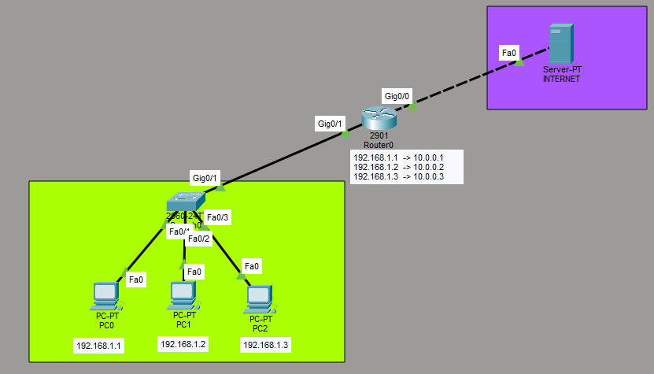
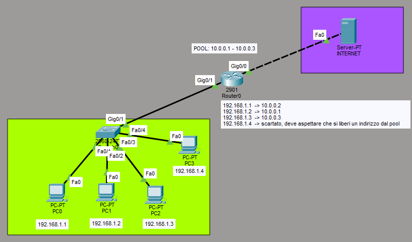
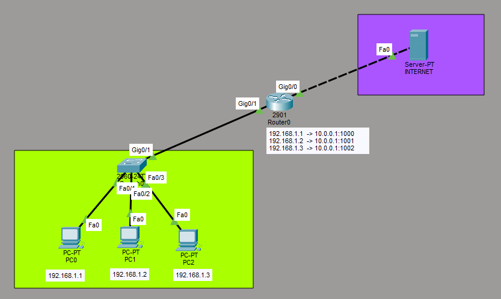

Data: 2026-05-16
[Network_Address_Translation](./README.md)
#Puzzle_Of_Knowledge/Computer_Science/System_And_Networks/IP_Services/Network_Address_Translation
___
# Index
- [[#Network Address Translation]]
	- [[#Prospettiva]]
		- [[#Inside Local (Interno Locale)]]
		- [[#Inside Global (Interno Globale)]]
		- [[#Outside Global (Esterno Globale)]]
		- [[#Outside Local (Esterno Locale)]]
- [[#NAT Statico]]
- [[#NAT Dinamico]]
- [[#PAT]]
___
# *Network Address Translation*

Il **NAT** è una tecnica che consente di tradurre gli indirizzi IP privati (interni) in indirizzi pubblici (esterni) e viceversa.
Si configura sul **router** che fa da confine tra la rete interna e quella esterna.

- **INSIDE** → interfaccia verso la LAN (rete privata)
- **OUTSIDE** → interfaccia verso la WAN (rete pubblica)

|Tipo NAT|Cardinalità|Descrizione|
|---|---|---|
|Statico|1 : 1|IP, TCP, UDP|
|Dinamico|n : n|Pool di indirizzi pubblici|
|Dinamico + Overload|n : 1|Un solo IP pubblico, porta variabile|
## Prospettiva
1. **Dove si trova l'host?** (**Inside** = Mia rete locale / **Outside** = Internet esterna)
2. **Da quale punto di vista lo guardo?** (**Local** = Come si vede da dentro la LAN / **Global** = Come si vede da fuori su Internet
### Inside Local (Interno Locale)
- **Chi è**: Il PC della tua LAN.
- **Come si vede**: Con il suo IP privato originale (es. `192.168.1.3`). È l'indirizzo configurato sulla scheda di rete dell'host.
### Inside Global (Interno Globale)
- **Chi è**: Sempre il tuo PC della LAN, ma **dopo** che ha attraversato il router.
- **Come si vede**: Con l'IP pubblico che il router gli ha assegnato per viaggiare su internet (es. `10.0.0.100`). È l'IP che i server web vedono arrivare.
### Outside Global (Esterno Globale)
- **Chi è**: Il server di destinazione che sta su internet (es. il server di Google o della scuola).
- **Come si vede**: Con il suo vero IP pubblico legittimo (es. `8.8.8.8`).
### Outside Local (Esterno Locale)
- **Chi è**: Sempre il server di destinazione su internet, ma visto **dall'interno della tua LAN**.
- **La regola generale**: Nel 99% dei laboratori standard e degli esercizi scolastici, **Outside Local e Outside Global sono identici**. Il router non tocca l'IP del server remoto, quindi lo vedi allo stesso modo sia da dentro che da fuori. (Cambia solo in scenari avanzatissimi come il "Double NAT", che per ora puoi ignorare).
___
# NAT Statico

Il NAT statico associa in modo **fisso e permanente** un indirizzo IP locale (privato) a un indirizzo IP pubblico.

- La corrispondenza è **1 : 1**: un IP privato → un IP pubblico.

È utile quando un host interno deve essere raggiungibile dall'esterno sempre con lo stesso indirizzo (es. un server HTTP).

| Proto  | Inside Global | Inside Local | Outside Local | Outside Global |
| ------ | ------------- | ------------ | ------------- | -------------- |
| **IP** | 10.0.0.1      | 192.168.1.1  | —             | —              |
| **IP** | 10.0.0.2      | 192.168.1.2  | —             | —              |
| **IP** | 10.0.0.3      | 192.168.1.3  |               |                |

- I campi OUTSIDE sono vuoti perchè è legato a una specifica **sessione** di navigazione verso un server esterno

___
# NAT Dinamico

Il NAT dinamico assegna indirizzi pubblici in modo **automatico e temporaneo** da un **pool** di indirizzi disponibili. 

- La corrispondenza è **n : n**: più host interni vengono mappati su più IP pubblici.

L'assegnazione è univoca nel momento dell'utilizzo ma non è fissa: quando la sessione termina, l'IP pubblico torna disponibile nel pool.

| Proto   | Inside Global         | Inside Local        | Outside Local | Outside Global |
| ------- | --------------------- | ------------------- | ------------- | -------------- |
| **TCP** | **10.0.0.10** : 51001 | 192.168.1.3 : 51001 | 8.8.8.8 : 443 | 8.8.8.8 : 443  |
| **TCP** | **10.0.0.11** : 51002 | 192.168.1.1 : 51002 | 9.9.9.9 : 80  | 9.9.9.9 : 80   |
| **TCP** | **10.0.0.12** : 51001 | 192.168.1.2 : 51001 | 8.8.8.8 : 443 | 8.8.8.8 : 443  |

> [!NOTE] Ricorda Goldon
>Se è NAT dinamico senza overload, le porte interne ed esterne **NON** vengono modificate dal router. 

___
# PAT

Il PAT (*Port Address Translation*), detto anche **NAT con overload**, permette a **più host interni** di condividere un **unico indirizzo IP pubblico**, differenziando le sessioni tramite le **porte**.

- Cardinalità: **n : 1**

| Proto   | Inside Global         | Inside Local           | Outside Local | Outside Global |
| ------- | --------------------- | ---------------------- | ------------- | -------------- |
| **TCP** | 10.0.0.100 : **1024** | 192.168.1.3 : **5000** | 8.8.8.8 : 80  | 8.8.8.8 : 80   |
| **TCP** | 10.0.0.100 : **1025** | 192.168.1.4 : **5000** | 8.8.8.8 : 80  | 8.8.8.8 : 80   |
| **TCP** | 10.0.0.100 : **1026** | 192.168.1.5 : **5000** | 9.9.9.9 : 443 | 9.9.9.9 : 443  |

> [!NOTE] Ricorda Goldon
Nel PAT tutti gli host usano lo stesso IP pubblico, ma con porte diverse: il router tiene traccia di quale porta corrisponde a quale host interno.

___