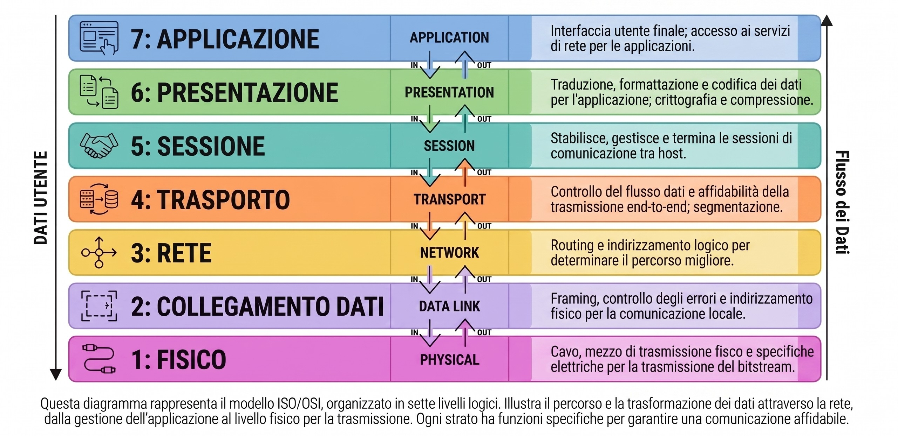

Data: 2026-04-22
[Models](./README.md)
#Puzzle_Of_Knowledge/Computer_Science/System_And_Networks/Network_Fundamentals/Models
___
# Index
- [[#Il Modello ISO/OSI]]
	- [[#I 7 Livelli del Modello]]
- [[#Meccanismi di Funzionamento]]
	- [[#Incapsulamento]]
	- [[#Decapsulamento]]
	- [[#Segmentazione]]
	- [[#Sequenziamento]]
	- [[#Multiplexing]]
___
# Il Modello ISO/OSI

Il modello *Open Systems Interconnection* è lo standard di riferimento per capire come i dati viaggiano attraverso una rete informatica. 
Si divide in sette livelli, ognuno con un compito specifico.


## I 7 Livelli del Modello

| Liv. | Nome                  | Funzione principale                                                                                                                                 |    PDU    |
| :--: | --------------------- | --------------------------------------------------------------------------------------------------------------------------------------------------- | :-------: |
|  7   | **Applicazione**      | Interfaccia utente e app di rete Es. Browser                                                                                                        |   Dati    |
|  6   | **Presentazione**     | Traduzione, crittografia, compressione                                                                                                              |   Dati    |
|  5   | **Sessione**          | Apre, gestisce e chiude le conversazioni (sessioni) tra le applicazioni ai due capi della comunicazione. Gestisce il dialogo e la sincronizzazione. |   Dati    |
|  4   | **Trasporto**         | Definisce i servizi per segmentare, trasferire e riasemblare i dati                                                                                 | Segmenti  |
|  3   | **Rete**              | Determina il percorso migliore per i dati (routing) e utilizza l'indirizzamento logico (IP).                                                        | Pacchetti |
|  2   | **Collegamento dati** | Gestisce l'accesso fisico dei bit al mezzo di trasmissione e <br>l'errore di trasmissione. Utilizza l'indirizzo fisico MAC.                         |   Frame   |
|  1   | **Fisico**            | Si occupa della trasmissione dei segnali grezzi attraverso  cavi, fibra ottica, o aria. Tra dispositivi                                             |    Bit    |
___
# Meccanismi di Funzionamento

## Incapsulamento
**Mittente / Invio**. 
Ogni livello riceve i dati dal livello superiore, aggiunge le proprie informazioni di controllo (header) e passa il pacchetto risultante al livello inferiore.
  
```
Dati → Segmenti → Pacchetti → Frame → Bit 
```

## Decapsulamento
**Destinatario / Ricezione**.
Ogni livello riceve i dati dal livello inferiore, analizza e rimuove la propria intestazione per consegnare i dati "puliti" al livello superiore.
  
```
Bit → Frame → Pacchetti → Segmenti → Dati 
```
## Segmentazione 

> [!example] Analogia
>  Immagina di voler inviare un intero libro per posta usando solo cartoline: non potresti spedirlo in un colpo solo.

È la divisione di un flusso di dati grande (il libro) in unità molto più piccole e gestibili (le 100 cartoline).
## Sequenziamento

È l'**assegnazione** di un numero a ciascun segmento (es. 1 di 100, 2 di 100). 
Protocolli come il TCP utilizzano questa numerazione per garantire che il destinatario possa ricostruire il messaggio originale nell'**ordine esatto**, anche se i pacchetti arrivano a destinazione in momenti **diversi**.

## Multiplexing

> [!example] Analogia
>  Un postino che consegna contemporaneamente cartoline di mittenti diversi, alternandole, invece di aspettare che uno finisca tutte le sue.

Tecnica che permette di **interlacciare più comunicazioni** sullo stesso canale di rete. Grazie alla segmentazione, pacchetti di conversazioni diverse possono alternarsi senza che una singola trasmissione monopolizzi il collegamento.
___
