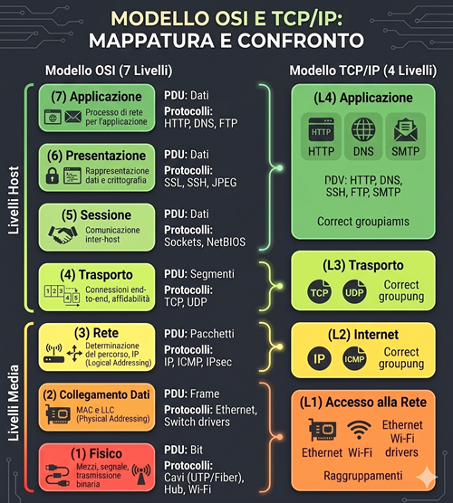

Data: 2026-04-22
[Models](./README.md)
#Puzzle_Of_Knowledge/Computer_Science/System_And_Networks/Network_Fundamentals/Models
___
# Index
- [[#Internet Protocol Suite]]
- [[#Corrispondenza con il Modello OSI]]
	- [[#I 4 Livelli Pratici]]
- [[#Perchè TCP/IP]]
- [[#Implementazione Reale]]
___
# Internet Protocol Suite

Il modello **TCP/IP** è l'architettura di rete reale su cui si basa Internet. Mentre il modello OSI è uno standard teorico e didattico.
Il TCP/IP è nato da esigenze pratiche di interconnessione (progetto ARPANET).
___
# Corrispondenza con il Modello OSI

La differenza principale risiede nel modo in cui i livelli superiori e inferiori vengono **raggruppati**. 
La suite TCP/IP semplifica la struttura per renderla più efficiente nelle implementazioni software.

## I 4 Livelli Pratici

| Livello | livello  OSI | Nome                  | Funzione principale                                                               |     PDU     |
| :-----: | :----------: | --------------------- | --------------------------------------------------------------------------------- | :---------: |
|    4    |   5, 6, 7    | **Applicazione**      | Gestisce i protocolli per le app e include i servizi di sessione e presentazione. |    Dati     |
|    3    |      4       | **Trasporto**         | Gestisce la comunicazione host-to-host (affidabile o veloce).                     |  Segmenti   |
|    2    |      3       | **Internet**          | Si occupa dell'instradamento (routing) e dell'indirizzamento logico.              |  Pacchetti  |
|    1    |     1, 2     | **Accesso alla Rete** | Definisce la trasmissione fisica sul mezzo e l'interfaccia hardware.              | Frame / Bit |
___
# Perchè TCP/IP

Il modello OSI è stato definito dopo che molti protocolli erano già in uso, risultando a tratti troppo burocratico.
Il TCP/IP ha **vinto** perché:
- **Pragmatismo**: Si concentra sulla comunicazione tra computer piuttosto che sulla teoria astratta.
- **Semplicità**: Raggruppare i livelli 5, 6 e 7 semplifica lo sviluppo del software (un unico programma gestisce i dati e la loro presentazione).
- **Flessibilità**: Il livello Internet è "agnostico" rispetto al tipo di cavo o segnale usato sotto, permettendo a IP di girare su qualsiasi tecnologia.
___
# Implementazione Reale

Nella pratica, lo stack TCP/IP risiede principalmente nel **Kernel** del sistema operativo.
- Le applicazioni utente (browser, giochi) interagiscono con lo stack tramite le **Socket API**.
- I dati scendono attraverso il Kernel (che aggiunge header TCP e IP) fino ad arrivare al **Firmware/Hardware** della scheda di rete per la trasmissione dei bit.
___
