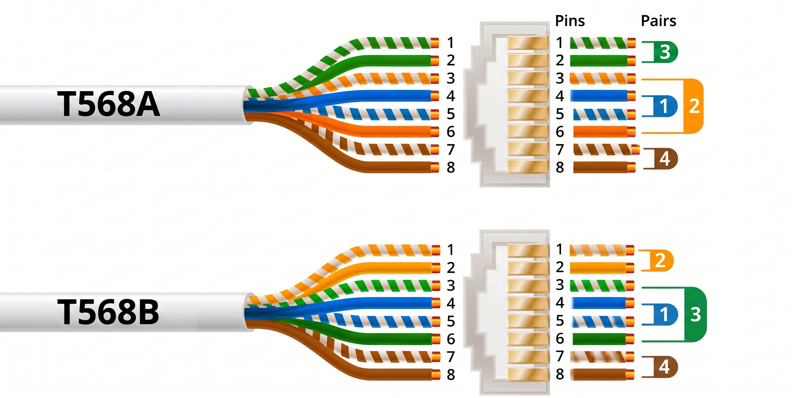
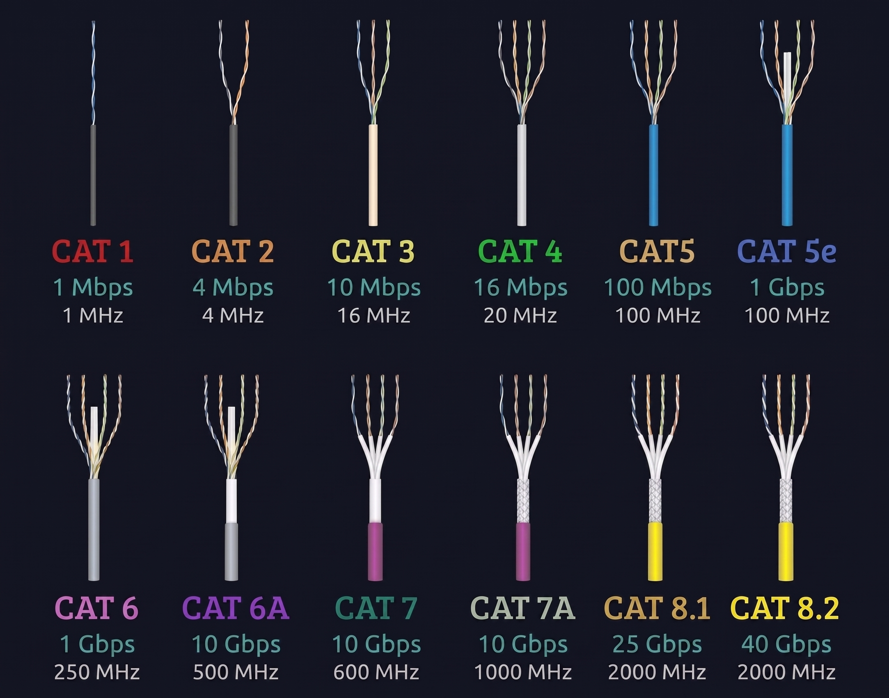
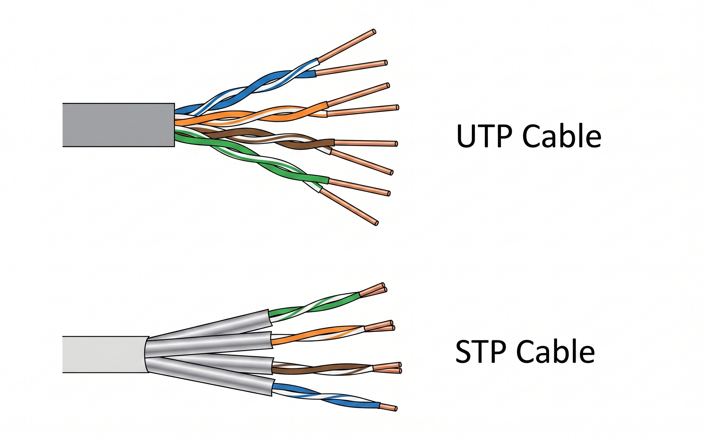
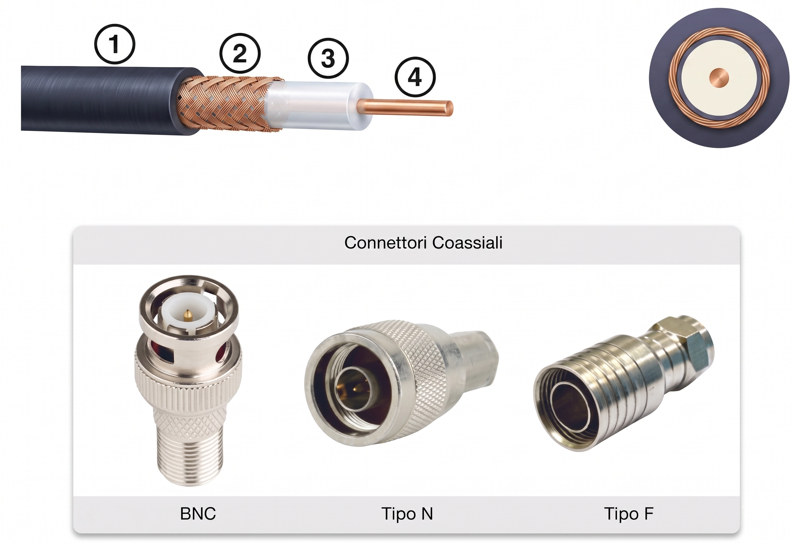

Data: 2026-04-22
[Physical_Layer](./README.md)
#Puzzle_Of_Knowledge/Computer_Science/System_And_Networks/Network_Fundamentals/Physical_Layer
___
# Index
- [[#Livello Fisico]]
	- [[#Tipologie Di Cavo]]
		- [[#Rame]]
			- [[#UTP]]
			- [[#STP]]
			- [[#Cavo Coassiale]]
		- [[#Fibra Ottica]]
		- [[#Wireless]]
- [[#PoE]]
- [[#Duplex]]
	- [[#Modalità Duplex]]
	- [[#Auto-negotiation]]
	- [[#Duplex Mismatch]]
- [[#Metriche di Rete]]
- [[#Interfacce]]
___
# Livello Fisico

Il Livello Fisico si occupa di **attivare**, **mantenere** e **disattivare** le connessioni fisiche tra dispositivi. Opera esclusivamente sui segnali elettrici, ottici o radio, senza alcuna consapevolezza dei dati trasmessi.
## Tipologie Di Cavo

### Rame
#### UTP
**Unshielded Twisted Pair**: Il cavo più diffuso nelle reti LAN. 
I 8 fili intrecciati in 4 doppini intrecciati a loro volta, tutto perchè riducono le interferenze elettromagnetiche.
- **Distanza massima:** 100 m (segmento)
- **Standard di cablaggio:** T568A / T568B

- **Connettore:** RJ-45
Esistono varie **categorie** di cavi UTP (ad esempio adesso siamo arrivati alla 8). Solitamente si sceglie la categoria in base alla larghezza di banda richiesta.

#### STP
**Shielded Twisted Pair**: Versione schermata dell'UTP, più resistente alle interferenze in ambienti industriali o ad alta densità elettromagnetica.

#### Cavo Coassiale
**Lento**, Usato storicamente per reti e ancora presente in impianti TV/CATV e alcuni contesti legacy.
1. Guaina esterna
2. Schermatura intrecciata in rame
3. Isolante in plastica
4. Conduttore di rame

### Fibra Ottica
- Trasmette dati tramite impulsi **luminosi**. 
- **Immune** alle interferenze elettromagnetiche.
- Ideale per **lunghe** distanze e alta larghezza di banda.
  
| Tipo            | Modalità luce                            | Velocità              | Distanza | Costo    |
| --------------- | ---------------------------------------- | --------------------- | -------- | -------- |
| **Monomodale**  | Luce dritta, un solo percorso            | Altissima             | Corta    | Più alto |
| **Multimodale** | Luce che rimbalza (riflessione multipla) | Elevata (ma limitata) | Lunga    | Moderato |

> [!NOTE] Monomodale
> La fibra monomodale richiede laser più precisi ed è più costosa, ma è la scelta standard per collegamenti WAN (Esempio: cavi marini).
> **Future-proofing:** Una volta posata, la fibra monomodale può essere aggiornata a velocità superiori semplicemente cambiando gli apparati laser ai lati, senza dover cambiare il cavo.

### Wireless
| Tecnologia              | Utilizzo tipico                               |
| ----------------------- | --------------------------------------------- |
| **Wi-Fi** (IEEE 802.11) | LAN wireless, accesso internet                |
| **Bluetooth**           | Connessioni a corto raggio (periferiche, IoT) |
| **Satellite**           | Connettività remota, zone non cablate         |

___
# PoE

Il **Power over Ethernet** consente di alimentare dispositivi di rete direttamente tramite il cavo Ethernet, eliminando la necessità di un alimentatore separato.

| Standard                 | Potenza max erogata | Uso casi tipici                          |
| ------------------------ | ------------------- | ---------------------------------------- |
| **IEEE 802.3af**         | 15,4 W              | IP Phone, sensori                        |
| **IEEE 802.3at** (PoE+)  | 30 W                | Access Point Wi-Fi, IP Camera            |
| **IEEE 802.3bt** (PoE++) | 60–100 W            | Thin client, schermi, AP ad alta densità |
___
# Duplex

il **duplex** definisce la capacità di un sistema di trasmettere e ricevere dati contemporaneamente attraverso un canale di comunicazione.
## Modalità Duplex

| Modalità        | Descrizione                              |
| --------------- | ---------------------------------------- |
| **Half-duplex** | Trasmissione in un solo senso alla volta |
| **Full-duplex** | Trasmissione bidirezionale simultanea    |
## Auto-negotiation
Meccanismo con cui due dispositivi **concordano** automaticamente velocità e modalità duplex sulla stessa connessione.
## Duplex Mismatch 
Si verifica quando i due estremi della connessione usano impostazioni diverse (es. un lato in full-duplex, l'altro in half-duplex). Questo causa:
- Aumento delle **collisioni**
- **Degrado** delle performance (throughput ridotto)
- **Errori** FCS e late collisions nei log

> [!danger] Best Practice
> Configurare sempre speed e duplex in modo esplicito su porte critiche (uplink, server) anziché affidarsi all'auto-negotiation.

___
## Metriche di Rete

| Metrica                | **Cosa misura**                     | **Unità di misura** |
| ---------------------- | ----------------------------------- | ------------------- |
| **Larghezza di banda** | Capacità massima potenziale         | bps (bit/s)         |
| **Latenza**            | Ritardo temporale                   | ms (millisecondi)   |
| **Throughput**         | Dati totali inviati (inclusi extra) | bps (bit/s)         |
| **Goodput**            | Dati reali ricevuti (solo payload)  | bps (bit/s)         |
___
# Interfacce

| Componente                       | Descrizione                                      |
| -------------------------------- | ------------------------------------------------ |
| **NIC** (Network Interface Card) | Scheda di rete fisica installata nel dispositivo |
| **Porta fisica**                 | Connettore hardware sulla scheda o dispositivo   |
| **Interfaccia**                  | Lato software associato alla porta fisica        |

___