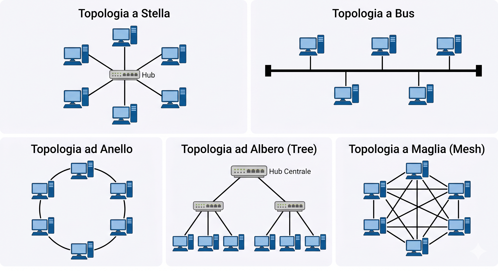

Data: 2026-04-23
[Physical_Layer](./README.md)
#Puzzle_Of_Knowledge/Computer_Science/System_And_Networks/Network_Fundamentals/Physical_Layer
___
# Index
- [[# Topologia Di LAN]]
	- [[# Topologia a Stella]]
	- [[# Topologia a Bus]]
	- [[# Topologia ad Anello]]
	- [[# Topologia a Maglia]]
	- [[# Topologia a Albero]]
- [[# Tipologie Di Rete]]
	- [[# Reti Aziendali]]
	- [[# Rete Convergente]]
- [[# Diagrammi di Rete]]
	- [[# Domini di Rete]]
	- [[# Dominio di Collisione]]
	- [[# Dominio di Broadcast]]
___
# Topologia Di LAN
Le topologie di rete descrivono la disposizione dei **nodi** (computer, server, periferiche) e le **connessioni** tra di essi.
## Topologia a Stella
Ogni dispositivo (PC) ha un collegamento diretto e dedicato verso un **Hub** (o Switch) centrale. 
I PC non comunicano direttamente tra loro, ma attraverso il centro della stella.
## Topologia a Bus
Tutti i dispositivi sono collegati a un **singolo** cavo principale (il bus), che ha dei terminatori ai due capi. Se un PC trasmette, il segnale percorre tutto il cavo ed è visibile a tutti gli altri.
## Topologia ad Anello
I dispositivi sono collegati l'uno all'altro in modo da formare un cerchio chiuso. 
Ogni PC ha esattamente due vicini, i dati viaggiano in una **sola direzione** lungo l'anello.
## Topologia a Maglia
In questa versione (completa), ogni dispositivo è collegato direttamente a tutti gli altri dispositivi della rete.
Questo offre la **massima ridondanza**: se un cavo si rompe, ci sono sempre percorsi alternativi.
## Topologia a Albero
C'è un nodo **radice** in alto, che si collega a nodi di livello inferiore, i quali a loro volta si collegano ad altri dispositivi.

| Topologia  | Costo      | Affidabilità             | Facilità Espansione         |
| ---------- | ---------- | ------------------------ | --------------------------- |
| **Stella** | Medio      | Alta (tranne il centro)  | Molto Alta                  |
| **Bus**    | Basso      | Bassa                    | Bassa                       |
| **Anello** | Medio      | Media                    | Media                       |
| **Maglia** | Molto Alto | Massima                  | Difficile                   |
| **Albero** | Alto       | Media (dipende dai nodi) | Alta (struttura gerarchica) |
___
# Tipologie Di Rete

Le reti si classificano in base alla loro estensione geografica:

|  Sigla  | Nome                      | Copertura                             | Esempio              |
| :-----: | ------------------------- | ------------------------------------- | -------------------- |
| **GAN** | Global Area Network       | Mondiale                              | Internet - Satellite |
| **WAN** | Wide Area Network         | Regione / Nazione — più ISP coinvolti | Fibra lunga          |
| **MAN** | Metropolitan Area Network | Città                                 | WiMAX                |
| **LAN** | Local Area Network        | Edificio o Campus — alta velocità     | Ethernet - Wi-Fi     |
| **PAN** | Personal Area Network     | Stanza / dispositivi personali        | Bluetooth - NFC      |

## Reti Aziendali
- **Intranet**: Rete privata interna all'azienda, accessibile solo ai dipendenti.
- **Extranet**: Estensione controllata della rete aziendale che consente l'accesso a utenti esterni autorizzati (es. fornitori, partner).
## Rete Convergente
In passato, dati, voce e video viaggiavano su infrastrutture separate e dedicate.  
Oggi si utilizza un'**unica infrastruttura unificata (convergente)** capace di trasportare simultaneamente tutti e tre i tipi di traffico.
___
# Diagrammi di Rete

| Tipo                 | Cosa mostra                                                       |
| -------------------- | ----------------------------------------------------------------- |
| **Diagramma Fisico** | Cavi, stanze, rack fisici                                         |
| **Diagramma Logico** | Indirizzi IP, porte, dispositivi intermedi (router, switch, ecc.) |

___
# Domini di Rete
Può avere più significati, ma in generale rappresenta un gruppo di host (computer e altri dispositivi) collegati tra loro che condividono un database centrale e regole di sicurezza comuni.
## Dominio di Collisione
In un dominio di collisione, i dispositivi condividono lo **stesso cavo** (o lo stesso spazio radio nel Wi-Fi).
Una **collisione** avviene quando due dispositivi trasmettono contemporaneamente.

| Dispositivo | Livello OSI | Dominio di Collisione        | Metodo di Trasmissione                                  |
| ----------- | ----------- | ---------------------------- | ------------------------------------------------------- |
| **Hub**     | Livello 1   | **Unico** per tutte le porte | **Broadcasting**: invia i dati a tutti indistintamente  |
| **Switch**  | Livello 2   | Uno per **ogni porta**       | **Unicasting**: invia i dati solo al destinatario reale |
## Dominio di Broadcast
Insieme dei dispositivi che **ricevono un messaggio broadcast** inviato da un nodo della rete.

| Dispositivo | Gestione del Broadcast | Effetto sulla Rete                                                                               |
| ----------- | ---------------------- | ------------------------------------------------------------------------------------------------ |
| **Hub**     | **Propaga tutto**      | Il broadcast entra da una porta ed esce da tutte le altre.                                       |
| **Switch**  | **Propaga tutto**      | Pur gestendo bene le collisioni, lo switch inoltra i pacchetti broadcast a ogni porta della LAN. |
| **Router**  | **Blocca**             | Il router non inoltra mai pacchetti broadcast da una rete (interfaccia) all'altra.               |
___