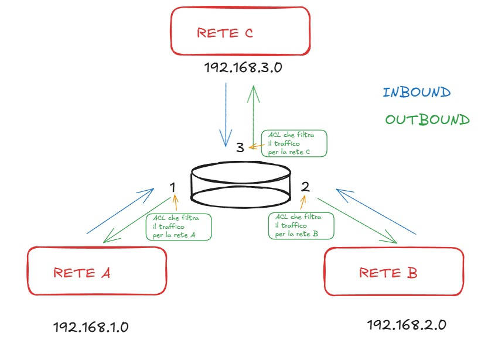
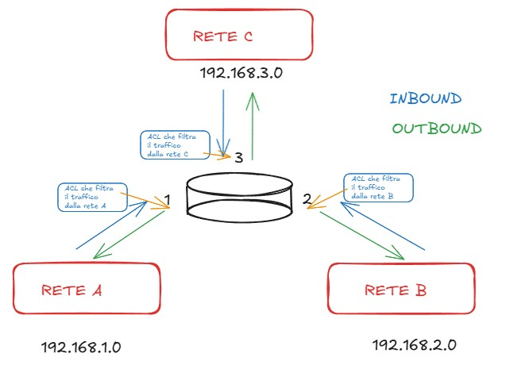

Data: 2026-05-12
[Network_Defense](./README.md)
#Puzzle_Of_Knowledge/Computer_Science/System_And_Networks/Security_Cryptography/Network_Defense
___
# Index
- [[#Firewall]]
- [[#ACL]]
	- [[#Concetti Chiave ACL:]]
	- [[#Policy]]
		- [[#Wildcard Mask]]
			- [[#Esempio]]
- [[#Il problema del traffico di risposta]]
- [[#ACL Standard (1–99)]]
	- [[#Esempi ACL Standard]]
- [[#ACL Estese(100–199)]]
	- [[#Rendere Stateful un'ACL Estesa]]
	- [[#Esempi ACL Estese]]
___
# Firewall
Le regole del firewall vengono configurate tramite **ACL** *Access Control List*.
___
# ACL

Un'**ACL** *Access Control List* è una tabella di regole ordinate.
Ogni pacchetto viene confrontato con le regole **dall'alto verso il basso**; alla prima corrispondenza (match) viene applicata la **policy** relativa.

```
Pacchetto → Regola 10 → match? → applica policy
                ↓ no
            Regola 20 → match? → applica policy
                ↓ no
            ...
            Default: DENY ANY  ← implicito, sempre presente
```

> [!NOTE] Title
> **Importante:** In fondo ad ogni ACL esiste sempre una regola **DENY ANY** implicita. Tutto ciò che non è esplicitamente permesso viene scartato.

**Esempio di ACL**:

| N. Regola | Policy   | Indirizzo        |
| --------- | -------- | ---------------- |
| 10        | PERMIT   | 192.168.1.130    |
| 20        | DENY     | 192.168.1.0/24   |
| Default   | DENY ANY | (Ogni indirizzo) |
## Concetti Chiave ACL:
### Policy

| Policy | Comportamento                                               |
| ------ | ----------------------------------------------------------- |
| **PERMIT** | Lascia passare il pacchetto                                 |
| **DENY**   | Scarta il pacchetto silenziosamente                         |
| **REJECT** | Scarta il pacchetto e notifica il mittente (messaggio ICMP) |
### Wildcard Mask
La **wildcard mask** indica al firewall quali bit dell'indirizzo IP controllare.

> [!NOTE] Nota
> La wildcard mask è esattamente il **contrario** della subnet mask.
> maschera: `255.255.255.0`
> wildcard mask:`0.0.0.255`

| Bit | Significato | Significato          |
| --- | ----------- | -------------------- |
| `0` | **Match**   | Controlla questo bit |
| `1` | **Ignore**  | Ignora questo bit    |

| Wildcard mask     | Significato                                             |
| ----------------- | ------------------------------------------------------- |
| `0.0.0.0`         | Solo un host fa match con l'indirizzo della regola      |
| `255.255.255.255` | Tutti gli host fanno match con l'indirizzo della regola |
#### Esempio
Voglio scartare tutti i pacchetti di **tutta** la rete `192.168.1.0/24`:

```
deny 192.168.1.0 0.0.0.255
```

- Arriva un pacchetto da: `192.168.1.3`

Il firewall confronta **bit per bit** l'IP del pacchetto con l'indirizzo della regola, **solo dove la wildcard vale `0`** (match obbligatorio). Dove vale `1` (ignore), non controlla.

| Campo         | Ottetto 1   | Ottetto 2   | Ottetto 3   | Ottetto 4       |
| ------------- | ----------- | ----------- | ----------- | --------------- |
| IP pacchetto  | 192         | 168         | 1           | **3**           |
| IP regola     | 192         | 168         | 1           | **0**           |
| Wildcard mask | 0           | 0           | 0           | **255**         |
| Azione        | ✅ controlla | ✅ controlla | ✅ controlla | ⏭️ ignora       |
| Match?        | ✅ sì        | ✅ sì        | ✅ sì        | ✅ (non importa) |
- I primi 3 ottetti corrispondono → **DENY** ✅

___
# Il problema del traffico di risposta

Se con un'ACL blocco `rete B → rete A`, implicitamente blocco anche `rete A → rete B`, perchè anche **anche le risposte** ai pacchetti inviati da rete A vengono bloccate.

**Esempio**: rete A fa ping verso rete B → la risposta (ICMP echo-reply) viene bloccata → il ping mostra `Request timed out` (non `Destination Unreachable`).
```
RETE A            ROUTER            RETE B
  | Richiesta per B |                  |
  |---------------->|  Richiesta per B |
  |                 |----------------->|
  |                 |  Risposta per A  |
  |BLOCCATO DALL'ACL|<-----------------|
  |                 |                  |

```

___
# ACL Standard (1–99)

Le ACL standard filtrano **solo in base all'IP sorgente** (Layer 3).

**Caratteristiche:**
- Range numerico: `1–99`
- Filtrano solo sulla **sorgente**
- Vanno applicate **OUTBOUND** sull'interfaccia **più vicina alla destinazione**
  


> [!NOTE] Nota
> Vengono applicate **vicino** alla destinazione perché filtrano solo la **sorgente**: 

## Esempi ACL Standard

- Gli IP sono della sorgente

| Regola | Azione     | Sorgente              | **Descrizione (NON È NELL'ACL)**  |
| ------ | ---------- | --------------------- | --------------------------------- |
| 10     | **Deny**   | 192.168.1.10 0.0.0.0  | Blocca l'host specifico           |
| 20     | **Permit** | 192.168.1.0 0.0.0.255 | Permette il resto della LAN       |
| 30     | **Deny**   | Any                   | Implicit Deny (Default alla fine) |
___
# ACL Estese(100–199)
Le ACL estese filtrano su (Layer 3 + Layer 4):
- **IP sorgente**
- **IP destinazione**
- **Protocollo**
- **Porta**

**Caratteristiche**:
- Range numerico: `100–199`
- Filtrano sorgente **e** destinazione
- Filtrano per protocollo (TCP, UDP, ICMP, IP, …) e per porta
- Vanno applicate **INBOUND** sull'interfaccia **più vicina alla sorgente**



> [!NOTE] Nota
> Vengono applicate **vicino** alla sorgente per bloccare il traffico il **prima possibile**, evitando di occupare la rete inutilmente.
## Rendere Stateful un'ACL Estesa
Con le ACL estese di Cisco è possibile simulare un comportamento stateful usando keyword speciali:

| Keyword       | Significato                                          |
| ------------- | ---------------------------------------------------- |
| `established` | Permette pacchetti TCP con flag ACK o RST (risposte) |
| `echo-reply`  | Permette risposte ICMP (ping di ritorno)             |

> [!NOTE] Nota
> **Nota, Porte effimere**: Quando navighi su Internet, la comunicazione funziona così (HTTP):
> - **Server (destinazione)**: porta **fissa** e nota (es. 80 per HTTP, 443 per HTTPS)
> - **Client (sorgente)**: porta **casuale ed effimera** (es. 51234), assegnata temporaneamente dal sistema operativo
> 
> Quando si scrivono regole ACL, tenerlo a mente: il traffico di ritorno arriva sulla porta effimera del client.

## Esempi ACL Estese

| Regola | Azione     | Protocollo | Sorgente           | Destinazione        | Porta/Servizio |
| ------ | ---------- | ---------- | ------------------ | ------------------- | -------------- |
| 10     | **Permit** | TCP        | 10.0.0.0 0.0.0.255 | 172.16.1.50 0.0.0.0 | eq 80 (HTTP)   |
| 20     | **Permit** | TCP        | 10.0.0.0 0.0.0.255 | 172.16.1.50 0.0.0.0 | eq 443 (HTTPS) |
| 30     | **Permit** | ICMP       | Any                | Any                 | echo-reply     |
| 40     | **Deny**   | IP         | Any                | Any                 | -              |
___


