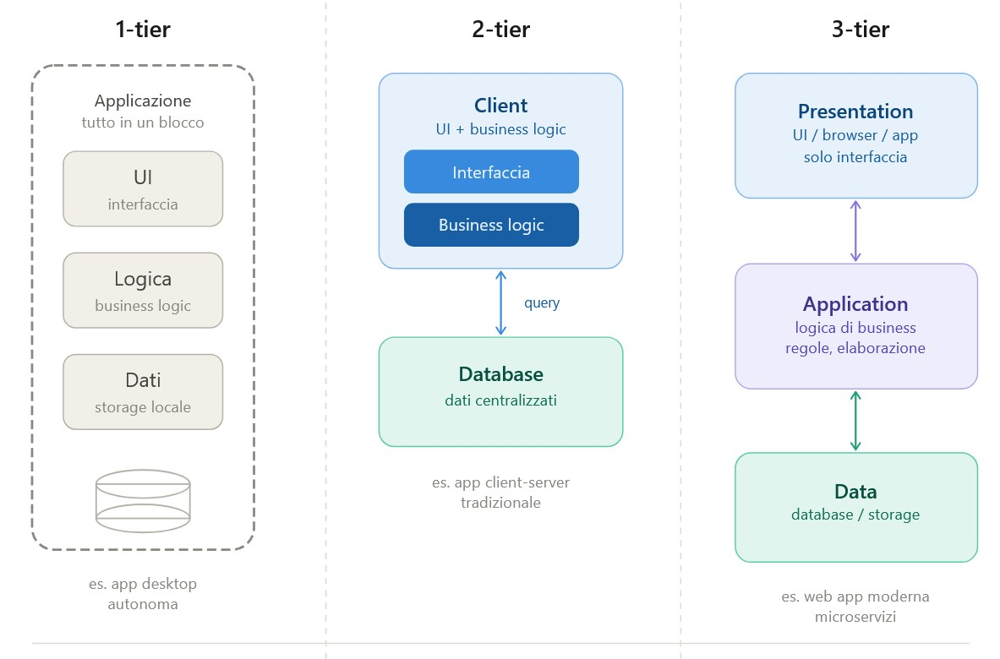

Data: 2026-05-05
[Web_Architectures](./README.md)
#Puzzle_Of_Knowledge/Computer_Science/Theory/Web_Architectures
___
# Index
- [[#Architettura]]
- [[#N-Tier]]
	- [[#1-Tier]]
		- [[#Vantaggi:]]
		- [[#Svantaggi:]]
	- [[#2-Tier]]
		- [[#Vantaggi:]]
		- [[#Svantaggi:]]
	- [[#3-Tier]]
		- [[#Vantaggi:]]
___
# Architettura

È un **modello** di progettazione software in cui l'applicazione è divisa in 3 livelli (MVC):

| MVC        | Livello               | Descrizione                         |
| ---------- | --------------------- | ----------------------------------- |
| View       | **Presentation Tier** | È l'interfaccia utente (UI).        |
| Controller | **Business Logic**    | Calcoli e le elaborazioni dei dati. |
| Model      | **Data Tier**         | Database.                           |

___
# N-Tier

Un sistema software può essere organizzato in livelli separati.

## 1-Tier
Tutto gira su una **singola** macchina.
### Vantaggi:
- Facile da sviluppare.
### Svantaggi:
- **Sincronizzazione**: Per sincronizzare un sistema il numero di connessioni deve essere:  $n^2-1$.
- **No SPOT**: *Single Point Of True*.
- **Non Scalabile**: Se dovessi applicare le modifiche su un solo livello come il controller, dovrei modificare tutto il resto.

## 2-Tier
Si divide il blocco in **client** e **server**, dove il client gestisce la parte di **business logic**.

### Vantaggi:
- **SPOT**
### Svantaggi:
- **Sicurezza**: Si può intercettare la connessione diretta del client al DB, rubando così le credenziali.
- **Non Scalabile completamente**: Ancora la parte di business logic e il client sono ancora saldati.

## 3-Tier
Si **divide** ogni entità e si sviluppa a parte

### Vantaggi:
- **Scalabilità**: Puoi potenziare solo il livello che ne ha bisogno. (es. se il traffico aumenta, puoi aggiungere server al livello logico senza toccare il database).
- **Manutenibilità**: Se decidi di cambiare database (es. da Oracle a PostgreSQL), devi modificare solo il Data Tier. Il resto dell'app rimane invariato.
- **Sicurezza**: Il Client (Presentation) non ha mai accesso diretto al Database (Data). Deve passare attraverso il livello Logico, che funge da firewall e controllore.
- **Riuso**: Diversi tipi di interfacce (web, mobile, IoT) possono utilizzare la stessa logica di business centralizzata.

___