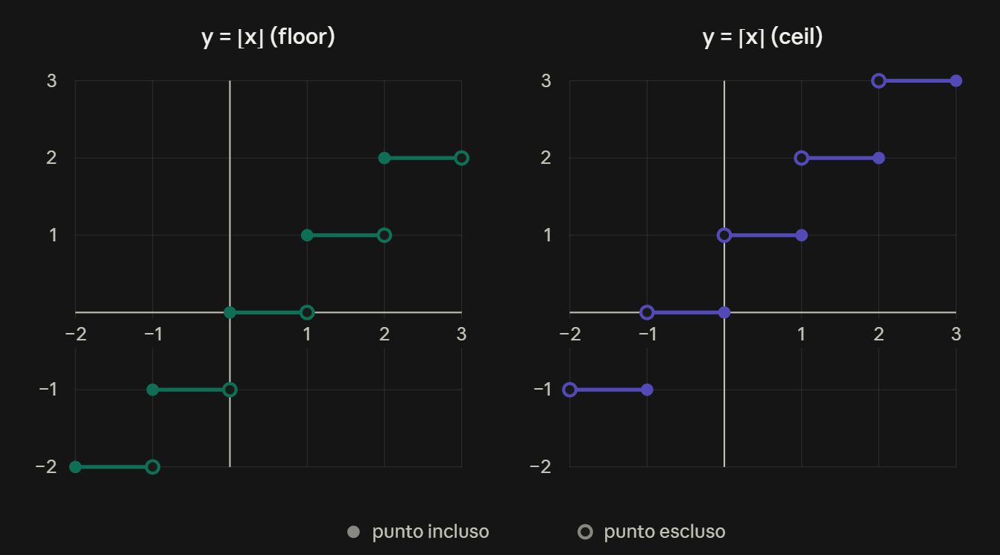

Data: 2026-09-30
[Analisi_1](./README.md)
#Puzzle_Of_Knowledge/Math/Analisi_1
___
# Index
- [[#Operazioni Insiemistiche]]
	- [[#Unione $\cup$|Unione ∪]]
	- [[#Intersezione $\cap$|Intersezione ∩]]
	- [[#Differenza $\setminus$|Differenza ∖]]
	- [[#Prodotto Cartesiano $\times$|Prodotto Cartesiano ×]]
- [[#Numeri Naturali $\mathbb{N}$|Numeri Naturali ℕ]]
	- [[#Operazioni]]
		- [[#Proprietà Delle Operazioni]]
			- [[#Addizione]]
			- [[#Prodotto]]
	- [[#Proprietà Dei Numeri Naturali]]
		- [[#Ordinamento Totale]]
		- [[#Compatibilità]]
- [[#Numeri Interi $\mathbb{Z}$|Numeri Interi ℤ]]
	- [[#Assioma Di Esistenza Dell'Opposto]]
- [[#Numeri Razionali $\mathbb{Q}$|Numeri Razionali ℚ]]
	- [[#Inverso e Reciproco]]
	- [[#Assioma Dell'Inverso Moltiplicativo]]
- [[#Numeri Reali $\mathbb{R}$|Numeri Reali ℝ]]
	- [[#Assioma Di Separazione]]
	- [[#Proprietà Di Archimede]]
	- [[#Parte Intera]]
		- [[#Funzione floor $\lfloor x\rfloor$|Funzione floor ⌊x⌋]]
		- [[#Funzione ceil $\lceil x\rceil$|Funzione ceil ⌈x⌉]]
		- [[#Grafico a Gradini Funzione Floor e Funzione Ceil]]
	- [[#Proposizione $\sqrt{2} \in \mathbb{R} \setminus \mathbb{Q}$|Proposizione √2 ∈ ℝ ∖ ℚ]]
	- [[#Teorema densità di $\mathbb{Q}$ in $\mathbb{R}$|Teorema densità di ℚ in ℝ]]
___

# Operazioni Insiemistiche

## Unione $\cup$

Elementi che stanno in **A oppure in B** (o in entrambi).

$$A \cup B = \{x : x \in A \lor x \in B\}$$

> [!example] Esempio:
> $A = {1, 2, 3}, B = {3, 4} → A ∪ B = {1, 2, 3, 4}$
## Intersezione $\cap$

Elementi che stanno **sia in A sia in B**.

$$A \cap B = \{x : x \in A \land x \in B\}$$

> [!example] Esempio:
> A = {1, 2, 3}, B = {3, 4} → A ∩ B = {3}

> [!info] Info:
Se $A ∩ B = ∅$, i due insiemi si dicono **disgiunti**.
## Differenza $\setminus$

Elementi che stanno **in A ma non in B**.

$$A \setminus B = \{x : x \in A \land x \notin B\}$$
> [!example] Esempio:
>$A = {1, 2, 3}, B = {3, 4} → A ∖ B = {1, 2}$

> [!danger] Attenzione!
> $A \setminus B \neq B \setminus A$

## Prodotto Cartesiano $\times$

Insieme delle **coppie ordinate** $(a,b)$ con il primo elemento preso da $A$ e il secondo da $B$.

$$A \times B = \{(a,b) : a \in A \land b \in B\}$$

> [!example] Esempio:
> $A = \{1, 2\}$, $B = \{a, b\}$
> $$A \times B = \{(1,a),\ (1,b),\ (2,a),\ (2,b)\}$$

> [!danger] Attenzione!
> Il prodotto cartesiano **non è commutativo**:
> $$A \times B \neq B \times A$$
>
> > [!example] Esempio:
> > Con $A = \{1, 2\}$ e $B = \{a, b\}$ si ha $(1,a)\in A\times B$, ma $(1,a)\notin B\times A$, perché in $B\times A$ il primo elemento deve stare in $B$.

___
# Numeri Naturali $\mathbb{N}$

> [!abstract] Definizione
$$\mathbb{N} = \left\{0, 1, 2, 3, 4, \dots\right\}$$

## Operazioni

Su $\mathbb{N}$ sono definite due operazioni **addizione** e **prodotto**, e vanno interpretate come **mappe**
$$
+ : \mathbb{N}+\mathbb{N} \to \mathbb{N}, \quad (a,b) \mapsto a+b \qquad\qquad \cdot : \mathbb{N}\times\mathbb{N} \to \mathbb{N}, \quad (a,b) \mapsto ab
$$
### Proprietà Delle Operazioni
#### Addizione

$$Assioma: a,b,c \in \mathbb{N}$$

| Proprietà       | Formula                                                               |
| --------------- | --------------------------------------------------------------------- |
| Commutativa     | $a+b=b+a$                                                             |
| Associativa     | $(a+b)+c=a+(b+c)$                                                     |
| Elemento neutro | $\exists, e_0\in\mathbb{N}$ \| $a+e_0=a \quad \forall a\in\mathbb{N}$ |

> [!info] Info: Elemento Neutro
> Il valore di $a$ non cambia grazie all'elemento neutro.
> Inoltre l'elemento neutro è **unico**:
> $$ \exists !, e_0 \in \mathbb{N} \quad\text{e}\quad e_0 = 0 $$

#### Prodotto
$$Assioma: a,b,c \in \mathbb{N}$$

| Proprietà       | Formula                                                                    |
| --------------- | -------------------------------------------------------------------------- |
| Commutativo     | $a\cdot b=b\cdot a \quad$                                                  |
| Associativo     | $(a\cdot b)\cdot c=a\cdot(b\cdot c)$                                       |
| Elemento neutro | $\exists, e_1\in\mathbb{N}$ \| $a\cdot e_1=a \quad \forall a\in\mathbb{N}$ |

> [!info] Info: Elemento Neutro
> Il valore di $a$ non cambia grazie all'elemento neutro.
> Inoltre l'elemento neutro è **unico**:
>$$ \exists !, e_1 \in \mathbb{N} \quad\text{e}\quad e_1 = 1 $$

## Proprietà Dei Numeri Naturali

### Ordinamento Totale

> [!abstract] Definizione
> Per $a,b\in\mathbb{N}$ si **definisce**:
> 
> $$ a \le b \quad\Longleftrightarrow\quad \exists, c \in \mathbb{N} \ \mid\ a + c = b $$
> 
> Cioè $a\le b$ se esiste un naturale $c$ che sommato ad $a$ dà $b$

Questa relazione ha quattro proprietà:

|     | Proprietà          | Quantificatore                | Enunciato                                  |
| --- | ------------------ | ----------------------------- | ------------------------------------------ |
| a)  | **Riflessiva**     | $\forall a\in\mathbb{N}:$     | $a\le a$                                   |
| b)  | **Antisimmetrica** | $\forall a,b\in\mathbb{N}$:   | $a\le b$ e $b\le a$ $\Rightarrow$ $a=b$    |
| c)  | **Transitiva**     | $\forall a,b,c\in\mathbb{N}$: | $a\le b$ e $b\le c$ $\Rightarrow$ $a\le c$ |
| d)  | **Dicotomia**      | $\forall a,b\in\mathbb{N}$:   | $a\le b$ oppure $b\le a$                   |
### Compatibilità

**Compatibilità $(\le,+)$**:

$$ \forall a,b,c\in\mathbb{N}: \quad a\le b \Longrightarrow a+c \le b+c $$
**Compatibilità $(\le,\cdot)$**:

$$ \forall a,b,c\in\mathbb{N}: \quad a\le b \ \text{ e } \ c>0 ;\Longrightarrow; a\cdot c \le b\cdot c $$

> [!info] Info:
> La stessa proprietà vale anche con la disuguaglianza stretta ($a<b$, $c>0 \Rightarrow ac<bc$).

___
# Numeri Interi $\mathbb{Z}$

> [!abstract] Definizione
>$$\mathbb{Z} = \mathbb{N} \cup (-\mathbb{N})$$
>Dove $$-A := {-a : a \in A}$$

## Assioma Di Esistenza Dell'Opposto

> [!Abstract] Definizione: Enunciato
$$\forall m \in \mathbb{Z}\ \ \exists, n \in \mathbb{Z} \mid m + n = 0$$

> [!info] Info: Compatibilità Con L'Ordinamento
> Se $a, b, c \in \mathbb{Z}$:
>- $a \leq b,\ c > 0 \Rightarrow ac \leq bc$
>- $a \leq b,\ c < 0 \Rightarrow ac \geq bc$ 

> [!danger] Attenzione! Problema Nei Numeri Interi
> $$a \in \mathbb{Z}, \exists b \in \mathbb{Z} \mid ab = 1  \space(?)$$
> In $\mathbb{Z}$ Vale solamente per $a \in {-1, 1}$
> 
> $$b := a^{-1}$$ 
> $$1^{-1} = 1 ; -1^{-1} = -1$$

___
# Numeri Razionali $\mathbb{Q}$

> [!abstract] Definizione: Rappresentazione Canonica Dei Numeri Razionali
> $${ m \cdot n^{-1} : m \in \mathbb{Z},\ n \in \mathbb{Z} \setminus {0},\ \text{M.C.D.}(m,n) = 1 }$$
> > [!Info] Info: 
>  $$\text{M.C.D.}(m,n) = 1 \space$$
>  $m, n$ si dicono coprimi tra loro
> 
> > [!Example] Esempio:
> $\frac{1}{3} \sim \frac{2}{6} \sim \frac{3}{9}$, si prende in considerazione solo $\frac{1}{3}$ dove $1$ e $3$ sono coprimi tra loro.
> 

## Inverso e Reciproco

L'**inverso** di $m$ è il suo **reciproco** in $\mathbb{Q}$: $\dfrac{1}{m}$.

> [!Info] Info:
> Inverso e reciproco sono operazioni diverse.

## Assioma Dell'Inverso Moltiplicativo

> [!Abstract] Definizione: Enunciato
> In $\mathbb{Q}$ vale$$\forall a \in \mathbb{Q} \setminus \left\{0\right\}\ \ \exists b \in \mathbb{Q} \mid ab = 1 \quad (b = a^{-1})$$

___
# Numeri Reali $\mathbb{R}$

$$\mathbb{N} \subseteq \mathbb{Z} \subseteq \mathbb{Q} \subseteq \mathbb{R}$$

## Assioma Di Separazione

> [!abstract] Definizione: Enunciato
> Siano $A,B\subseteq\mathbb{R}$ con $A\neq\emptyset\neq B$.
> Si dicono **separati** se
> $$a\le b \quad \forall a\in A,\ \forall b\in B$$
> Se $A,B$ sono separati, allora:
> $$\exists\,x\in\mathbb{R} \mid a\le x\le b \quad \forall a\in A,\ \forall b\in B$$
> $x$ è detto **separatore** di $A$ e $B$.
>> [!info] Info:
>> - Si può dimostrare che esiste un insieme $\mathbb{R}$ che verifica tali assiomi.
>> - Altre costruzioni di $\mathbb{R}$ sono equivalenti a quella assiomatica che usiamo.

## Proprietà Di Archimede

> [!abstract] Definizione: Enunciato
> $$\forall x\in\mathbb{R}\ \ \exists\,n\in\mathbb{N} \mid n>x$$
> > [!info] Info: In parole
>> Dato un qualunque reale $x$, c'è sempre un naturale più grande. 
>>
>> Quindi di dice che l'insieme $\mathbb{N}$ **non è limitato superiormente** in $\mathbb{R}$.
## Parte Intera

> [!abstract] Definizione: Proprietà della parte intera
> $$\forall x\in\mathbb{R}\ \ \exists!\,n\in\mathbb{Z}\mid n\le x<n+1$$
> $n$ è detto **parte intera** di $x$.
>>[!Info] Info: 
>>la **parte intera** di un numero con la virgola ($x$) è il numero intero più grande che non supera quel numero.
>>>[!Example] Esempio:
>>>**Se il numero è positivo ($x = 3.14$)**: Si trova tra $3$ e $4$ ($3 \le 3.14 < 4$). L'intero che ti sei lasciato alle spalle è **$3$**.
> >>

### Funzione floor $\lfloor x\rfloor$
$$n = \lfloor x \rfloor \iff n \le x < n+1$$
> [!Info] Info:
> arrotonda sempre e comunque per **difetto** al numero intero immediatamente inferiore o uguale.
> > [!example] Esempio:
>>- $\lfloor x\rfloor=0 \quad \forall x\mid 0\le x<1$
>>- $\lfloor 0{,}5\rfloor=0 \qquad \lfloor 2{,}5\rfloor=2$
>> - $-1\le -0{,}5<0 \Rightarrow \lfloor -0{,}5\rfloor=-1$

> [!danger] Attenzione!
> Per i numeri negativi la parte intera **non** è "togliere la parte decimale": $\lfloor -0{,}5\rfloor=-1$, non $0$.

### Funzione ceil $\lceil x\rceil$

$$n = \lceil x \rceil \iff n-1\le x<n$$

> [!Info] Info:
> Arrotonda sempre e comunque per **eccesso** al numero intero immediatamente superiore o uguale
> > [!example] Esempio:
>>- $\lceil 0\rceil=0$
>> - $\lceil \tfrac{3}{2}\rceil=2$

> [!abstract] Definizione:
> Per $x\in\mathbb{Z}$ vale $\lceil x\rceil=\lfloor x\rfloor=x$.
>
> > [!example] Esempio: $x=3$
> > $$\lceil 3\rceil=\lfloor 3\rfloor=3$$
>
> > [!danger] Attenzione! $x\in\mathbb{Z}$
> > L'uguaglianza
> > $$\lceil x\rceil=\lfloor x\rfloor+1$$
> > è **falsa** $\forall\, x\in\mathbb{Z}$.
> >
> > > [!example] Esempio: $x\in\mathbb{Z}$
> > > Per $x\in\mathbb{Z}$ vale $\lceil x\rceil=\lfloor x\rfloor=x$.
> > > Con $x=3$:
> > > $$\lceil 3\rceil=3\qquad \lfloor 3\rfloor+1=3+1=4$$
> > > Poiché $3\neq 4$, l'uguaglianza **non vale**.
>
> > [!info] Info: $x\in\mathbb{R}\setminus\mathbb{Z}$
> > L'uguaglianza $\lceil x\rceil=\lfloor x\rfloor+1$ è vera solo se $x\in\mathbb{R}\setminus\mathbb{Z}$.
> >
> > > [!example] Esempio: $x\in\mathbb{R}\setminus\mathbb{Z}$
> > > Con $x=2{,}5$:
> > > $$\lceil 2{,}5\rceil=3\qquad \lfloor 2{,}5\rfloor+1=2+1=3$$
> > > L'uguaglianza **vale**.

### Grafico a Gradini Funzione Floor e Funzione Ceil

## Proposizione $\sqrt{2} \in \mathbb{R} \setminus \mathbb{Q}$

> [!Success] Dimostrazione: Idea
> $$A = \left\{x \in \mathbb{R} \mid x^2 > 2\right\}$$
$$B = \left\{x \in \mathbb{R} \mid x^2 < 2\right\}$$
Si verifica che tra i 2 insiemi sono separati: $\exists \lambda \in \mathbb{R}$
$$b \leq \lambda \leq a \quad \forall a \in A,\ \forall b \in B$$
Perché fa vedere che $\lambda^2 = 2$.

## Teorema densità di $\mathbb{Q}$ in $\mathbb{R}$

$$\forall x \in \mathbb{R}\ \text{e}\ \forall \varepsilon > 0,\ \text{esiste } z \in \mathbb{Q} \mid z \leq x < z + \varepsilon$$
___

