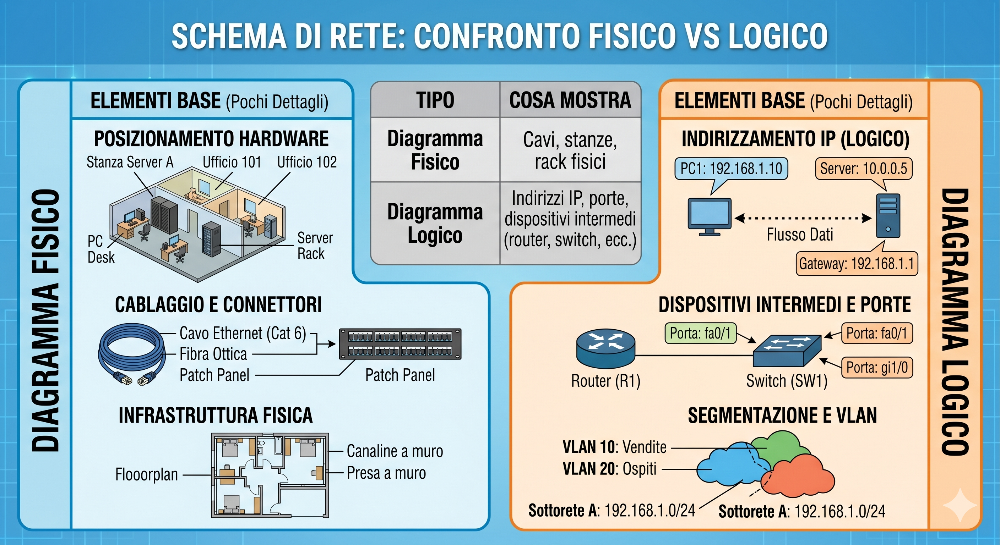
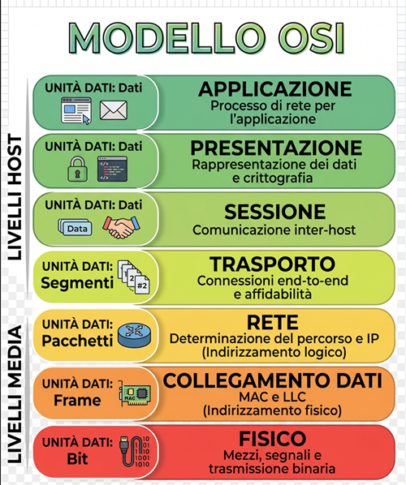
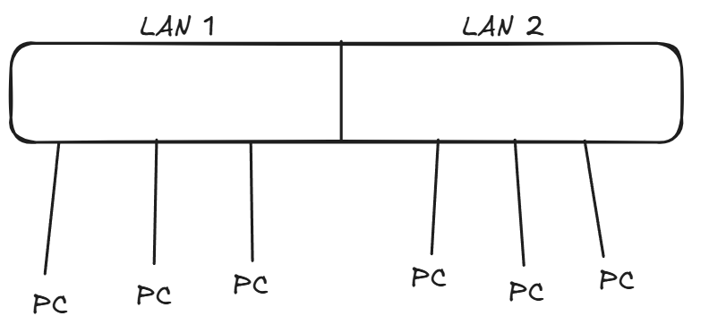
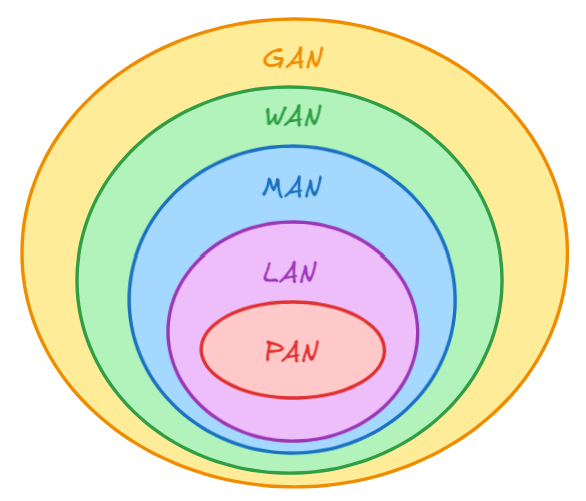
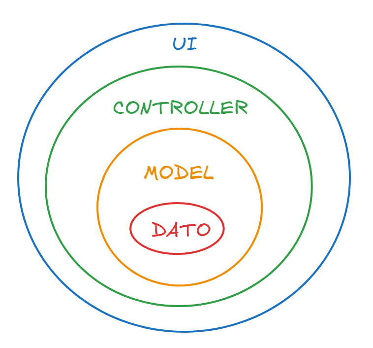
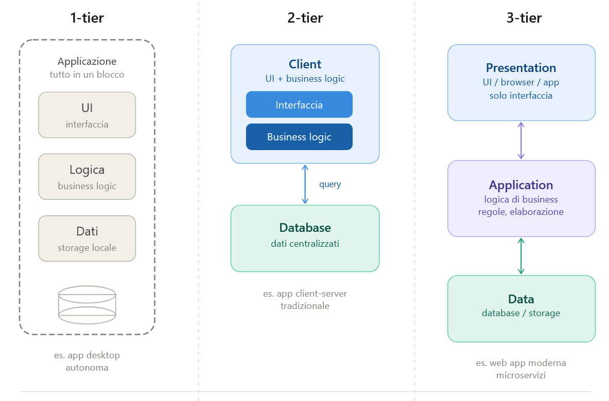
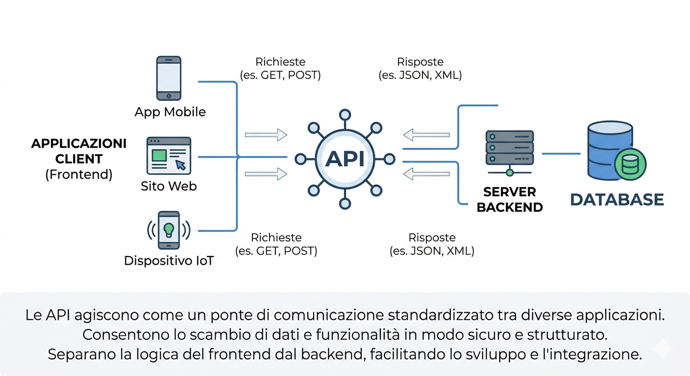
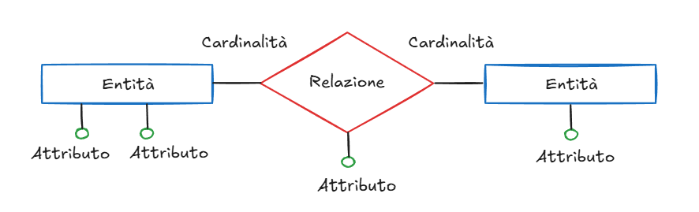
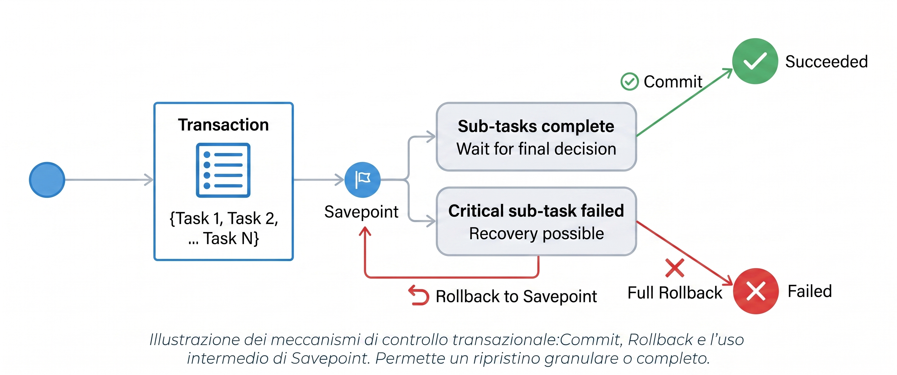

Data: 2025-10-17
[Blaze_Experience](../README.md)
#ParteTuttoDaQua
___
# Blaze_Experience

gigiociodgsis

___

# Start Index
- 📁 [Puzzle_Of_Knowledge](Puzzle_Of_Knowledge/README)
    - 📁 [Computer_Science](Puzzle_Of_Knowledge/Computer_Science/README)
        - 📁 [Operating_Systems](Puzzle_Of_Knowledge/Computer_Science/Operating_Systems/README)
        - 📁 [Programming](Puzzle_Of_Knowledge/Computer_Science/Programming/README)
            - 📁 [Programming_Languages](Puzzle_Of_Knowledge/Computer_Science/Programming/Programming_Languages/README)
                - 📁 [CSS](Puzzle_Of_Knowledge/Computer_Science/Programming/Programming_Languages/CSS/README)
                    - [Declaration_Block](Puzzle_Of_Knowledge/Computer_Science/Programming/Programming_Languages/CSS/Declaration_Block)
                    - [Semantic](Puzzle_Of_Knowledge/Computer_Science/Programming/Programming_Languages/CSS/Semantic)
                - 📁 [Dart](Puzzle_Of_Knowledge/Computer_Science/Programming/Programming_Languages/Dart/README)
                    - [Class](Puzzle_Of_Knowledge/Computer_Science/Programming/Programming_Languages/Dart/Class)
                    - [Data](Puzzle_Of_Knowledge/Computer_Science/Programming/Programming_Languages/Dart/Data)
                    - [Function](Puzzle_Of_Knowledge/Computer_Science/Programming/Programming_Languages/Dart/Function)
                    - [Future](Puzzle_Of_Knowledge/Computer_Science/Programming/Programming_Languages/Dart/Future)
                    - [Io](Puzzle_Of_Knowledge/Computer_Science/Programming/Programming_Languages/Dart/Io)
                    - [Libraries](Puzzle_Of_Knowledge/Computer_Science/Programming/Programming_Languages/Dart/Libraries)
                    - [Statements](Puzzle_Of_Knowledge/Computer_Science/Programming/Programming_Languages/Dart/Statements)
                    - [Stream](Puzzle_Of_Knowledge/Computer_Science/Programming/Programming_Languages/Dart/Stream)
                - 📁 [Flutter](Puzzle_Of_Knowledge/Computer_Science/Programming/Programming_Languages/Flutter/README)
                    - [Riassunto](Puzzle_Of_Knowledge/Computer_Science/Programming/Programming_Languages/Flutter/Riassunto)
                - 📁 [HTML](Puzzle_Of_Knowledge/Computer_Science/Programming/Programming_Languages/HTML/README)
                    - [Syntax](Puzzle_Of_Knowledge/Computer_Science/Programming/Programming_Languages/HTML/Syntax)
                - 📁 [JS](Puzzle_Of_Knowledge/Computer_Science/Programming/Programming_Languages/JS/README)
                    - [AJAX](Puzzle_Of_Knowledge/Computer_Science/Programming/Programming_Languages/JS/AJAX)
                    - [Data](Puzzle_Of_Knowledge/Computer_Science/Programming/Programming_Languages/JS/Data)
                    - [DOM](Puzzle_Of_Knowledge/Computer_Science/Programming/Programming_Languages/JS/DOM)
                    - [Function](Puzzle_Of_Knowledge/Computer_Science/Programming/Programming_Languages/JS/Function)
                    - [Statements](Puzzle_Of_Knowledge/Computer_Science/Programming/Programming_Languages/JS/Statements)
                - 📁 [PHP](Puzzle_Of_Knowledge/Computer_Science/Programming/Programming_Languages/PHP/README)
                    - [Cookie_Session](Puzzle_Of_Knowledge/Computer_Science/Programming/Programming_Languages/PHP/Cookie_Session)
                    - [Functions](Puzzle_Of_Knowledge/Computer_Science/Programming/Programming_Languages/PHP/Functions)
                    - [Language](Puzzle_Of_Knowledge/Computer_Science/Programming/Programming_Languages/PHP/Language)
                    - [MYSQLI](Puzzle_Of_Knowledge/Computer_Science/Programming/Programming_Languages/PHP/MYSQLI)
                    - [Statements](Puzzle_Of_Knowledge/Computer_Science/Programming/Programming_Languages/PHP/Statements)
            - 📁 [Terminal_And_Shell](Puzzle_Of_Knowledge/Computer_Science/Programming/Terminal_And_Shell/README)
        - 📁 [System_And_Networks](Puzzle_Of_Knowledge/Computer_Science/System_And_Networks/README)
            - 📁 [Network_Fundamentals](Puzzle_Of_Knowledge/Computer_Science/System_And_Networks/Network_Fundamentals/README)
                - 📁 [Models](Puzzle_Of_Knowledge/Computer_Science/System_And_Networks/Network_Fundamentals/Models/README)
                    - [ISO_OSI](Puzzle_Of_Knowledge/Computer_Science/System_And_Networks/Network_Fundamentals/Models/ISO_OSI)
                    - [TCP_IP](Puzzle_Of_Knowledge/Computer_Science/System_And_Networks/Network_Fundamentals/Models/TCP_IP)
                - 📁 [Physical_Layer](Puzzle_Of_Knowledge/Computer_Science/System_And_Networks/Network_Fundamentals/Physical_Layer/README)
                    - [Cables_And_Interfaces](Puzzle_Of_Knowledge/Computer_Science/System_And_Networks/Network_Fundamentals/Physical_Layer/Cables_And_Interfaces)
                    - [Topology_Types](Puzzle_Of_Knowledge/Computer_Science/System_And_Networks/Network_Fundamentals/Physical_Layer/Topology_Types)
                - 📁 [Transport_Layer](Puzzle_Of_Knowledge/Computer_Science/System_And_Networks/Network_Fundamentals/Transport_Layer/README)
                    - [TCP](Puzzle_Of_Knowledge/Computer_Science/System_And_Networks/Network_Fundamentals/Transport_Layer/TCP)
                    - [UDP](Puzzle_Of_Knowledge/Computer_Science/System_And_Networks/Network_Fundamentals/Transport_Layer/UDP)
            - 📁 [Planning_Addressing](Puzzle_Of_Knowledge/Computer_Science/System_And_Networks/Planning_Addressing/README)
                - 📁 [IP_Addressing](Puzzle_Of_Knowledge/Computer_Science/System_And_Networks/Planning_Addressing/IP_Addressing/README)
                    - [IPv4](Puzzle_Of_Knowledge/Computer_Science/System_And_Networks/Planning_Addressing/IP_Addressing/IPv4)
                    - [CIDR](Puzzle_Of_Knowledge/Computer_Science/System_And_Networks/Planning_Addressing/IP_Addressing/CIDR)
                    - [Subnetting_IPv4](Puzzle_Of_Knowledge/Computer_Science/System_And_Networks/Planning_Addressing/IP_Addressing/Subnetting_IPv4)
                    - [IPv6](Puzzle_Of_Knowledge/Computer_Science/System_And_Networks/Planning_Addressing/IP_Addressing/IPv6)
                - 📁 [Routing_Logic](Puzzle_Of_Knowledge/Computer_Science/System_And_Networks/Planning_Addressing/Routing_Logic/README)
                    - [Static_Routing](Puzzle_Of_Knowledge/Computer_Science/System_And_Networks/Planning_Addressing/Routing_Logic/Static_Routing)
                    - [Dynamic_Routing](Puzzle_Of_Knowledge/Computer_Science/System_And_Networks/Planning_Addressing/Routing_Logic/Dynamic_Routing)
                    - [Forwarding_Decisions](Puzzle_Of_Knowledge/Computer_Science/System_And_Networks/Planning_Addressing/Routing_Logic/Forwarding_Decisions)
                    - [First_Hop_Redundancy](Puzzle_Of_Knowledge/Computer_Science/System_And_Networks/Planning_Addressing/Routing_Logic/First_Hop_Redundancy)
                - 📁 [Core_Protocols](Puzzle_Of_Knowledge/Computer_Science/System_And_Networks/Planning_Addressing/Core_Protocols/README)
                    - [ARP](Puzzle_Of_Knowledge/Computer_Science/System_And_Networks/Planning_Addressing/Core_Protocols/ARP)
                    - [ICMP](Puzzle_Of_Knowledge/Computer_Science/System_And_Networks/Planning_Addressing/Core_Protocols/ICMP)
                    - [CDP](Puzzle_Of_Knowledge/Computer_Science/System_And_Networks/Planning_Addressing/Core_Protocols/CDP)
                    - [LLDP](Puzzle_Of_Knowledge/Computer_Science/System_And_Networks/Planning_Addressing/Core_Protocols/LLDP)
            - 📁 [Switching_And_Network_Access](Puzzle_Of_Knowledge/Computer_Science/System_And_Networks/Switching_And_Network_Access/README)
                - 📁 [VLAN](Puzzle_Of_Knowledge/Computer_Science/System_And_Networks/Switching_And_Network_Access/VLAN/README)
                    - [VLAN_Segmentation](Puzzle_Of_Knowledge/Computer_Science/System_And_Networks/Switching_And_Network_Access/VLAN/VLAN_Segmentation)
                    - [802.1Q_Tagging](Puzzle_Of_Knowledge/Computer_Science/System_And_Networks/Switching_And_Network_Access/VLAN/802.1Q_Tagging)
                    - [Access_Vs_Trunk](Puzzle_Of_Knowledge/Computer_Science/System_And_Networks/Switching_And_Network_Access/VLAN/Access_Vs_Trunk)
                    - [VTP](Puzzle_Of_Knowledge/Computer_Science/System_And_Networks/Switching_And_Network_Access/VLAN/VTP)
                - 📁 [Inter-VLAN_Routing](Puzzle_Of_Knowledge/Computer_Science/System_And_Networks/Switching_And_Network_Access/Inter-VLAN_Routing/README)
                    - [Router-On-A-stick](Puzzle_Of_Knowledge/Computer_Science/System_And_Networks/Switching_And_Network_Access/Inter-VLAN_Routing/Router-On-A-stick)
                    - [Layer_3_Switch_SVI](Puzzle_Of_Knowledge/Computer_Science/System_And_Networks/Switching_And_Network_Access/Inter-VLAN_Routing/Layer_3_Switch_SVI)
                - 📁 [Redundancy_Aggregation](Puzzle_Of_Knowledge/Computer_Science/System_And_Networks/Switching_And_Network_Access/Redundancy_Aggregation/README)
                    - [STP](Puzzle_Of_Knowledge/Computer_Science/System_And_Networks/Switching_And_Network_Access/Redundancy_Aggregation/STP)
                    - [EtherChannel](Puzzle_Of_Knowledge/Computer_Science/System_And_Networks/Switching_And_Network_Access/Redundancy_Aggregation/EtherChannel)
            - 📁 [IP_Services](Puzzle_Of_Knowledge/Computer_Science/System_And_Networks/IP_Services/README)
                - 📁 [Infrastructure_Services](Puzzle_Of_Knowledge/Computer_Science/System_And_Networks/IP_Services/Infrastructure_Services/README)
                    - [DNS](Puzzle_Of_Knowledge/Computer_Science/System_And_Networks/IP_Services/Infrastructure_Services/DNS)
                    - [DHCP](Puzzle_Of_Knowledge/Computer_Science/System_And_Networks/IP_Services/Infrastructure_Services/DHCP)
                    - [NTP](Puzzle_Of_Knowledge/Computer_Science/System_And_Networks/IP_Services/Infrastructure_Services/NTP)
                    - [SNMP](Puzzle_Of_Knowledge/Computer_Science/System_And_Networks/IP_Services/Infrastructure_Services/SNMP)
                - 📁 [Traffic_Management](Puzzle_Of_Knowledge/Computer_Science/System_And_Networks/IP_Services/Traffic_Management/README)
                    - [QoS](Puzzle_Of_Knowledge/Computer_Science/System_And_Networks/IP_Services/Traffic_Management/QoS)
                - 📁 [Network_Address_Translation](Puzzle_Of_Knowledge/Computer_Science/System_And_Networks/IP_Services/Network_Address_Translation/README)
                    - [NAT](Puzzle_Of_Knowledge/Computer_Science/System_And_Networks/IP_Services/Network_Address_Translation/NAT)
                    - [PAT](Puzzle_Of_Knowledge/Computer_Science/System_And_Networks/IP_Services/Network_Address_Translation/PAT)
            - 📁 [Protocols](Puzzle_Of_Knowledge/Computer_Science/System_And_Networks/Protocols/README)
                - 📁 [Web_And_Communication](Puzzle_Of_Knowledge/Computer_Science/System_And_Networks/Protocols/Web_And_Communication/README)
                    - [HTTP](Puzzle_Of_Knowledge/Computer_Science/System_And_Networks/Protocols/Web_And_Communication/HTTP)
                    - [HTTPS](Puzzle_Of_Knowledge/Computer_Science/System_And_Networks/Protocols/Web_And_Communication/HTTPS)
                    - [Email](Puzzle_Of_Knowledge/Computer_Science/System_And_Networks/Protocols/Web_And_Communication/Email)
                    - [SMTP](Puzzle_Of_Knowledge/Computer_Science/System_And_Networks/Protocols/Web_And_Communication/SMTP)
                    - [POP](Puzzle_Of_Knowledge/Computer_Science/System_And_Networks/Protocols/Web_And_Communication/POP)
                    - [IMAP](Puzzle_Of_Knowledge/Computer_Science/System_And_Networks/Protocols/Web_And_Communication/IMAP)
                - 📁 [Management_And_Remote_Access](Puzzle_Of_Knowledge/Computer_Science/System_And_Networks/Protocols/Management_And_Remote_Access/README)
                    - [SSH](Puzzle_Of_Knowledge/Computer_Science/System_And_Networks/Protocols/Management_And_Remote_Access/SSH)
                    - [TELNET](Puzzle_Of_Knowledge/Computer_Science/System_And_Networks/Protocols/Management_And_Remote_Access/TELNET)
                    - [FTP](Puzzle_Of_Knowledge/Computer_Science/System_And_Networks/Protocols/Management_And_Remote_Access/FTP)
                    - [TFTP](Puzzle_Of_Knowledge/Computer_Science/System_And_Networks/Protocols/Management_And_Remote_Access/TFTP)
            - 📁 [Security_Cryptography](Puzzle_Of_Knowledge/Computer_Science/System_And_Networks/Security_Cryptography/README)
                - 📁 [Security](Puzzle_Of_Knowledge/Computer_Science/System_And_Networks/Security_Cryptography/Security/README)
                    - [Security_Concepts](Puzzle_Of_Knowledge/Computer_Science/System_And_Networks/Security_Cryptography/Security/Security_Concepts)
                    - [Device_Hardening](Puzzle_Of_Knowledge/Computer_Science/System_And_Networks/Security_Cryptography/Security/Device_Hardening)
                - 📁 [Cryptography](Puzzle_Of_Knowledge/Computer_Science/System_And_Networks/Security_Cryptography/Cryptography/README)
                    - [Symmetric_Cryptography](Puzzle_Of_Knowledge/Computer_Science/System_And_Networks/Security_Cryptography/Cryptography/Symmetric_Cryptography)
                    - [Asymmetric_Cryptography](Puzzle_Of_Knowledge/Computer_Science/System_And_Networks/Security_Cryptography/Cryptography/Asymmetric_Cryptography)
                    - [Hashing_And_Integrity](Puzzle_Of_Knowledge/Computer_Science/System_And_Networks/Security_Cryptography/Cryptography/Hashing_And_Integrity)
                    - [PKI_Certificates_X509](Puzzle_Of_Knowledge/Computer_Science/System_And_Networks/Security_Cryptography/Cryptography/PKI_Certificates_X509)
                - 📁 [Network_Defense](Puzzle_Of_Knowledge/Computer_Science/System_And_Networks/Security_Cryptography/Network_Defense/README)
                    - [Layer_2_Security](Puzzle_Of_Knowledge/Computer_Science/System_And_Networks/Security_Cryptography/Network_Defense/Layer_2_Security)
                    - [Firewall_Types](Puzzle_Of_Knowledge/Computer_Science/System_And_Networks/Security_Cryptography/Network_Defense/Firewall_Types)
                    - [Cisco_ACLs](Puzzle_Of_Knowledge/Computer_Science/System_And_Networks/Security_Cryptography/Network_Defense/Cisco_ACLs)
                    - [DMZ](Puzzle_Of_Knowledge/Computer_Science/System_And_Networks/Security_Cryptography/Network_Defense/DMZ)
                    - [AAA_Framework](Puzzle_Of_Knowledge/Computer_Science/System_And_Networks/Security_Cryptography/Network_Defense/AAA_Framework)
                - 📁 [Secure_Connectivity](Puzzle_Of_Knowledge/Computer_Science/System_And_Networks/Security_Cryptography/Secure_Connectivity/README)
                    - [IPsec_Protocol](Puzzle_Of_Knowledge/Computer_Science/System_And_Networks/Security_Cryptography/Secure_Connectivity/IPsec_Protocol)
                    - [SSL](Puzzle_Of_Knowledge/Computer_Science/System_And_Networks/Security_Cryptography/Secure_Connectivity/SSL)
                    - [TLS](Puzzle_Of_Knowledge/Computer_Science/System_And_Networks/Security_Cryptography/Secure_Connectivity/TLS)
                    - [VPN](Puzzle_Of_Knowledge/Computer_Science/System_And_Networks/Security_Cryptography/Secure_Connectivity/VPN)
            - 📁 [Wireless](Puzzle_Of_Knowledge/Computer_Science/System_And_Networks/Wireless/README)
                - 📁 [Wireless_Fundamentals](Puzzle_Of_Knowledge/Computer_Science/System_And_Networks/Wireless/Wireless_Fundamentals/README)
                    - [802_11_Standards_And_RF](Puzzle_Of_Knowledge/Computer_Science/System_And_Networks/Wireless/Wireless_Fundamentals/802_11_Standards_And_RF)
                    - [Wireless_Media_Access](Puzzle_Of_Knowledge/Computer_Science/System_And_Networks/Wireless/Wireless_Fundamentals/Wireless_Media_Access)
                - 📁 [Cisco_Architectures](Puzzle_Of_Knowledge/Computer_Science/System_And_Networks/Wireless/Cisco_Architectures/README)
                    - [WLC_And_AP_Deployment_Models](Puzzle_Of_Knowledge/Computer_Science/System_And_Networks/Wireless/Cisco_Architectures/WLC_And_AP_Deployment_Models)
                    - [CAPWAP_And_AP_Join_Process](Puzzle_Of_Knowledge/Computer_Science/System_And_Networks/Wireless/Cisco_Architectures/CAPWAP_And_AP_Join_Process)
                    - [Deployment_Models](Puzzle_Of_Knowledge/Computer_Science/System_And_Networks/Wireless/Cisco_Architectures/Deployment_Models)
                - 📁 [WLAN_Security_And_Config](Puzzle_Of_Knowledge/Computer_Science/System_And_Networks/Wireless/WLAN_Security_And_Config/README)
                    - [Encryption_Standards](Puzzle_Of_Knowledge/Computer_Science/System_And_Networks/Wireless/WLAN_Security_And_Config/Encryption_Standards)
                    - [Wireless_Security_Protocols](Puzzle_Of_Knowledge/Computer_Science/System_And_Networks/Wireless/WLAN_Security_And_Config/Wireless_Security_Protocols)
                    - [WLC_Management_Interfaces](Puzzle_Of_Knowledge/Computer_Science/System_And_Networks/Wireless/WLAN_Security_And_Config/WLC_Management_Interfaces)
            - 📁 [Automation_And_Programmability](Puzzle_Of_Knowledge/Computer_Science/System_And_Networks/Automation_And_Programmability/README)
                - [SDN_And_Controller](Puzzle_Of_Knowledge/Computer_Science/System_And_Networks/Automation_And_Programmability/SDN_And_Controller)
                - [API_And_Automation](Puzzle_Of_Knowledge/Computer_Science/System_And_Networks/Automation_And_Programmability/API_And_Automation)
                - [Data_Formats](Puzzle_Of_Knowledge/Computer_Science/System_And_Networks/Automation_And_Programmability/Data_Formats)
                - [Cloud_Network_Management](Puzzle_Of_Knowledge/Computer_Science/System_And_Networks/Automation_And_Programmability/Cloud_Network_Management)
                - [AI_ML_In_Networking](Puzzle_Of_Knowledge/Computer_Science/System_And_Networks/Automation_And_Programmability/AI_ML_In_Networking)
            - 📁 [Network_Design](Puzzle_Of_Knowledge/Computer_Science/System_And_Networks/Network_Design/README)
                - [Requirements_Analysis](Puzzle_Of_Knowledge/Computer_Science/System_And_Networks/Network_Design/Requirements_Analysis)
                - [Analysis_And_Sizing](Puzzle_Of_Knowledge/Computer_Science/System_And_Networks/Network_Design/Analysis_And_Sizing)
                - [Structured_Cabling](Puzzle_Of_Knowledge/Computer_Science/System_And_Networks/Network_Design/Structured_Cabling)
                - [Device_Selection_And_Sizing](Puzzle_Of_Knowledge/Computer_Science/System_And_Networks/Network_Design/Device_Selection_And_Sizing)
                - [Services_And_Placement](Puzzle_Of_Knowledge/Computer_Science/System_And_Networks/Network_Design/Services_And_Placement)
                - [Technical_Report_Outline](Puzzle_Of_Knowledge/Computer_Science/System_And_Networks/Network_Design/Technical_Report_Outline)
            - 📁 [Troubleshooting](Puzzle_Of_Knowledge/Computer_Science/System_And_Networks/Troubleshooting/README)
                - [Troubleshooting_Methodology](Puzzle_Of_Knowledge/Computer_Science/System_And_Networks/Troubleshooting/Troubleshooting_Methodology)
                - [Common_Issues_And_Commands](Puzzle_Of_Knowledge/Computer_Science/System_And_Networks/Troubleshooting/Common_Issues_And_Commands)
            - 📁 [Cisco_Packet_Tracer](Puzzle_Of_Knowledge/Computer_Science/System_And_Networks/Cisco_Packet_Tracer/README)
                - [FIREWALL_IN_LAS](Puzzle_Of_Knowledge/Computer_Science/System_And_Networks/Cisco_Packet_Tracer/FIREWALL_IN_LAS)
                - [FIREWALL](Puzzle_Of_Knowledge/Computer_Science/System_And_Networks/Cisco_Packet_Tracer/FIREWALL)
                - [NAT_LAS](Puzzle_Of_Knowledge/Computer_Science/System_And_Networks/Cisco_Packet_Tracer/NAT_LAS)
        - 📁 [Theory](Puzzle_Of_Knowledge/Computer_Science/Theory/README)
            - 📁 [Computation_Theory](Puzzle_Of_Knowledge/Computer_Science/Theory/Computation_Theory/README)
                - 📁 [Automata_Theory](Puzzle_Of_Knowledge/Computer_Science/Theory/Computation_Theory/Automata_Theory/README)
                - 📁 [Complexity_Theory](Puzzle_Of_Knowledge/Computer_Science/Theory/Computation_Theory/Complexity_Theory/README)
                - 📁 [Computability_Theory](Puzzle_Of_Knowledge/Computer_Science/Theory/Computation_Theory/Computability_Theory/README)
            - 📁 [Data_Structures](Puzzle_Of_Knowledge/Computer_Science/Theory/Data_Structures/README)
            - 📁 [Web_Architectures](Puzzle_Of_Knowledge/Computer_Science/Theory/Web_Architectures/README)
                - 📁 [Database](Puzzle_Of_Knowledge/Computer_Science/Theory/Web_Architectures/Database/README)
                    - 📁 [SQL](Puzzle_Of_Knowledge/Computer_Science/Theory/Web_Architectures/Database/SQL/README)
                        - [DCL](Puzzle_Of_Knowledge/Computer_Science/Theory/Web_Architectures/Database/SQL/DCL)
                        - [DDL](Puzzle_Of_Knowledge/Computer_Science/Theory/Web_Architectures/Database/SQL/DDL)
                        - [DML](Puzzle_Of_Knowledge/Computer_Science/Theory/Web_Architectures/Database/SQL/DML)
                        - [DQL](Puzzle_Of_Knowledge/Computer_Science/Theory/Web_Architectures/Database/SQL/DQL)
                        - [TCL](Puzzle_Of_Knowledge/Computer_Science/Theory/Web_Architectures/Database/SQL/TCL)
                    - [Relational_Algebra](Puzzle_Of_Knowledge/Computer_Science/Theory/Web_Architectures/Database/Relational_Algebra)
                    - [Database_Design](Puzzle_Of_Knowledge/Computer_Science/Theory/Web_Architectures/Database/Database_Design)
                - [Architetture_N-Tier](Puzzle_Of_Knowledge/Computer_Science/Theory/Web_Architectures/Architetture_N-Tier)
                - [API](Puzzle_Of_Knowledge/Computer_Science/Theory/Web_Architectures/API)
    - 📁 [Math](Puzzle_Of_Knowledge/Math/README)
        - 📁 [Integral](Puzzle_Of_Knowledge/Math/Integral/README)
            - [Definite_Integral](Puzzle_Of_Knowledge/Math/Integral/Definite_Integral)
            - [Indefinite_Integral](Puzzle_Of_Knowledge/Math/Integral/Indefinite_Integral)
        - [Circumference](Puzzle_Of_Knowledge/Math/Circumference)
        - [Probability](Puzzle_Of_Knowledge/Math/Probability)
        - [Statistica](Puzzle_Of_Knowledge/Math/Statistica)
- 📁 [Red_Lab](Red_Lab/README)
    - 📁 **Fit_Blaze**
        - [Coude](Red_Lab/Fit_Blaze/Coude)
        - [Endpoint](Red_Lab/Fit_Blaze/Endpoint)
        - [Progetto](Red_Lab/Fit_Blaze/Progetto)
    - 📁 **Giochi**
        - 📁 **Reverse**
            - [Regole](Red_Lab/Giochi/Reverse/Regole)
    - [BLANZ](Red_Lab/BLANZ)
    - [GitPerSega](Red_Lab/GitPerSega)
- 📁 [School](School/README)
    - 📁 [3ID_2023-24](School/3ID_2023-24/README)
        - [sistemi](School/3ID_2023-24/sistemi)
    - 📁 [4ID_2024-25](School/4ID_2024-25/README)
    - 📁 [5ID_2025-26](School/5ID_2025-26/README)
        - [TPSIT](School/5ID_2025-26/TPSIT)
- 📁 [Setup_Archive](Setup_Archive/README)
    - 📁 [Obsidian_Base](Setup_Archive/Obsidian_Base/README)
        - [Example_Of_Text](Setup_Archive/Obsidian_Base/Example_Of_Text)
        - [Formatting](Setup_Archive/Obsidian_Base/Formatting)
        - [Links_Obsidian](Setup_Archive/Obsidian_Base/Links_Obsidian)
    - 📁 [Plugin](Setup_Archive/Plugin/README)
        - 📁 **Calendar**
            - 📁 **Daily_Quest**
                - [2025-10-22 DHCP DNS](Setup_Archive/Plugin/Calendar/Daily_Quest/2025-10-22%20DHCP%20DNS)
                - [2025-10-22 ExMate](Setup_Archive/Plugin/Calendar/Daily_Quest/2025-10-22%20ExMate)
                - [2025-10-23 ARP SubNetEx](Setup_Archive/Plugin/Calendar/Daily_Quest/2025-10-23%20ARP%20SubNetEx)
                - [2025-10-24 Finire future](Setup_Archive/Plugin/Calendar/Daily_Quest/2025-10-24%20Finire%20future)
                - [2025-10-25 mate](Setup_Archive/Plugin/Calendar/Daily_Quest/2025-10-25%20mate)
                - [2025-10-26 Leopardi](Setup_Archive/Plugin/Calendar/Daily_Quest/2025-10-26%20Leopardi)
                - [2025-10-27 Algebra Relazionale](Setup_Archive/Plugin/Calendar/Daily_Quest/2025-10-27%20Algebra%20Relazionale)
                - [2025-10-29 Finire Integrali Frazioni](Setup_Archive/Plugin/Calendar/Daily_Quest/2025-10-29%20Finire%20Integrali%20Frazioni)
                - [2025-10-30 Stream](Setup_Archive/Plugin/Calendar/Daily_Quest/2025-10-30%20Stream)
                - [2025-10-31 Stream](Setup_Archive/Plugin/Calendar/Daily_Quest/2025-10-31%20Stream)
                - [2025-11-01 Stream](Setup_Archive/Plugin/Calendar/Daily_Quest/2025-11-01%20Stream)
                - [2025-11-02 Integrali stream](Setup_Archive/Plugin/Calendar/Daily_Quest/2025-11-02%20Integrali%20stream)
                - [2025-11-03 Integrali Definiti](Setup_Archive/Plugin/Calendar/Daily_Quest/2025-11-03%20Integrali%20Definiti)
                - [2025-11-04 io e isolate](Setup_Archive/Plugin/Calendar/Daily_Quest/2025-11-04%20io%20e%20isolate)
                - [2025-11-05 io e isolate](Setup_Archive/Plugin/Calendar/Daily_Quest/2025-11-05%20io%20e%20isolate)
                - [2025-11-06 TipSit Ripasso](Setup_Archive/Plugin/Calendar/Daily_Quest/2025-11-06%20TipSit%20Ripasso)
                - [2025-11-08 Inglese Appunti](Setup_Archive/Plugin/Calendar/Daily_Quest/2025-11-08%20Inglese%20Appunti)
                - [2025-11-09 Inglese Studio](Setup_Archive/Plugin/Calendar/Daily_Quest/2025-11-09%20Inglese%20Studio)
            - 📁 **Exam**
                - [2025-10-15 Storia Unità D' Italia](Setup_Archive/Plugin/Calendar/Exam/2025-10-15%20Storia%20Unità%20D'%20Italia)
                - [2025-10-17 Italiano Tema Tipologia C](Setup_Archive/Plugin/Calendar/Exam/2025-10-17%20Italiano%20Tema%20Tipologia%20C)
                - [2025-10-24 Sistemi SubNeEx DHCP DNS ARP](Setup_Archive/Plugin/Calendar/Exam/2025-10-24%20Sistemi%20SubNeEx%20DHCP%20DNS%20ARP)
                - [2025-10-27 Italiano Leopardi](Setup_Archive/Plugin/Calendar/Exam/2025-10-27%20Italiano%20Leopardi)
                - [2025-10-28 Informatica Algebra Relazione](Setup_Archive/Plugin/Calendar/Exam/2025-10-28%20Informatica%20Algebra%20Relazione)
                - [2025-10-30 Mate Integrali Indefiniti](Setup_Archive/Plugin/Calendar/Exam/2025-10-30%20Mate%20Integrali%20Indefiniti)
                - [2025-11-03 TPSIT Chrono](Setup_Archive/Plugin/Calendar/Exam/2025-11-03%20TPSIT%20Chrono)
                - [2025-11-04 Mate Integrale Definiti](Setup_Archive/Plugin/Calendar/Exam/2025-11-04%20Mate%20Integrale%20Definiti)
                - [2025-11-07 TPSIT Teoria_Dart](Setup_Archive/Plugin/Calendar/Exam/2025-11-07%20TPSIT%20Teoria_Dart)
                - [2025-11-10 Inlgese Microlingua 9](Setup_Archive/Plugin/Calendar/Exam/2025-11-10%20Inlgese%20Microlingua%209)
            - 📁 **Gym**
                - [2025-11-04 Petto](Setup_Archive/Plugin/Calendar/Gym/2025-11-04%20Petto)
                - [2025-11-07 Gambe](Setup_Archive/Plugin/Calendar/Gym/2025-11-07%20Gambe)
            - 📁 **Social_Event**
                - [2025-10-28 Cena Con Le Sisters](Setup_Archive/Plugin/Calendar/Social_Event/2025-10-28%20Cena%20Con%20Le%20Sisters)
        - 📁 **Pearls**
            - 📁 **Daily**
                - [13-03-2026](Setup_Archive/Plugin/Pearls/Daily/13-03-2026)
                - [15-03-2026](Setup_Archive/Plugin/Pearls/Daily/15-03-2026)
                - [16-03-2026](Setup_Archive/Plugin/Pearls/Daily/16-03-2026)
                - [16-04-2026](Setup_Archive/Plugin/Pearls/Daily/16-04-2026)
                - [18-04-2026](Setup_Archive/Plugin/Pearls/Daily/18-04-2026)
                - [19-03-2026](Setup_Archive/Plugin/Pearls/Daily/19-03-2026)
                - [20-03-2026](Setup_Archive/Plugin/Pearls/Daily/20-03-2026)
                - [21-04-2026](Setup_Archive/Plugin/Pearls/Daily/21-04-2026)
                - [22-03-2026](Setup_Archive/Plugin/Pearls/Daily/22-03-2026)
                - [23-03-2026](Setup_Archive/Plugin/Pearls/Daily/23-03-2026)
    - 📁 [Rules](Setup_Archive/Rules/README)
        - [Rules](Setup_Archive/Rules/Rules)
        - [Short_Cut](Setup_Archive/Rules/Short_Cut)
    - 📁 **Templates**
        - [Index_Template](Setup_Archive/Templates/Index_Template)
        - [Linker_Files](Setup_Archive/Templates/Linker_Files)
        - [Note_Template](Setup_Archive/Templates/Note_Template)
        - [Protocols_Templete](Setup_Archive/Templates/Protocols_Templete)
        - [README_Template](Setup_Archive/Templates/README_Template)
    - 📁 **Viewable**
        - 📁 **Excalidraw**
            - 📁 **Computer_Science**
                - 📁 **System_And_Networks**
                    - [Tipologie_Di_Rete](Setup_Archive/Viewable/Excalidraw/Computer_Science/System_And_Networks/Tipologie_Di_Rete)
                - 📁 **Theory**
                    - [Progettazione_Dati_Logica_Esempio](Setup_Archive/Viewable/Excalidraw/Computer_Science/Theory/Progettazione_Dati_Logica_Esempio)
                    - [Schema_E-R_Esempio](Setup_Archive/Viewable/Excalidraw/Computer_Science/Theory/Schema_E-R_Esempio)
            - 📁 **old**
                - 📁 **D_Compiuter_Science**
                    - 📁 **D_Programming**
                        - [form_html](Setup_Archive/Viewable/Excalidraw/old/D_Compiuter_Science/D_Programming/form_html)
                        - [Formattazione_HTML](Setup_Archive/Viewable/Excalidraw/old/D_Compiuter_Science/D_Programming/Formattazione_HTML)
                        - [Grid_css](Setup_Archive/Viewable/Excalidraw/old/D_Compiuter_Science/D_Programming/Grid_css)
                        - [LIste_HTML](Setup_Archive/Viewable/Excalidraw/old/D_Compiuter_Science/D_Programming/LIste_HTML)
                        - [Selettore_css](Setup_Archive/Viewable/Excalidraw/old/D_Compiuter_Science/D_Programming/Selettore_css)
                        - [Tabella_HTML](Setup_Archive/Viewable/Excalidraw/old/D_Compiuter_Science/D_Programming/Tabella_HTML)
                        - [Tipi_Di_Input](Setup_Archive/Viewable/Excalidraw/old/D_Compiuter_Science/D_Programming/Tipi_Di_Input)
                    - 📁 **D_Sysetm_And_Networks**
                        - [Access_Point](Setup_Archive/Viewable/Excalidraw/old/D_Compiuter_Science/D_Sysetm_And_Networks/Access_Point)
                        - [ACL_Spiegazione](Setup_Archive/Viewable/Excalidraw/old/D_Compiuter_Science/D_Sysetm_And_Networks/ACL_Spiegazione)
                        - [Algoritmo_NTP](Setup_Archive/Viewable/Excalidraw/old/D_Compiuter_Science/D_Sysetm_And_Networks/Algoritmo_NTP)
                        - [Bridge_Esempio](Setup_Archive/Viewable/Excalidraw/old/D_Compiuter_Science/D_Sysetm_And_Networks/Bridge_Esempio)
                        - [Collegamento_In_Cross](Setup_Archive/Viewable/Excalidraw/old/D_Compiuter_Science/D_Sysetm_And_Networks/Collegamento_In_Cross)
                        - [Connessione_Non_Persistente](Setup_Archive/Viewable/Excalidraw/old/D_Compiuter_Science/D_Sysetm_And_Networks/Connessione_Non_Persistente)
                        - [Connessionie_Persistente](Setup_Archive/Viewable/Excalidraw/old/D_Compiuter_Science/D_Sysetm_And_Networks/Connessionie_Persistente)
                        - [DHCP_Scope_Remove](Setup_Archive/Viewable/Excalidraw/old/D_Compiuter_Science/D_Sysetm_And_Networks/DHCP_Scope_Remove)
                        - [Funzionamento_Generale_SNMP](Setup_Archive/Viewable/Excalidraw/old/D_Compiuter_Science/D_Sysetm_And_Networks/Funzionamento_Generale_SNMP)
                        - [OID_SNMP](Setup_Archive/Viewable/Excalidraw/old/D_Compiuter_Science/D_Sysetm_And_Networks/OID_SNMP)
                        - [Propagazione_Del_Segnale](Setup_Archive/Viewable/Excalidraw/old/D_Compiuter_Science/D_Sysetm_And_Networks/Propagazione_Del_Segnale)
                        - [Repeater_Esempio](Setup_Archive/Viewable/Excalidraw/old/D_Compiuter_Science/D_Sysetm_And_Networks/Repeater_Esempio)
                        - [Richesta_HTTP](Setup_Archive/Viewable/Excalidraw/old/D_Compiuter_Science/D_Sysetm_And_Networks/Richesta_HTTP)
                        - [Risposta_HTTP](Setup_Archive/Viewable/Excalidraw/old/D_Compiuter_Science/D_Sysetm_And_Networks/Risposta_HTTP)
                        - [Schema_Bande_Interferenze](Setup_Archive/Viewable/Excalidraw/old/D_Compiuter_Science/D_Sysetm_And_Networks/Schema_Bande_Interferenze)
                        - [Schema_Roaming](Setup_Archive/Viewable/Excalidraw/old/D_Compiuter_Science/D_Sysetm_And_Networks/Schema_Roaming)
                        - [Server_Radius_Nome_Utenti](Setup_Archive/Viewable/Excalidraw/old/D_Compiuter_Science/D_Sysetm_And_Networks/Server_Radius_Nome_Utenti)
                        - [Server_Radius_WLC](Setup_Archive/Viewable/Excalidraw/old/D_Compiuter_Science/D_Sysetm_And_Networks/Server_Radius_WLC)
                        - [Tabella_Del_Segnale](Setup_Archive/Viewable/Excalidraw/old/D_Compiuter_Science/D_Sysetm_And_Networks/Tabella_Del_Segnale)
                        - [VLAN_Tagged](Setup_Archive/Viewable/Excalidraw/old/D_Compiuter_Science/D_Sysetm_And_Networks/VLAN_Tagged)
                        - [VLAN_Untagged](Setup_Archive/Viewable/Excalidraw/old/D_Compiuter_Science/D_Sysetm_And_Networks/VLAN_Untagged)
                        - [WLAN_Controller_Esempio](Setup_Archive/Viewable/Excalidraw/old/D_Compiuter_Science/D_Sysetm_And_Networks/WLAN_Controller_Esempio)
                        - [WLC_Admin_Advanced_Setting](Setup_Archive/Viewable/Excalidraw/old/D_Compiuter_Science/D_Sysetm_And_Networks/WLC_Admin_Advanced_Setting)
                        - [WLC_Admin_Create_Your_Wireless_Networks](Setup_Archive/Viewable/Excalidraw/old/D_Compiuter_Science/D_Sysetm_And_Networks/WLC_Admin_Create_Your_Wireless_Networks)
                        - [WLC_Admin_Set_Up_Your_Controller](Setup_Archive/Viewable/Excalidraw/old/D_Compiuter_Science/D_Sysetm_And_Networks/WLC_Admin_Set_Up_Your_Controller)
                        - [WLC_Advanced](Setup_Archive/Viewable/Excalidraw/old/D_Compiuter_Science/D_Sysetm_And_Networks/WLC_Advanced)
                        - [WLC_AP_Groups](Setup_Archive/Viewable/Excalidraw/old/D_Compiuter_Science/D_Sysetm_And_Networks/WLC_AP_Groups)
                        - [WLC_AP_Nome](Setup_Archive/Viewable/Excalidraw/old/D_Compiuter_Science/D_Sysetm_And_Networks/WLC_AP_Nome)
                        - [WLC_Configurazione_WLAN](Setup_Archive/Viewable/Excalidraw/old/D_Compiuter_Science/D_Sysetm_And_Networks/WLC_Configurazione_WLAN)
                        - [WLC_Create_Admin_User](Setup_Archive/Viewable/Excalidraw/old/D_Compiuter_Science/D_Sysetm_And_Networks/WLC_Create_Admin_User)
                        - [WLC_General](Setup_Archive/Viewable/Excalidraw/old/D_Compiuter_Science/D_Sysetm_And_Networks/WLC_General)
                        - [WLC_Grupp_APs](Setup_Archive/Viewable/Excalidraw/old/D_Compiuter_Science/D_Sysetm_And_Networks/WLC_Grupp_APs)
                        - [WLC_Guppi_WLANs](Setup_Archive/Viewable/Excalidraw/old/D_Compiuter_Science/D_Sysetm_And_Networks/WLC_Guppi_WLANs)
                        - [WLC_Interfacce_Apply](Setup_Archive/Viewable/Excalidraw/old/D_Compiuter_Science/D_Sysetm_And_Networks/WLC_Interfacce_Apply)
                        - [WLC_Interfacce](Setup_Archive/Viewable/Excalidraw/old/D_Compiuter_Science/D_Sysetm_And_Networks/WLC_Interfacce)
                        - [WLC_Interfaccia_Impostazioni](Setup_Archive/Viewable/Excalidraw/old/D_Compiuter_Science/D_Sysetm_And_Networks/WLC_Interfaccia_Impostazioni)
                        - [WLC_Radius_New](Setup_Archive/Viewable/Excalidraw/old/D_Compiuter_Science/D_Sysetm_And_Networks/WLC_Radius_New)
                        - [WLC_Radius](Setup_Archive/Viewable/Excalidraw/old/D_Compiuter_Science/D_Sysetm_And_Networks/WLC_Radius)
                        - [WLC_Salva](Setup_Archive/Viewable/Excalidraw/old/D_Compiuter_Science/D_Sysetm_And_Networks/WLC_Salva)
                        - [WLC_Security_AAA_Servers](Setup_Archive/Viewable/Excalidraw/old/D_Compiuter_Science/D_Sysetm_And_Networks/WLC_Security_AAA_Servers)
                        - [WLC_Security_Layer2](Setup_Archive/Viewable/Excalidraw/old/D_Compiuter_Science/D_Sysetm_And_Networks/WLC_Security_Layer2)
                        - [WLC_Verifica_AP](Setup_Archive/Viewable/Excalidraw/old/D_Compiuter_Science/D_Sysetm_And_Networks/WLC_Verifica_AP)
                        - [WLC_VLAN_Creazione](Setup_Archive/Viewable/Excalidraw/old/D_Compiuter_Science/D_Sysetm_And_Networks/WLC_VLAN_Creazione)
                - 📁 **D_Math**
                    - [Albero_Di_Esempi](Setup_Archive/Viewable/Excalidraw/old/D_Math/Albero_Di_Esempi)
                    - [Carattere](Setup_Archive/Viewable/Excalidraw/old/D_Math/Carattere)
                    - [Distribuzioni_Semplici](Setup_Archive/Viewable/Excalidraw/old/D_Math/Distribuzioni_Semplici)
                    - [Eventi_Compatibili_Incompatibili](Setup_Archive/Viewable/Excalidraw/old/D_Math/Eventi_Compatibili_Incompatibili)
                    - [Eventi_Elementari](Setup_Archive/Viewable/Excalidraw/old/D_Math/Eventi_Elementari)
                    - [Grafico_integrale](Setup_Archive/Viewable/Excalidraw/old/D_Math/Grafico_integrale)
                    - [Insieme_Derivate](Setup_Archive/Viewable/Excalidraw/old/D_Math/Insieme_Derivate)
                    - [Integrale_definito_3casi](Setup_Archive/Viewable/Excalidraw/old/D_Math/Integrale_definito_3casi)
                    - [Integrale_definito_aree_curve](Setup_Archive/Viewable/Excalidraw/old/D_Math/Integrale_definito_aree_curve)
                    - [Integrale_definito_Aree](Setup_Archive/Viewable/Excalidraw/old/D_Math/Integrale_definito_Aree)
                    - [Integrale_definito_Indica](Setup_Archive/Viewable/Excalidraw/old/D_Math/Integrale_definito_Indica)
                    - [Integrale_definito_Media](Setup_Archive/Viewable/Excalidraw/old/D_Math/Integrale_definito_Media)
                    - [Schema_Assioma_Probabilità](Setup_Archive/Viewable/Excalidraw/old/D_Math/Schema_Assioma_Probabilità)
                    - [Schema_Divisione_Polinomi](Setup_Archive/Viewable/Excalidraw/old/D_Math/Schema_Divisione_Polinomi)
                    - [Schema_Insieme_Primitive_Infinite](Setup_Archive/Viewable/Excalidraw/old/D_Math/Schema_Insieme_Primitive_Infinite)
            - [Schema_NAT](Setup_Archive/Viewable/Excalidraw/Schema_NAT)
        - 📁 **Image**
            - 📁 **Computer_Science**
                - 📁 **System_And_Networks**
                    - 
                    - 
                    - 
                    - 
                    - 
                    - 
                    - 
                    - 
                    - 
                    - 
                - 📁 **Theory**
                    - 
                    - 
                    - 
                    - 
                    - 
            - 📁 **I_Compiuter_Science**
                - 📁 **I_Programming**
                    - 
                    - 
                    - 
                    - 
                    - 
                    - 
                    - 
                - 📁 **I_Systems_And_Network**
                    - 
                    - 
                    - 
                    - 
                    - 
                    - 
                    - 
                    - 
                    - 
                    - 
                    - 
                    - 
                    - 
                    - 
                    - 
                    - 
                    - 
                    - 
                    - 
                    - 
                    - 
                    - 
                    - 
                    - 
                    - 
                    - 
                    - 
                    - 
                    - 
                    - 
                    - 
                    - 
                    - 
                    - 
                    - 
                    - 
                    - 
                    - 
                    - 
                    - 
                    - 
                    - 
                    - 
            - 📁 **I_Math**
                - 
                - 
                - 
                - 
                - 
                - 
                - 
            - 📁 **I_Other**
                - 
                - 
                - 
                - 
                - 
                - 
                - 
                - 
                - 
                - 
                - 
                - 
                - 
                - 
                - 
                - 
                - 
                - 
                - 
                - 
                - 
                - 
            - 
            - 
            - 
            - 
            - 
            - [Vecchio.canvas](Setup_Archive/Viewable/Image/Vecchio.canvas)
        - 📁 **PDF**
            - 
- 📁 **Modelli**
    - 📁 [segaSistemai](Modelli/segaSistemai/README)
        - 📁 [Networking](Modelli/segaSistemai/Networking/README)
            - 📁 [Configuration](Modelli/segaSistemai/Networking/Configuration/README)
                - [Physics_Part](Modelli/segaSistemai/Networking/Configuration/Physics_Part)
                - [Router](Modelli/segaSistemai/Networking/Configuration/Router)
                - [VLAN](Modelli/segaSistemai/Networking/Configuration/VLAN)
                - [WLAN](Modelli/segaSistemai/Networking/Configuration/WLAN)
                - [WLC EX](Modelli/segaSistemai/Networking/Configuration/WLC%20EX)
                - [WPA3](Modelli/segaSistemai/Networking/Configuration/WPA3)
            - 📁 [Network_Protocols](Modelli/segaSistemai/Networking/Network_Protocols/README)
                - [ARP](Modelli/segaSistemai/Networking/Network_Protocols/ARP)
                - [DHCP](Modelli/segaSistemai/Networking/Network_Protocols/DHCP)
                - [DNS](Modelli/segaSistemai/Networking/Network_Protocols/DNS)
                - [HTTP](Modelli/segaSistemai/Networking/Network_Protocols/HTTP)
                - [NTP](Modelli/segaSistemai/Networking/Network_Protocols/NTP)
                - [SNMP](Modelli/segaSistemai/Networking/Network_Protocols/SNMP)
            - 📁 [Subnetting_Practice](Modelli/segaSistemai/Networking/Subnetting_Practice/README)
                - [Subnetting_IPv4](Modelli/segaSistemai/Networking/Subnetting_Practice/Subnetting_IPv4)
            - [Relazione esame](Modelli/segaSistemai/Networking/Relazione%20esame)
        - 📁 [Systems_Theory](Modelli/segaSistemai/Systems_Theory/README)
            - 📁 [Netting](Modelli/segaSistemai/Systems_Theory/Netting/README)
                - [VLAN](Modelli/segaSistemai/Systems_Theory/Netting/VLAN)
                - [WLAN](Modelli/segaSistemai/Systems_Theory/Netting/WLAN)
            - [Cryptography](Modelli/segaSistemai/Systems_Theory/Cryptography)
- [sorting-spec](sorting-spec)
- [Corso ingenieria](Corso%20ingenieria)
- [COSE DA FARE](COSE%20DA%20FARE)
- [Inglese](Inglese)
- [Senza nome](Senza%20nome)
- [Sistemi](Sistemi)